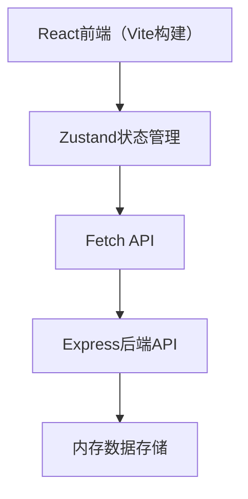

## 1. 架构设计



## 2. 技术描述

- **前端框架**：React@18 + TypeScript
- **构建工具**：Vite
- **状态管理**：Zustand
- **路由**：react-router-dom@6
- **后端**：Express@4
- **跨域**：cors中间件
- **唯一ID**：uuid
- **数据存储**：内存数组（开发模拟）

## 3. 项目结构

```
community-canvas/
├── package.json
├── vite.config.js
├── tsconfig.json
├── index.html
├── src/
│   ├── main.tsx          # React入口，路由与store初始化
│   ├── App.tsx           # 根组件，路由配置
│   ├── store/
│   │   └── appStore.ts   # Zustand全局状态
│   ├── components/
│   │   ├── Navbar.tsx       # 导航栏组件
│   │   ├── Board.tsx        # 公告板组件
│   │   ├── AnnouncementCard.tsx  # 公告卡片
│   │   ├── ActivityCard.tsx     # 活动卡片
│   │   ├── CreateAnnouncementModal.tsx
│   │   └── SearchBar.tsx        # 搜索框组件
│   ├── pages/
│   │   ├── HomePage.tsx        # 首页（公告板）
│   │   ├── ActivitiesPage.tsx  # 活动列表页
│   │   ├── ActivityDetail.tsx  # 活动详情页
│   │   └── AnnouncementDetail.tsx  # 公告详情页
│   ├── types/
│   │   └── index.ts         # 类型定义
│   └── utils/
│       └── helpers.ts       # 工具函数
└── server/
    └── index.ts          # Express服务器
```

## 4. 路由定义

| 路由 | 页面 | 说明 |
|------|------|------|
| / | 首页（公告板） | 展示公告列表，发布入口 |
| /activities | 活动列表 | 分类筛选，瀑布流展示 |
| /activities/:id | 活动详情 | 活动信息，参与管理 |
| /announcements/:id | 公告详情 | 公告完整内容 |
| /my/announcements | 我的公告 | 用户发布的公告 |
| /my/activities | 我的活动 | 用户参与的活动 |

## 5. API定义

### 数据类型
```typescript
interface Announcement {
  id: string;
  title: string;
  content: string;
  author: string;
  createdAt: string;
  category?: string;
}

interface Activity {
  id: string;
  title: string;
  description: string;
  date: string;
  location: string;
  capacity: number;
  participants: string[];
  category: string;
  organizer: string;
}

interface User {
  id: string;
  name: string;
  avatar?: string;
}
```

### 接口列表
| 方法 | 路径 | 说明 |
|------|------|------|
| GET | /api/announcements | 获取公告列表 |
| POST | /api/announcements | 创建公告 |
| GET | /api/activities | 获取活动列表 |
| POST | /api/activities | 创建活动 |
| POST | /api/activities/join | 加入活动 |
| POST | /api/activities/leave | 退出活动 |

### 请求/响应示例

**GET /api/announcements**
```
响应：
{
  "data": Announcement[],
  "total": number
}
```

**POST /api/announcements**
```
请求体：
{
  "title": string,
  "content": string,
  "author": string
}

响应：
{
  "success": boolean,
  "data": Announcement
}
```

**POST /api/activities/join**
```
请求体：
{
  "activityId": string,
  "userId": string
}

响应：
{
  "success": boolean,
  "data": Activity
}
```

## 6. 数据模型

### 内存数据结构
- `announcements: Announcement[]` - 公告数组
- `activities: Activity[]` - 活动数组
- `currentUser: User` - 当前登录用户（模拟）

### 初始模拟数据
- 20条公告（不同时间、不同作者）
- 12个活动（覆盖6个分类，不同参与人数）

## 7. 状态管理（Zustand）

### Store 状态
- `announcements: Announcement[]` - 公告列表
- `activities: Activity[]` - 活动列表
- `currentUser: User | null` - 当前用户
- `searchQuery: string` - 搜索关键词
- `activeCategory: string` - 活动分类筛选

### Store Actions
- `fetchAnnouncements()` - 获取公告列表
- `createAnnouncement(data)` - 创建公告
- `fetchActivities()` - 获取活动列表
- `joinActivity(activityId, userId)` - 加入活动
- `leaveActivity(activityId, userId)` - 退出活动
- `setSearchQuery(query)` - 设置搜索词
- `setActiveCategory(category)` - 设置分类
