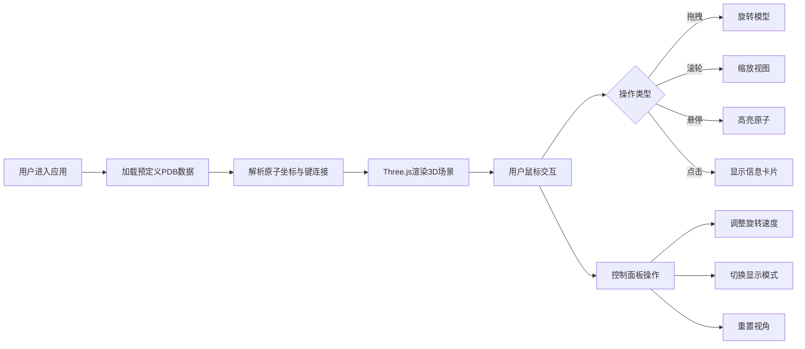

## 1. 产品概述

MoleculeVue是一款面向生物医学教学的蛋白质分子3D交互可视化应用，旨在帮助学生直观理解复杂蛋白质分子的三维空间折叠结构和动态构象变化，解决现有教学工具过于专业、操作门槛高或缺乏交互性的问题。

- **核心价值**：通过低门槛、高交互性的3D可视化，让学生能够自由探索蛋白质分子结构，提升学习效率和理解深度
- **目标用户**：生物医学专业学生、教师及科研人员
- **市场定位**：教学辅助工具，填补专业科研软件与基础教学需求之间的空白

## 2. 核心功能

### 2.1 用户角色
| 角色 | 注册方式 | 核心权限 |
|------|----------|----------|
| 学生/教师 | 无需注册，直接使用 | 浏览分子结构、交互操作、切换显示模式 |

### 2.2 功能模块
1. **3D场景渲染模块**：蛋白质分子三维结构实时渲染，支持原子和化学键可视化
2. **交互控制模块**：鼠标拖拽旋转、滚轮缩放、悬停高亮、点击查询
3. **显示模式切换模块**：球棍模型、空间填充模型、线框模式三种渲染方式
4. **信息展示模块**：原子信息卡片、控制面板UI
5. **动画控制模块**：自动旋转、模式切换过渡动画

### 2.3 页面详情
| 页面名称 | 模块名称 | 功能描述 |
|-----------|-------------|---------------------|
| 主页面 | 3D渲染区域 | 全屏展示蛋白质分子3D结构，深蓝色背景 |
| 主页面 | 控制面板 | 右上角悬浮，包含旋转速度滑块、显示模式下拉、重置视角按钮 |
| 主页面 | 信息卡片 | 屏幕中央悬浮，点击原子时显示元素符号、坐标、邻居原子数 |

## 3. 核心流程

用户进入应用 → 自动加载预定义蛋白质数据 → 解析并渲染3D分子结构 → 用户通过鼠标交互（旋转/缩放/悬停/点击）探索结构 → 通过控制面板调整参数 → 点击原子查看详细信息

## 4. 用户界面设计

### 4.1 设计风格
- **主色调**：深蓝色 #0A0E27（背景）、蓝色 #3B82F6（交互元素）
- **原子配色**：碳 #808080、氧 #FF0D0D、氮 #3050F8
- **字体**：现代无衬线字体，白色文字
- **视觉效果**：半透明磨砂玻璃、圆角设计、平滑动画过渡

### 4.2 页面设计概述
| 页面名称 | 模块名称 | UI元素 |
|-----------|-------------|-------------|
| 主页面 | 3D渲染区域 | 全屏、深蓝色背景、无滚动条、实时3D渲染 |
| 主页面 | 控制面板 | 右上角悬浮（top:20px, right:30px）、宽度260px、半透明深色背景rgba(10,14,39,0.8)、圆角12px、内边距16px |
| 主页面 | 控制面板-滑块 | 蓝色轨道#3B82F6、白色圆形手柄、0-5范围、默认值1 |
| 主页面 | 控制面板-下拉菜单 | 深色背景、白色文字、悬停变色 |
| 主页面 | 控制面板-按钮 | 圆角设计、蓝色边框、悬停填充 |
| 主页面 | 信息卡片 | 屏幕中央、磨砂玻璃效果rgba(255,255,255,0.1)、模糊10px、圆角16px、内边距20px、2秒后自动淡出 |

### 4.3 响应式
- 桌面端优先设计，全屏渲染
- 控制面板位置固定，不随窗口大小变化
- 3D画布自适应窗口尺寸

### 4.4 3D场景指导
- **环境**：纯深蓝色背景 #0A0E27，营造沉浸式科学探索氛围
- **光照**：环境光 + 平行光，确保分子结构清晰可见，保留适当阴影增强立体感
- **相机**：正交相机，提供等比例缩放，避免透视畸变影响结构观察
- **交互**：OrbitControls实现流畅旋转缩放，自动旋转功能
- **动画**：0.3秒高亮过渡、0.5秒模式切换过渡、2秒信息卡片淡出
- **性能**：保持55fps以上，交互响应50ms以内
