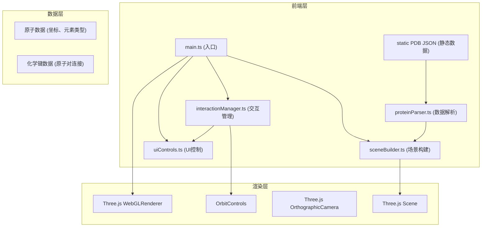

## 1. 架构设计



## 2. 技术描述

- **前端框架**：TypeScript + Three.js@0.160 + Vite
- **构建工具**：Vite 5.x
- **3D渲染**：Three.js + OrbitControls
- **状态管理**：模块化设计，各模块间通过回调函数通信
- **样式**：原生CSS + CSS变量

### 核心依赖
| 依赖 | 版本 | 用途 |
|------|------|------|
| three | 0.160.0 | 3D渲染引擎 |
| @types/three | 0.160.0 | Three.js类型定义 |
| vite | 5.x | 构建工具 |
| typescript | 5.x | 类型安全 |

## 3. 模块文件结构与调用关系

```
src/
├── main.ts              # 入口文件，初始化场景、光照、相机，启动动画循环
│   ├── 调用: sceneBuilder.buildScene()
│   ├── 调用: interactionManager.init()
│   ├── 调用: uiControls.init()
│   └── 持有: scene, camera, renderer, controls 实例
│
├── proteinParser.ts     # PDB数据解析器
│   ├── 输入: 静态JSON数据 (预定义50个原子)
│   ├── 输出: AtomData[], BondData[]
│   └── 被调用: main.ts → 传递给 sceneBuilder
│
├── sceneBuilder.ts      # 3D场景构建器
│   ├── 输入: AtomData[], BondData[]
│   ├── 输出: THREE.Group (包含所有原子Mesh和键LineSegments)
│   ├── 功能: 根据元素类型创建不同颜色/大小的球体，创建化学键圆柱
│   └── 被调用: main.ts
│
├── interactionManager.ts # 交互管理器
│   ├── 输入: THREE.Scene, THREE.Camera, HTMLElement
│   ├── 功能: 鼠标事件监听、光线投射、原子高亮、点击查询
│   ├── 输出: 高亮状态变化、点击事件回调
│   └── 被调用: main.ts → 与 uiControls 联动
│
├── uiControls.ts        # UI控制面板
│   ├── 功能: 渲染控制面板、旋转速度滑块、显示模式下拉、重置按钮
│   ├── 回调: onRotationSpeedChange, onDisplayModeChange, onResetView
│   └── 被调用: main.ts
│
└── types.ts             # 类型定义
    ├── AtomData 接口
    ├── BondData 接口
    └── DisplayMode 类型
```

### 数据流向
```
静态JSON (src/data/proteinData.json)
    ↓ (proteinParser.ts)
AtomData[], BondData[]
    ↓ (sceneBuilder.ts)
THREE.Mesh[], THREE.LineSegments[] → THREE.Group
    ↓ (main.ts)
添加到 THREE.Scene
    ↓ (interactionManager.ts)
光线投射检测 → 更新材质 → UI状态更新
```

## 4. 类型定义

```typescript
// src/types.ts
export interface AtomData {
  id: number;
  element: string;      // 'C', 'O', 'N', 'H', 'S', etc.
  x: number;
  y: number;
  z: number;
}

export interface BondData {
  atom1: number;        // 原子索引
  atom2: number;        // 原子索引
  order: number;        // 键级: 1=单键, 2=双键, 3=三键
}

export type DisplayMode = 'ball-stick' | 'space-filling' | 'wireframe';

export interface AtomInfo {
  element: string;
  x: number;
  y: number;
  z: number;
  neighbors: number;
}
```

## 5. 性能优化策略

1. **几何体复用**：相同元素的原子共享 SphereGeometry 实例
2. **材质复用**：相同元素的原子共享 MeshStandardMaterial 实例
3. **批量更新**：模式切换时批量修改材质属性，避免频繁重绘
4. **动画帧优化**：使用 requestAnimationFrame，仅在需要时重绘
5. **光线投射优化**：限制检测对象数量，仅对原子Mesh进行检测
6. **内存管理**：应用销毁时正确释放几何体和材质资源

## 6. 关键技术实现点

1. **原子高亮效果**：使用 OutlineEffect 或 emissive 材质实现发光效果，配合 TWEEN.js 实现0.3秒平滑过渡
2. **显示模式切换**：通过修改材质的 wireframe 属性和球体半径，配合 TWEEN.js 实现0.5秒动画过渡
3. **正交相机**：使用 OrthographicCamera 确保等比例缩放，适合科学可视化
4. **信息卡片**：使用 CSS 动画实现淡入淡出效果，position: fixed 居中显示
5. **性能监控**：可选集成 stats.js 监控帧率，确保55fps以上
