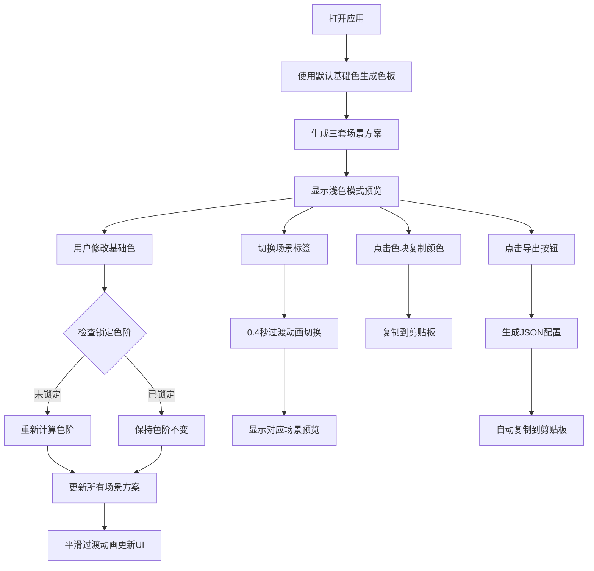

## 1. 产品概述

ColorPalette Pro 是一款面向插画师和设计师的专业色彩协调工具，帮助用户快速生成品牌色板并自动适配多场景UI配色方案。

- **核心价值**：解决设计师在品牌配色过程中反复手动调整、难以确保多场景色彩一致性以及缺乏灵感的痛点
- **目标用户**：UI设计师、插画师、品牌设计师、前端开发者
- **产品定位**：轻量级、高效率、专业级的色彩设计辅助工具

## 2. 核心功能

### 2.1 用户角色

| 角色 | 注册方式 | 核心权限 |
|------|----------|----------|
| 设计师用户 | 无需注册，直接使用 | 色板创建、方案预览、颜色复制、导出配置 |

### 2.2 功能模块

1. **主色板创建模块**：基础颜色输入、5色阶调和色板生成、单色色阶复制
2. **场景方案生成模块**：浅色模式、深色模式、毛玻璃模式三套配色方案
3. **实时预览切换模块**：标签页切换、0.4秒平滑过渡动画、全页面配色联动
4. **色板管理模块**：色阶锁定功能、JSON导出功能、剪贴板自动复制

### 2.3 功能详情

| 功能模块 | 子功能 | 功能描述 |
|---------|--------|----------|
| 主色板创建 | 基础色输入 | 支持十六进制颜色输入，实时预览基础色 |
| 主色板创建 | 色阶生成 | 基于HSL色彩模型自动生成5个色阶，饱和度保持90%以上 |
| 主色板创建 | 色块复制 | 点击任意色块即可复制十六进制颜色值到剪贴板 |
| 场景方案生成 | 浅色模式 | 主色作为强调色，白色背景，深灰色文字 |
| 场景方案生成 | 深色模式 | 主色作为高亮色，深色背景，浅灰色文字 |
| 场景方案生成 | 毛玻璃模式 | 主色作为叠加色，模糊渐变背景，圆角卡片 |
| 实时预览切换 | 标签切换 | 三个标签页快速切换不同场景方案 |
| 实时预览切换 | 过渡动画 | 0.4秒CSS平滑过渡，所有元素颜色同步变化 |
| 色板管理 | 色阶锁定 | 锁定后调整基础色时该色阶保持不变 |
| 色板管理 | 导出功能 | 一键导出完整JSON配置并自动复制到剪贴板 |

## 3. 核心流程

用户打开应用后，系统使用默认基础色生成初始色板和三套场景方案。用户可修改基础色来重新计算色板，可锁定特定色阶保持不变。通过顶部标签页切换预览不同场景下的配色效果，所有变化均带有平滑过渡动画。最后可通过导出按钮获取完整的色板JSON配置。

## 4. 用户界面设计

### 4.1 设计风格

- **设计语言**：Neumorphism（新拟物化）风格，按钮采用内外阴影结合的立体效果
- **主色调**：可自定义，默认使用活力橙色系作为演示
- **导航条**：深色导航条（#1E293B），80px高度，简约专业
- **按钮样式**：圆角8px，带内阴影（inset 0 2px 4px rgba(0,0,0,0.2)）和外阴影（0 4px 8px rgba(0,0,0,0.1)）
- **卡片样式**：圆角12px，内边距24px，柔和投影（0 8px 30px rgba(0,0,0,0.12)）
- **字体**：使用现代无衬线字体，清晰易读
- **动画**：0.4秒贝塞尔曲线过渡，流畅自然

### 4.2 页面设计概述

| 区域 | 模块名称 | UI元素 |
|------|----------|--------|
| 顶部 | 导航栏 | 应用Logo、基础颜色选择器 |
| 左侧 | 色板面板 | 5个垂直排列的色阶色块、锁定按钮 |
| 右侧 | 预览区域 | 场景标签页、UI卡片预览（按钮、标题、输入框示例） |
| 右下角 | 导出按钮 | 悬浮固定导出按钮 |

### 4.3 响应式设计

- **桌面端**：两栏布局，左侧320px固定面板，右侧自适应预览区
- **移动端**（<768px）：左侧面板折叠为顶部横向色板，预览区占据全屏
- **触控优化**：移动端增大点击区域，色阶色块高度增加至56px

### 4.4 交互细节

- **色块悬停**：放大至102%，阴影加深，提供即时视觉反馈
- **锁定按钮**：灰色未锁定状态，点击后变为金色锁定状态
- **标签切换**：选中态高亮，下划线动画指示当前选中项
- **复制反馈**：点击色块后显示短暂的复制成功提示
