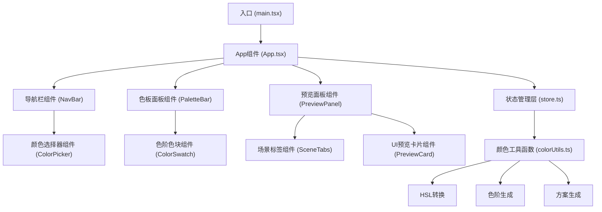

## 1. 架构设计

本项目为纯前端应用，采用React组件化架构，使用Zustand进行状态管理，通过CSS变量实现主题色的全局控制与平滑过渡。



## 2. 技术描述

- **前端框架**：React@18 + TypeScript
- **构建工具**：Vite 5.x
- **状态管理**：Zustand 4.x
- **样式方案**：纯CSS + CSS变量（不使用额外UI库）
- **工具库**：uuid（用于生成唯一标识）

## 3. 项目文件结构

| 文件路径 | 用途说明 |
|---------|----------|
| `package.json` | 项目依赖与脚本配置 |
| `vite.config.js` | Vite构建配置，含React插件 |
| `tsconfig.json` | TypeScript配置（严格模式，ES2020） |
| `index.html` | HTML入口文件 |
| `src/main.tsx` | React应用入口，挂载App组件 |
| `src/App.tsx` | 根组件，整体布局与主题控制 |
| `src/store.ts` | Zustand状态管理，色板数据与计算函数 |
| `src/utils/colorUtils.ts` | 颜色工具函数集合 |
| `src/components/ColorPicker.tsx` | 基础颜色输入组件 |
| `src/components/PaletteBar.tsx` | 色板显示组件，含锁定按钮 |
| `src/components/PreviewPanel.tsx` | 场景预览组件，含标签切换 |
| `src/components/PreviewCard.tsx` | UI预览卡片组件 |
| `src/styles/global.css` | 全局样式与CSS变量定义 |

## 4. 状态管理设计

### 4.1 Store状态定义

```typescript
interface PaletteState {
  baseColor: string;           // 基础颜色（十六进制）
  palette: string[];           // 5个色阶的颜色数组
  locked: boolean[];           // 5个色阶的锁定状态
  currentMode: 'light' | 'dark' | 'glass';  // 当前预览模式
  
  // Actions
  setBaseColor: (color: string) => void;
  toggleLock: (index: number) => void;
  setMode: (mode: 'light' | 'dark' | 'glass') => void;
  generatePalette: (baseColor: string) => string[];
  exportJSON: () => string;
}
```

### 4.2 场景配色方案数据结构

```typescript
interface ColorScheme {
  background: string;
  text: string;
  primary: string;
  secondary: string;
  accent: string;
  cardBg: string;
  inputBg: string;
  border: string;
}
```

## 5. 核心算法说明

### 5.1 色阶生成算法

1. 将基础色从十六进制转换为HSL色彩空间
2. 保持色相（H）不变，饱和度（S）保持90%以上
3. 以基础色的亮度为中间值，向两端扩展生成5个色阶
4. 色阶亮度间隔均匀，从最浅到最深依次排列
5. 检查锁定状态，被锁定的色阶不参与重新计算

### 5.2 场景方案生成

- **浅色模式**：背景#FFFFFF，文字#1A1A1A，主色作为强调色和按钮色
- **深色模式**：背景#1E1E2E，文字#E0E0E0，主色作为高亮色
- **毛玻璃模式**：使用主色渐变背景，15px模糊效果，16px圆角卡片

## 6. 性能优化策略

- **计算优化**：色板计算使用纯函数，缓存计算结果，避免重复计算
- **渲染优化**：使用React.memo包裹子组件，减少不必要的重渲染
- **动画性能**：使用CSS变量和transition属性，利用GPU加速
- **状态更新**：Zustand状态批量更新，避免多次触发渲染
- **目标性能**：颜色计算+界面渲染在80ms内完成，确保0.4s过渡动画流畅
