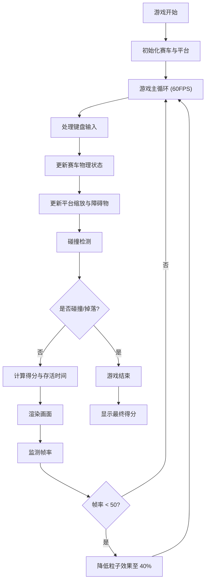

# DriftArena 产品需求文档

## 1. 产品概述

DriftArena 是一款基于 Canvas 2D 的网页漂移竞技游戏，玩家操控微型赛车在不断缩小的圆形平台上漂移过弯，躲避障碍物和平台边缘，坚持越久得分越高。

- **核心玩法**：漂移操控 + 平台收缩 + 障碍物躲避
- **目标用户**：休闲游戏玩家、赛车游戏爱好者
- **产品价值**：轻量级、高挑战性的即时竞技体验

## 2. 核心功能

### 2.1 功能模块

| 模块名称 | 功能描述 |
|---------|---------|
| 赛车操控 | 真实漂移物理手感，空格键触发漂移，松开后获得加速 |
| 平台系统 | 圆形平台随时间缩小，边缘红光闪烁提示危险 |
| 障碍物系统 | 随机生成的圆盘障碍物，碰撞导致减速和控制失灵 |
| 轮胎痕迹 | 漂移时留下发光橙色痕迹，5秒后逐渐消失 |
| HUD 界面 | 速度表盘、得分、存活时间、平台直径百分比、操作提示 |
| 性能优化 | 60FPS 游戏循环，帧率监测与粒子效果动态调整 |

### 2.2 游戏详情

| 功能点 | 参数描述 |
|--------|---------|
| 平台初始直径 | 600px |
| 平台缩小速率 | 每 15 秒缩小 5% |
| 平台最小直径 | 200px |
| 边缘光带颜色 | #FF3333 红色，闪烁间隔 0.8 秒 |
| 漂移加速持续 | 0.5 秒 |
| 轮胎痕迹持续 | 5 秒渐变消失 |
| 障碍物生成间隔 | 5-8 秒随机 |
| 障碍物半径 | 20-35px 随机 |
| 碰撞惩罚 | 损失 20% 当前速度 + 0.5 秒控制失灵 |
| 速度表盘范围 | 0-300 单位 |

## 3. 核心流程

## 4. 用户界面设计

### 4.1 设计风格

- **主色调**：深空蓝 (#0A0B1A) 背景，霓虹橙 (#FF6B35) 点缀
- **平台渐变**：深蓝色到深紫色径向渐变
- **边缘光带**：闪烁红色 (#FF3333)
- **字体**：无衬线字体，清晰易读
- **整体风格**：赛博朋克 / 科技感 / 深空主题

### 4.2 HUD 布局

| 位置 | 元素 | 描述 |
|------|------|------|
| 左上角 | 速度表盘 | 圆形进度条，0-300 单位，深灰背景，橙红色指针 |
| 左上角 | 当前得分 | 白色 24px 无衬线字体 |
| 右上角 | 存活时间 | 倒计时显示 |
| 右上角 | 平台直径 | 当前直径百分比 |
| 右下角 | 操作提示 | 半透明黑色背景圆角 12px，WASD + 空格键说明 |

### 4.3 响应式

- 桌面端优先，Canvas 居中显示
- 游戏区域固定尺寸，不随窗口缩放

## 5. 性能要求

- 目标帧率：60 FPS
- 帧率监测：实时监测，低于 50 FPS 时自动降低粒子效果数量至 40%
- 渲染技术：Canvas 2D API，requestAnimationFrame 驱动
