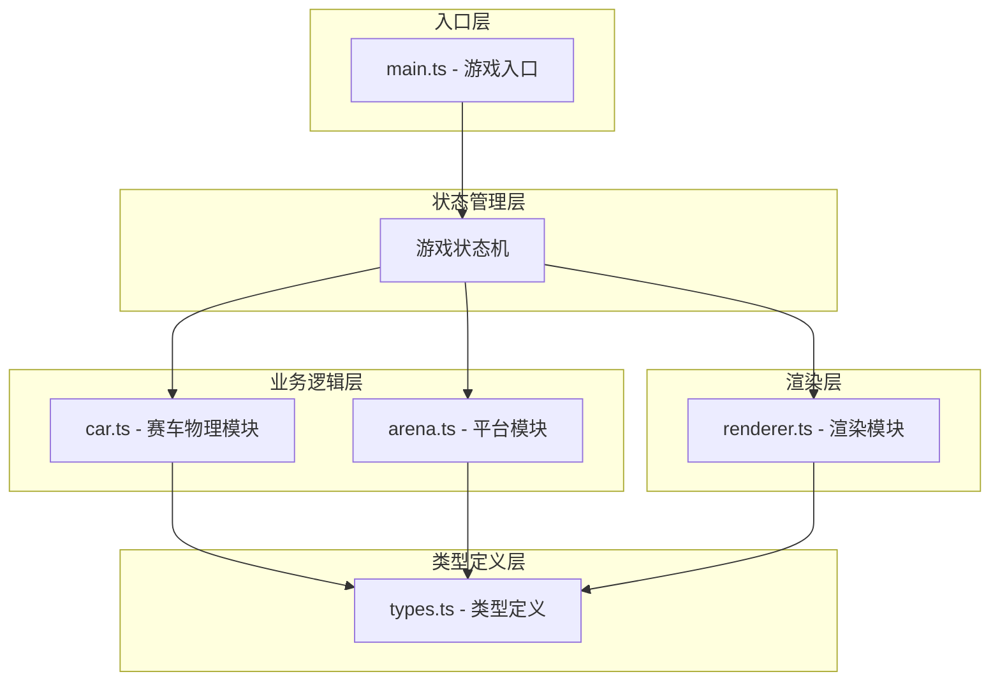

# DriftArena 技术架构文档

## 1. 架构设计



## 2. 技术描述

- **构建工具**：Vite
- **编程语言**：TypeScript (strict 模式, target es2020)
- **渲染技术**：Canvas 2D API
- **无外部运行时依赖**：纯原生实现
- **启动脚本**：`npm run dev`

### 文件结构

```
DriftArena/
├── package.json
├── vite.config.js
├── tsconfig.json
├── index.html
└── src/
    ├── main.ts        # 入口，初始化Canvas、游戏循环和状态管理
    ├── car.ts         # 赛车物理模块
    ├── arena.ts       # 平台模块
    ├── renderer.ts    # 渲染模块
    └── types.ts       # 类型定义
```

## 3. 模块职责

### 3.1 types.ts - 类型定义

```typescript
// 赛车状态接口
interface CarState {
  x: number;
  y: number;
  angle: number;
  speed: number;
  maxSpeed: number;
  acceleration: number;
  turnSpeed: number;
  isDrifting: boolean;
  driftAngle: number;
  boostTimer: number;
  controlLockTimer: number;
}

// 平台状态接口
interface ArenaState {
  centerX: number;
  centerY: number;
  diameter: number;
  minDiameter: number;
  shrinkInterval: number;
  shrinkRate: number;
  edgeFlashTimer: number;
}

// 障碍物接口
interface Obstacle {
  x: number;
  y: number;
  radius: number;
  id: number;
}

// 轮胎痕迹接口
interface TireMark {
  x: number;
  y: number;
  angle: number;
  alpha: number;
  createdAt: number;
}

// 游戏状态
type GameState = 'playing' | 'gameover';
```

### 3.2 car.ts - 赛车物理模块

**职责**：
- 处理键盘输入（WASD + 空格）
- 更新赛车位置和速度
- 实现漂移物理（弧形轨迹滑行）
- 处理加速和控制失灵效果
- 生成轮胎痕迹
- 提供碰撞检测所需的几何信息

**核心方法**：
- `update(deltaTime: number)` - 更新赛车状态
- `setInput(input: InputState)` - 设置输入状态
- `getBounds()` - 获取碰撞边界

### 3.3 arena.ts - 平台模块

**职责**：
- 管理平台尺寸和缩放逻辑
- 边缘检测（赛车是否超出平台）
- 障碍物生成与管理
- 边缘闪烁效果计时

**核心方法**：
- `update(deltaTime: number)` - 更新平台状态
- `isOnPlatform(x: number, y: number): boolean` - 检测点是否在平台上
- `checkObstacleCollision(car: CarState): boolean` - 检测障碍物碰撞

### 3.4 renderer.ts - 渲染模块

**职责**：
- 绘制背景（深空蓝）
- 绘制平台（径向渐变 + 红色边缘光带）
- 绘制赛车
- 绘制轮胎痕迹（发光橙色，渐变消失）
- 绘制障碍物（深灰色圆盘 + 网格纹理）
- 绘制 HUD（速度表盘、得分、存活时间、操作提示）

**核心方法**：
- `render(car: CarState, arena: ArenaState, obstacles: Obstacle[], tireMarks: TireMark[], hudData: HudData)`

### 3.5 main.ts - 游戏入口

**职责**：
- 初始化 Canvas 和上下文
- 创建游戏状态和各模块实例
- 游戏主循环（requestAnimationFrame）
- 键盘事件监听
- 帧率监测与性能调整
- 游戏状态管理（开始、进行中、结束）

## 4. 性能优化策略

1. **requestAnimationFrame** 驱动游戏循环，确保与显示器同步
2. **deltaTime 计算**：基于时间差的物理更新，保证不同帧率下游戏体验一致
3. **帧率监测**：记录最近 10 帧的平均帧率
4. **动态粒子调整**：帧率低于 50 FPS 时，轮胎痕迹数量降至 40%
5. **对象池**：障碍物和轮胎痕迹使用对象池避免频繁 GC
6. **离屏 Canvas**：平台渐变和网格纹理预渲染

## 5. 游戏物理参数

| 参数 | 值 | 说明 |
|------|----|------|
| 初始速度 | 0 | 赛车初始速度 |
| 最大速度 | 300 | 速度表盘上限 |
| 加速度 | 150 | 每秒增加的速度 |
| 减速度 | 100 | 松开加速时的减速 |
| 转向速度 | 3.0 | rad/s，漂移时降低 |
| 漂移转向倍率 | 0.3 | 漂移时转向效率 |
| 漂移摩擦力 | 0.98 | 漂移时每帧速度乘数 |
| 加速倍率 | 1.5 | 漂移结束后的加速倍数 |
| 加速持续时间 | 0.5s | 松开空格后的加速时长 |
| 控制失灵时间 | 0.5s | 碰撞障碍物后的失控时长 |
| 碰撞减速比例 | 0.8 | 碰撞后速度变为原来的 80% |
