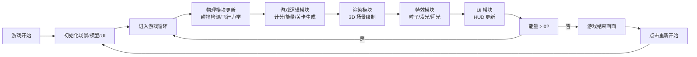
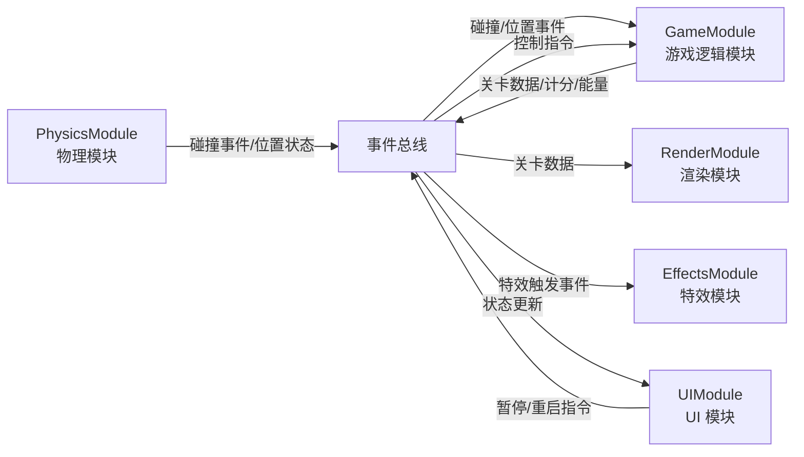

## 1. 产品概述

AetherWing 是一款 3D 飞行躲避收集游戏，玩家控制一只机械翼龙在峡谷中穿梭，躲避岩壁和障碍物，同时收集能量碎片维持飞行能量。游戏采用无限飞行模式，随着时间推移难度逐渐递增，考验玩家的反应能力和操控技巧。

- **核心玩法**：鼠标操控机械翼龙在 3D 峡谷中左右移动和俯仰飞行，躲避障碍收集能量碎片
- **目标用户**：休闲游戏玩家，喜欢飞行/跑酷类游戏的用户
- **市场价值**：提供沉浸式 3D 飞行体验，具有高度的可重玩性和挑战性

## 2. 核心功能

### 2.1 功能模块
1. **3D 渲染模块**：Three.js 场景、相机、光影、峡谷地形、翼龙模型、障碍物渲染
2. **物理引擎模块**：碰撞检测、重力模拟、飞行力学计算
3. **游戏逻辑模块**：关卡生成、能量管理、计分系统、难度递增
4. **特效模块**：粒子系统、能量碎片发光、撞击闪光、扩散光晕
5. **UI 交互模块**：HUD 显示（能量条、分数）、游戏结束画面、暂停/重启控制

### 2.2 功能详情

| 功能模块 | 子功能 | 详细描述 |
|---------|-------|---------|
| 峡谷生成 | 无限地形 | 峡谷沿 Z 轴无限生成，岩壁宽度从 600 单位逐渐收窄至 200 单位 |
| 峡谷生成 | 岩壁材质 | #4A3728 颜色岩石，带随机凹凸纹理模拟岩石质感 |
| 峡谷生成 | 障碍物 | 岩壁内侧每隔 15 单位生成长方体障碍物，颜色 #8B4513，大小 2-4 单位随机 |
| 翼龙操控 | 横向移动 | 鼠标左右移动控制，响应延迟 0.05s，最大偏移 ±200 单位 |
| 翼龙操控 | 俯仰控制 | 鼠标上下移动控制俯冲/上扬，俯冲增速 30%，上扬减速 20% |
| 翼龙模型 | 外观 | BoxGeometry 组合，身体 2x1x1，翅膀展开 12 单位 |
| 翼龙模型 | 材质 | 身体金属银 #C0C0C0（roughness 0.3），翅膀半透明 #A8D8EA（opacity 0.8） |
| 翼龙动画 | 倾斜 | 水平旋转时身体 15 度倾斜，GSAP 驱动 0.2s 过渡 |
| 能量碎片 | 生成 | 每隔 8-12 单位生成一个，八面体几何体，半径 0.6 单位 |
| 能量碎片 | 效果 | 自发光 #00FF88，强度 1.0，持续旋转每秒 30 度 |
| 能量碎片 | 拾取 | 1.5 单位内自动拾取，放大 1.5 倍并 0.3s 消散 |
| 能量碎片 | 光晕 | 拾取时触发扩散光晕，半径 0→8 单位，透明度 0.6→0，颜色 #88FF88 |
| 碰撞系统 | 能量损失 | 触碰岩壁或障碍物能量减少 20%，最大 100，初始 100 |
| 碰撞系统 | 视觉反馈 | 屏幕边缘 3px 红色边框闪烁 0.3s |
| 碰撞系统 | 震动反馈 | 相机 Z 轴抖动 0.1 单位，持续 0.2s |
| 碰撞系统 | 游戏结束 | 能量归零时显示 GAME OVER 画面 |
| 计分系统 | 距离得分 | 每飞行 100 单位增加 1 分 |
| 计分系统 | 碎片奖励 | 每收集 10 个碎片额外奖励 5 分 |
| 计分系统 | 加速机制 | 分数每达到 25 分，飞行速度永久提升 0.5 单位/秒 |
| 计分系统 | 峡谷收窄 | 分数每达到 25 分，峡谷收窄速率加快 10% |
| 计分系统 | 升级特效 | 分数达到 25 分倍数时全屏闪光 0.1s，白色 #FFFFFF，透明度 0.3 |
| HUD 界面 | 能量条 | 右上角，宽 200px 高 20px，背景 #333333，填充色从 #00FF88 渐变到 #FF4444 |
| HUD 界面 | 能量条样式 | 圆角 6px，1px 白色边框，上方火焰图标动画 |
| HUD 界面 | 分数显示 | 左上角，24px monospace，#FFFFFF，文字阴影 0 0 10px rgba(0,255,136,0.5) |
| 结束画面 | 遮罩 | 居中半透明黑色遮罩 rgba(0,0,0,0.7) |
| 结束画面 | 文字 | GAME OVER 48px，#FF4444，带 #FF8888 发光阴影 |
| 结束画面 | 分数 | 最终分数 24px 白色 |
| 结束画面 | 按钮 | 重新开始按钮 120x40px，背景 #00FF88，圆角 8px，hover 变亮 10% |
| 响应式设计 | 移动端适配 | 屏幕宽度 < 768px 时 HUD 缩小到 80% |

## 3. 核心流程

### 3.1 游戏主循环

### 3.2 模块通信流程

## 4. 用户界面设计

### 4.1 设计风格

- **整体风格**：科幻机械风，深色背景配合霓虹绿色能量元素
- **主色调**：深空蓝 #0A0A1A（背景）、霓虹绿 #00FF88（能量/强调）、金属银 #C0C0C0（机械）
- **辅助色**：警示红 #FF4444（危险/低能量）、天空蓝 #A8D8EA（翅膀）、岩石棕 #4A3728（地形）
- **字体**：monospace 等宽字体，科技感强
- **动效风格**：流畅的 GSAP 动画，发光效果，粒子特效

### 4.2 界面布局

| 界面 | 模块 | UI 元素 |
|------|------|---------|
| 游戏主界面 | 3D 场景 | 全屏 Three.js 渲染，背景 #0A0A1A，底部雾效 #0A0A1A density 0.002 |
| 游戏主界面 | HUD-能量条 | 右上角，火焰图标 + 能量条，颜色随能量渐变 |
| 游戏主界面 | HUD-分数 | 左上角，发光文字效果 |
| 游戏结束 | 遮罩层 | 半透明黑色全屏遮罩 |
| 游戏结束 | 文字 | GAME OVER 大标题，红色发光效果 |
| 游戏结束 | 分数 | 最终分数显示 |
| 游戏结束 | 按钮 | 重新开始按钮，悬停变亮 |

### 4.3 响应式设计

- **桌面优先**：基础布局针对桌面端设计
- **移动端适配**：屏幕宽度 < 768px 时，HUD 元素整体缩放至 80%
- **触控优化**：支持鼠标和触控操作

### 4.4 3D 场景设计

- **环境**：深空峡谷场景，底部有微弱雾效营造纵深感
- **光照**：环境光 + 方向光，突出金属质感和能量碎片的自发光效果
- **相机**：第三人称跟随视角，随翼龙俯仰微调角度
- **构图**：峡谷向远方延伸的透视感，翼龙位于画面下方三分之一处
- **后处理**：能量碎片发光、撞击闪光、全屏闪光等特效
- **性能预算**：draw call ≤ 120/帧，粒子 ≤ 500/秒，FPS ≥ 55

