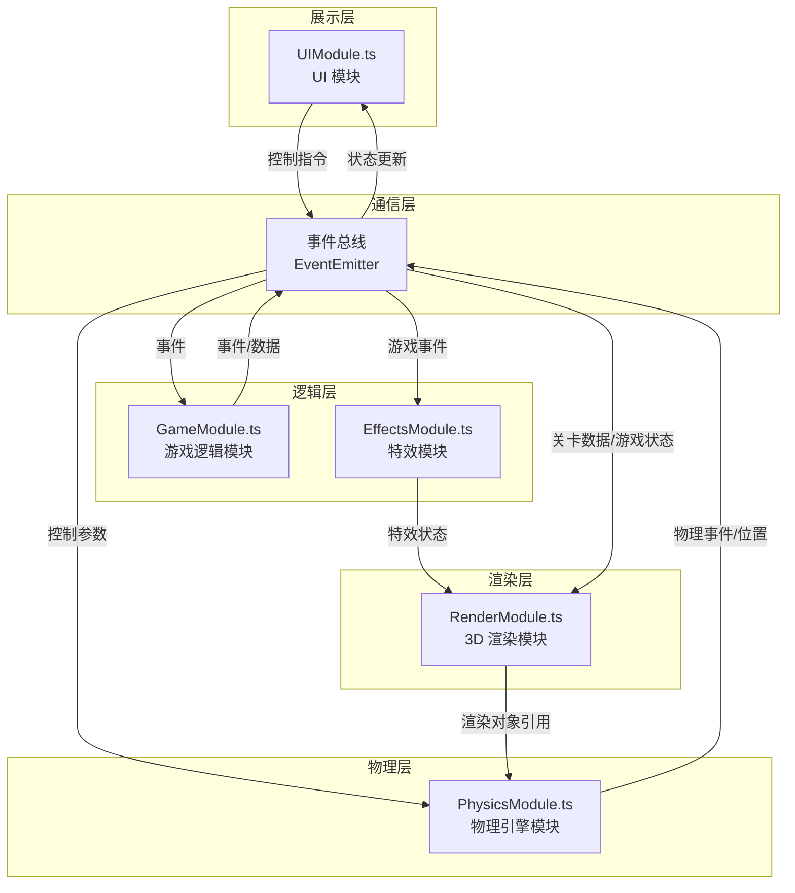

## 1. 架构设计



## 2. 技术选型

| 类别 | 技术 | 版本 | 用途 |
|------|------|------|------|
| 构建工具 | Vite | 最新 | 开发构建、热更新 |
| 语言 | TypeScript | 最新 | 类型安全、代码可维护性 |
| 3D 引擎 | Three.js | 0.160.0 | 3D 场景渲染、模型创建 |
| 动画库 | GSAP | 3.12.5 | UI 动画、模型动画、特效动画 |
| 模块系统 | ESM | ES2020 | 模块化开发 |
| 样式 | 原生 CSS | - | DOM HUD 样式 |

## 3. 项目结构

```
auto11/
├── index.html                 # 入口页面
├── package.json               # 项目依赖
├── vite.config.js             # Vite 构建配置
├── tsconfig.json              # TypeScript 配置
└── src/
    ├── main.ts                # 应用入口
    ├── core/
    │   └── EventBus.ts        # 事件总线
    ├── engine/
    │   ├── PhysicsModule.ts   # 物理引擎模块
    │   └── GameModule.ts      # 游戏逻辑模块
    ├── render/
    │   ├── RenderModule.ts    # 3D 渲染模块
    │   └── EffectsModule.ts   # 特效模块
    └── ui/
        └── UIModule.ts        # UI 模块
```

## 4. 核心模块设计

### 4.1 事件总线 (EventBus)

**职责**：实现发布-订阅模式，解耦各模块间的通信

**核心事件定义**：

| 事件名 | 触发方 | 接收方 | 数据 |
|--------|--------|--------|------|
| `player:position` | PhysicsModule | GameModule, RenderModule | `{ x, y, z, velocity, pitch }` |
| `player:collision` | PhysicsModule | GameModule, EffectsModule, UIModule | `{ type: 'wall' \| 'obstacle', position }` |
| `shard:collected` | GameModule | EffectsModule, UIModule | `{ position, shardId }` |
| `game:scoreUpdate` | GameModule | UIModule | `{ score, distance, shardsCollected }` |
| `game:energyUpdate` | GameModule | UIModule | `{ energy, maxEnergy }` |
| `game:levelUp` | GameModule | EffectsModule, RenderModule | `{ level, speedMultiplier, narrowMultiplier }` |
| `game:gameOver` | GameModule | UIModule, RenderModule | `{ finalScore }` |
| `game:restart` | UIModule | GameModule, PhysicsModule, RenderModule | - |
| `game:pause` | UIModule | GameModule, PhysicsModule | `{ paused }` |
| `render:canyonChunk` | GameModule | RenderModule | `{ chunkZ, width, obstacles, shards }` |
| `effects:glowPulse` | GameModule | EffectsModule | `{ position, color, duration }` |
| `effects:screenFlash` | GameModule | EffectsModule | `{ color, opacity, duration }` |
| `effects:shake` | GameModule | EffectsModule | `{ intensity, duration }` |

### 4.2 PhysicsModule (物理引擎模块)

**职责**：碰撞检测、重力模拟、飞行力学计算

**核心方法**：
- `update(delta: number)`: 每帧物理更新
- `setPlayerTarget(targetX: number, targetY: number)`: 设置玩家目标位置
- `checkCollisions(playerPos, walls, obstacles)`: 碰撞检测
- `applyFlightPhysics(delta)`: 飞行力学计算

**输出数据**：
- 玩家位置、速度、俯仰角
- 碰撞事件

### 4.3 GameModule (游戏逻辑模块)

**职责**：关卡生成、能量管理、计分系统、难度控制

**核心方法**：
- `start()`: 开始游戏
- `restart()`: 重新开始
- `update(delta: number)`: 逻辑更新
- `generateCanyonChunk(z: number)`: 生成峡谷段
- `collectShard(shardId: string)`: 收集碎片
- `handleCollision(type: string)`: 处理碰撞

**状态数据**：
- `score`: 当前分数
- `energy`: 当前能量
- `distance`: 飞行距离
- `shardsCollected`: 收集碎片数
- `speed`: 当前飞行速度
- `canyonWidth`: 当前峡谷宽度

### 4.4 RenderModule (3D 渲染模块)

**职责**：Three.js 场景管理、模型创建、渲染循环

**核心方法**：
- `init(container: HTMLElement)`: 初始化渲染器
- `createPlayer()`: 创建翼龙模型
- `createCanyonChunk(chunkData)`: 创建峡谷段
- `createObstacle(obstacleData)`: 创建障碍物
- `createShard(shardData)`: 创建能量碎片
- `updatePlayerPosition(pos)`: 更新玩家位置
- `render(delta)`: 渲染帧

### 4.5 EffectsModule (特效模块)

**职责**：粒子系统、发光效果、屏幕特效

**核心方法**：
- `createGlowPulse(position, color, duration)`: 扩散光晕
- `createScreenFlash(color, opacity, duration)`: 屏幕闪光
- `createShake(intensity, duration)`: 相机震动
- `updateParticles(delta)`: 更新粒子系统

### 4.6 UIModule (UI 模块)

**职责**：HUD 渲染、游戏结束界面、用户交互

**核心方法**：
- `init(container: HTMLElement)`: 初始化 UI
- `updateEnergy(energy, maxEnergy)`: 更新能量条
- `updateScore(score)`: 更新分数
- `showGameOver(finalScore)`: 显示游戏结束
- `hideGameOver()`: 隐藏游戏结束
- `bindRestartButton(callback)`: 绑定重启按钮

## 5. 性能优化策略

### 5.1 渲染优化

- **对象池技术**：障碍物和碎片使用对象池复用，避免频繁创建销毁
- **视锥剔除**：Three.js 内置视锥剔除，只渲染可见物体
- **合批渲染**：同材质物体尽量使用 InstancedMesh 减少 draw call
- **LOD 策略**：远处峡谷简化几何体

### 5.2 物理优化

- **空间分区**：按 Z 轴分段管理碰撞体，只检测附近物体
- **简化碰撞体**：使用 AABB 包围盒进行碰撞检测

### 5.3 性能指标

- 目标帧率：≥ 55 FPS（中等配置设备）
- Draw call：≤ 120 次/帧
- 粒子发射率：≤ 500 粒子/秒
- 内存占用：稳定无明显增长

## 6. 构建配置

### 6.1 Vite 配置

- 构建目标：ES2020
- 代码分割：按模块分割
- 生产构建：压缩、Tree Shaking

### 6.2 TypeScript 配置

- 严格模式：开启
- 目标版本：ES2020
- 模块解析：bundler
- 类型检查：构建时检查

