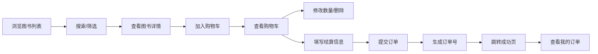

## 1. 产品概述

面向小型书店和独立出版商的在线图书展示与销售微站，解决实体书店线下客流有限、缺乏专业电商技术团队而无法低成本触达线上读者的问题。

- 核心价值：提供低成本、快速搭建的在线售书平台，帮助中小书店拓展线上渠道
- 目标用户：小型书店店主、独立出版商、个人作者

## 2. 核心功能

### 2.1 用户角色

| 角色 | 注册方式 | 核心权限 |
|------|----------|----------|
| 店主/管理员 | 系统预设 | 图书管理、订单管理、查看所有订单 |
| 顾客 | 无需注册 | 浏览图书、搜索筛选、购物车、下单购买、查看个人订单 |

### 2.2 功能模块

1. **图书列表页**：搜索框、价格筛选、分类筛选、图书卡片网格展示
2. **购物车页**：商品列表、数量调整、删除商品、小计/总计、结算表单
3. **订单页**：订单表格、状态标签、订单详情展开
4. **图书管理**：添加图书表单、封面上传、图片压缩

### 2.3 页面详情

| 页面名称 | 模块名称 | 功能描述 |
|---------|---------|----------|
| 图书列表页 | 搜索框 | 支持书名/作者搜索，显示历史搜索记录 |
| 图书列表页 | 价格筛选 | 0-50、50-100、100以上三个区间按钮 |
| 图书列表页 | 分类筛选 | 小说/文学、科技/科普、生活/艺术三类标签 |
| 图书列表页 | 图书卡片 | 封面、书名、作者、价格、加入购物车按钮 |
| 购物车页 | 商品列表 | 展示已选图书，支持数量调整和删除 |
| 购物车页 | 结算表单 | 姓名、电话、地址输入，提交订单 |
| 订单页 | 订单表格 | 订单号、时间、状态、金额，支持展开查看明细 |

## 3. 核心流程

用户浏览图书 → 搜索/筛选图书 → 加入购物车 → 查看购物车 → 填写收货信息 → 提交订单 → 查看订单状态

## 4. 用户界面设计

### 4.1 设计风格

- 主色调：深蓝色 #1E3A5F
- 强调色：金色 #C9A84C
- 背景色：米白色 #FAFAFA
- 按钮风格：圆角4px，点击水波纹动画0.4秒
- 字体：系统字体栈，标题加粗，正文常规
- 布局：顶部固定导航栏，卡片式网格布局
- 图标：使用 lucide-react 图标库

### 4.2 页面设计概述

| 页面名称 | 模块名称 | UI元素 |
|---------|---------|--------|
| 图书列表页 | 导航栏 | 书店名称logo、搜索、购物车（带数量角标）、用户菜单 |
| 图书列表页 | 筛选区 | 价格区间按钮组、分类标签组 |
| 图书列表页 | 卡片网格 | 4列布局，卡片240x360px，悬停上移+阴影加深 |
| 购物车页 | 商品项 | 左侧缩略图，中间书名/作者/价格，右侧数量调整/删除 |
| 购物车页 | 结算区 | 小计/总计金额、收货信息表单、提交按钮 |
| 订单页 | 订单表格 | 状态圆点标签（灰/蓝/橙/绿）、点击展开明细 |

### 4.3 响应式

- 桌面端（≥768px）：4列网格，导航栏高64px，左右留白64px
- 平板端（<768px）：2列网格，导航栏高56px，输入框按钮缩小
- 页面切换：淡入淡出0.3秒

### 4.4 动画效果

- 购物车滑入：向右滑入0.3秒
- 数量变化：数字跳动0.2秒
- 删除商品：向左缩小消失0.3秒
- 卡片悬停：上移4px+阴影加深0.3秒
- 筛选切换：背景色过渡0.2秒
- 按钮点击：水波纹0.4秒
