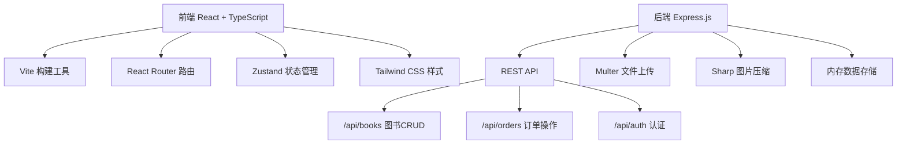
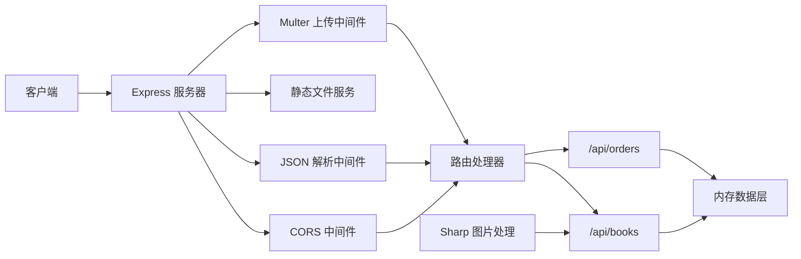
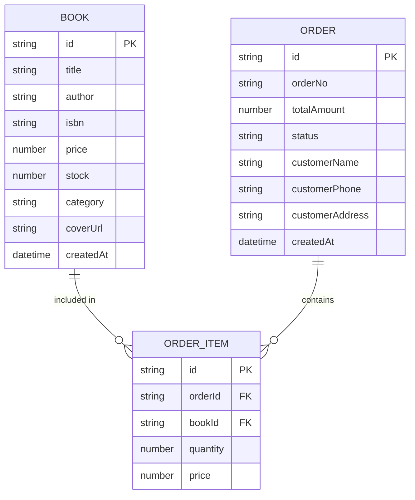

## 1. 架构设计



## 2. 技术描述

- **前端**：React@18 + TypeScript + Vite + React Router DOM@6 + Zustand
- **后端**：Express@4 + TypeScript + Multer + Sharp + UUID
- **样式**：Tailwind CSS 3.x
- **图标**：lucide-react
- **数据存储**：内存存储（开发演示用）
- **构建工具**：Vite 5.x

## 3. 路由定义

| 路由 | 页面 | 用途 |
|------|------|------|
| / | BookList | 图书列表首页 |
| /cart | CartPage | 购物车页面 |
| /orders | OrdersPage | 我的订单页面 |
| /success | OrderSuccess | 订单成功页面 |
| /admin/books | AdminBooks | 图书管理页面 |

## 4. API 定义

### 4.1 类型定义

```typescript
interface Book {
  id: string;
  title: string;
  author: string;
  isbn: string;
  price: number;
  stock: number;
  category: string;
  coverUrl: string;
  createdAt: string;
}

interface CartItem {
  bookId: string;
  book: Book;
  quantity: number;
}

interface Order {
  id: string;
  orderNo: string;
  items: CartItem[];
  totalAmount: number;
  status: 'pending' | 'paid' | 'shipped' | 'completed';
  customerName: string;
  customerPhone: string;
  customerAddress: string;
  createdAt: string;
}
```

### 4.2 接口列表

| 方法 | 路径 | 描述 | 请求体 | 响应 |
|------|------|------|--------|------|
| GET | /api/books | 获取图书列表 | - | Book[] |
| GET | /api/books/:id | 获取单本图书 | - | Book |
| POST | /api/books | 添加图书 | FormData | Book |
| PUT | /api/books/:id | 更新图书 | FormData | Book |
| DELETE | /api/books/:id | 删除图书 | - | { success: boolean } |
| GET | /api/orders | 获取订单列表 | - | Order[] |
| GET | /api/orders/:id | 获取订单详情 | - | Order |
| POST | /api/orders | 创建订单 | OrderCreate | Order |
| PUT | /api/orders/:id/status | 更新订单状态 | { status } | Order |

## 5. 服务器架构



## 6. 数据模型

### 6.1 ER 图



### 6.2 项目文件结构

```
.
├── package.json
├── vite.config.js
├── tsconfig.json
├── index.html
├── server.ts
├── src/
│   ├── main.ts
│   ├── App.tsx
│   ├── api/
│   │   └── apiService.ts
│   ├── pages/
│   │   ├── BookList.tsx
│   │   ├── CartPage.tsx
│   │   ├── OrdersPage.tsx
│   │   └── OrderSuccess.tsx
│   ├── components/
│   │   ├── Navbar.tsx
│   │   ├── BookCard.tsx
│   │   ├── CartItem.tsx
│   │   └── OrderRow.tsx
│   ├── store/
│   │   └── useCartStore.ts
│   ├── types/
│   │   └── index.ts
│   └── utils/
│       └── helpers.ts
└── uploads/
```
