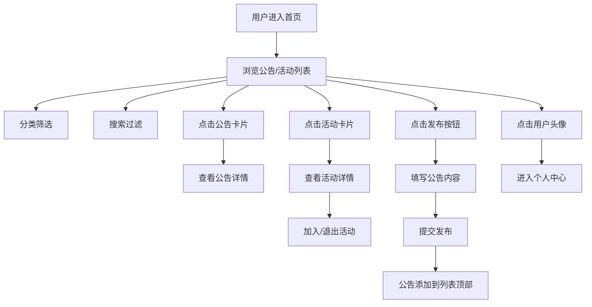

## 1. 产品概述
CommunityCanvas是一个社区公告板与活动组织应用，旨在为社区用户提供一个便捷的信息发布和活动参与平台。注册用户可以发布公告、创建活动并管理参与者，促进社区交流与互动。

- 主要用途：社区信息共享、活动组织与参与管理
- 目标用户：社区居民、兴趣小组、本地组织
- 产品价值：提升社区信息传播效率，促进线下活动组织，增强社区凝聚力

## 2. 核心功能

### 2.1 用户角色
| 角色 | 注册方式 | 核心权限 |
|------|----------|----------|
| 注册用户 | 模拟登录 | 浏览公告/活动、发布公告、创建活动、加入/退出活动、管理个人内容 |

### 2.2 功能模块
1. **首页**：导航栏、公告板网格、活动瀑布流、分类筛选、搜索功能
2. **公告详情页**：公告完整内容、发布者信息、发布时间
3. **活动详情页**：活动详情、参与管理、参与者列表、组织者信息
4. **个人中心**：我的公告、我的活动、退出登录

### 2.3 页面详情
| 页面名称 | 模块名称 | 功能描述 |
|----------|----------|----------|
| 首页 | 导航栏 | Logo、搜索框、用户头像菜单 |
| 首页 | 分类标签栏 | 横向滚动分类筛选（全部/艺术/体育/技术/社交/其他） |
| 首页 | 公告板网格 | 展示公告卡片，支持缩放入场动画 |
| 首页 | 活动瀑布流 | 瀑布流布局展示活动卡片，支持参与进度显示 |
| 首页 | 发布按钮 | 右上角悬浮圆形按钮，点击展开发布模态框 |
| 公告详情页 | 公告内容 | 完整展示公告标题、内容、作者、时间 |
| 活动详情页 | 活动信息 | 活动大图、名称、描述、日期、地点、组织者 |
| 活动详情页 | 参与管理 | 加入/退出活动按钮、参与者列表展示 |
| 个人中心 | 我的内容 | 展示用户发布的公告和参与的活动 |

## 3. 核心流程

### 主要用户流程
1. 用户进入首页，浏览公告和活动列表
2. 通过分类标签或搜索框筛选内容
3. 点击公告卡片查看详情
4. 点击活动卡片查看详情并选择加入/退出
5. 点击悬浮按钮发布新公告
6. 通过个人中心管理自己的内容

## 4. 用户界面设计

### 4.1 设计风格
- 主色调：靛蓝色 #6366f1
- 背景色：浅灰色 #f8fafc
- 强调色：翠绿 #10b981（成功/进度）、红色 #ef4444（警告/错误）
- 按钮风格：圆角胶囊形，悬停变暗效果，点击涟漪动画
- 字体：使用现代无衬线字体，标题18px font-weight 600
- 布局风格：卡片式布局，毛玻璃效果，固定顶部导航
- 图标：使用lucide-react图标库

### 4.2 页面设计概述
| 页面名称 | 模块名称 | UI元素 |
|----------|----------|----------|
| 首页 | 导航栏 | 高64px，白色背景，底部1px浅灰边框，Logo（24px圆角方形，靛蓝背景，白色"CC"），搜索框，用户头像 |
| 首页 | 公告卡片 | 宽280px高200px，圆角12px，毛玻璃效果，左侧4px彩色竖条，标题两行截断，缩放入场动画0.3s |
| 首页 | 活动卡片 | 瀑布流布局每列240px间距16px，圆角12px，毛玻璃效果，参与进度条（绿到橙渐变），悬停上移4px |
| 首页 | 发布按钮 | 直径48px圆形，背景#6366f1，白色加号图标，固定右下角 |
| 活动详情页 | 顶部大图 | 随机渐变背景（如linear-gradient(135deg, #667eea, #764ba2)） |
| 活动详情页 | 参与按钮 | 宽240px高48px，圆角24px，背景#6366f1，文字白色，悬停变暗10% |
| 活动详情页 | 参与者列表 | 圆形头像叠放，超出显示"+N" |

### 4.3 响应式设计
- **桌面端（>=1024px）**：公告网格4列，活动瀑布流3列
- **平板端（768-1023px）**：公告3列，活动2列
- **手机端（<768px）**：公告2列，活动1列，卡片宽度100%，内边距12px

### 4.4 动画效果
- 页面切换：fade过渡0.3s
- 卡片入场：scale(0.8)到scale(1)，0.3s
- 卡片悬停：上移4px，阴影加深，0.2s ease
- 按钮点击：涟漪动画，100%缩放到120%再回弹，0.3s
- 搜索框：宽度200px展开到350px，平滑过渡
