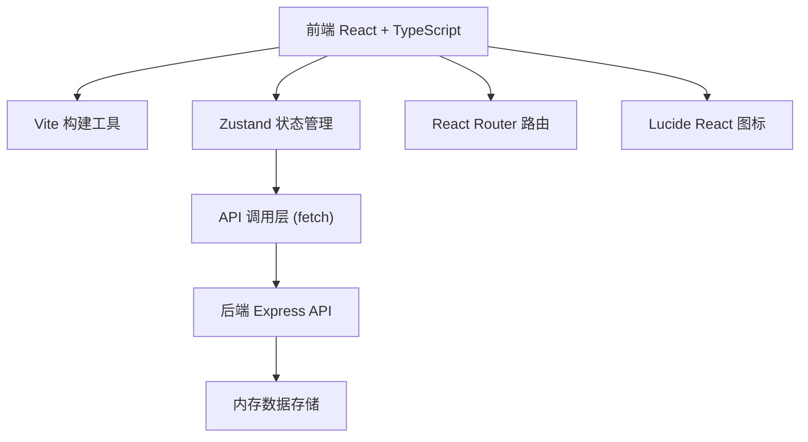
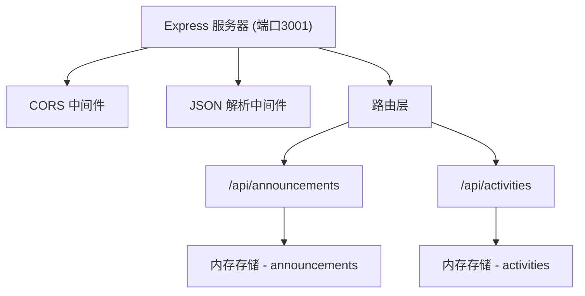
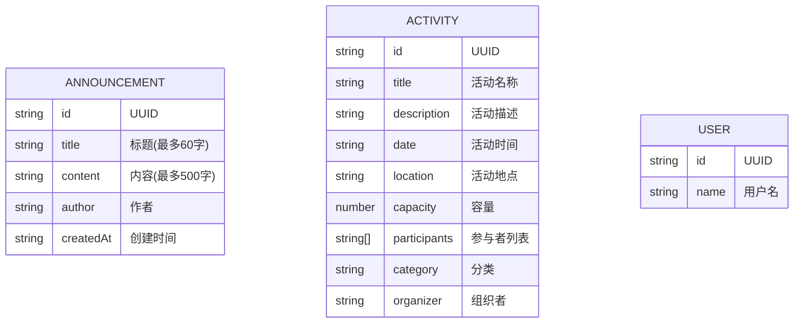

## 1. 架构设计



## 2. 技术描述

- **前端**：React@18 + TypeScript + Vite
- **状态管理**：Zustand
- **路由**：React Router DOM@6
- **图标**：lucide-react
- **后端**：Express@4 + TypeScript
- **数据库**：内存数组存储（开发环境）
- **构建工具**：Vite
- **包管理器**：npm

### 项目初始化
使用 `react-express-ts` 模板初始化项目，包含前后端完整配置。

## 3. 路由定义

| 路由 | 页面 | 用途 |
|------|------|------|
| / | 首页 | 公告板和活动列表 |
| /announcement/:id | 公告详情页 | 展示公告完整内容 |
| /activity/:id | 活动详情页 | 展示活动详情和参与管理 |
| /my | 个人中心 | 我的公告和活动 |

## 4. API 定义

### TypeScript 类型定义

```typescript
// 公告
interface Announcement {
  id: string;
  title: string;
  content: string;
  author: string;
  createdAt: string;
}

// 活动
interface Activity {
  id: string;
  title: string;
  description: string;
  date: string;
  location: string;
  capacity: number;
  participants: string[];
  category: string;
  organizer: string;
}

// 用户
interface User {
  id: string;
  name: string;
  avatar?: string;
}
```

### API 接口

| 方法 | 路径 | 描述 | 请求参数 | 响应 |
|------|------|------|----------|------|
| GET | /api/announcements | 获取公告列表 | - | Announcement[] |
| POST | /api/announcements | 创建公告 | { title, content, author } | Announcement |
| GET | /api/activities | 获取活动列表 | category? | Activity[] |
| POST | /api/activities | 创建活动 | { title, description, date, location, capacity, category, organizer } | Activity |
| POST | /api/activities/join | 加入活动 | { activityId, userId } | Activity |
| POST | /api/activities/leave | 退出活动 | { activityId, userId } | Activity |

## 5. 服务器架构



## 6. 数据模型

### 6.1 数据模型定义



### 6.2 初始数据

启动时自动生成20条模拟公告数据和15条模拟活动数据，用于测试和展示。

## 7. 性能优化

- 公告列表首次加载 < 500ms
- 搜索过滤响应 < 100ms（本地数据过滤，防抖300ms）
- 组件按需渲染，避免不必要的重绘
- 使用 React.memo 优化列表项渲染
