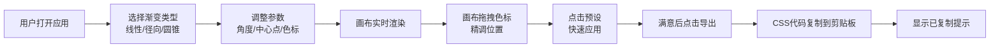

## 1. 产品概述

CSS 渐变调试器是一款面向前端开发者的迷你工具应用，帮助用户快速预览、调试和导出 CSS 渐变效果，解决在 UI 设计过程中反复手写渐变代码、频繁切换工具窗口的效率痛点。

- 核心价值：可视化渐变调试，所见即所得，一键导出 CSS 代码
- 目标用户：前端开发者、UI 设计师
- 产品定位：轻量级、专注渐变效果的开发者工具

## 2. 核心功能

### 2.1 功能模块

1. **渐变控制面板**：渐变类型选择、角度/方向调整、色标编辑器、渐变中心点控制
2. **实时画布预览**：300x300px 画布渲染渐变，支持画布上直接拖拽色标
3. **预设库**：内置 6 种精选渐变预设，一键应用
4. **导出功能**：一键复制完整 CSS 渐变代码到剪贴板，带成功反馈

### 2.2 页面详情

| 页面名称 | 模块名称 | 功能描述 |
|---------|---------|---------|
| 主页面 | 左侧控制面板 | 渐变类型选择器、角度滑块、色标列表编辑器、渐变中心点输入、预设库 |
| 主页面 | 右侧画布区域 | 渐变实时渲染画布、色标拖拽交互、导出按钮 |
| 主页面 | 顶部提示条 | 导出成功后淡入淡出的"已复制"提示 |

## 3. 核心流程

用户打开应用后，默认展示线性渐变效果。用户可通过左侧面板调整渐变类型、角度、色标等参数，右侧画布实时响应。也可直接在画布上拖拽色标精细调整位置，左侧面板同步更新。点击预设卡片可快速应用精选渐变。满意后点击导出按钮，CSS 代码自动复制到剪贴板，并显示 2 秒的"已复制"提示。

## 4. 用户界面设计

### 4.1 设计风格

- **设计定位**：专业开发者工具，深色科技感，简洁精准
- **主色调**：深色背景 `#1E293B`，卡片背景 `#334155`，文字 `#E2E8F0`
- **强调色**：天蓝色 `#38BDF8`，用于聚焦状态、交互元素高亮
- **输入框**：圆角 8px，背景 `#475569`，边框 `#64748B`，聚焦时边框变 `#38BDF8`
- **按钮风格**：强调色填充，悬停放大 1.05 倍，过渡 0.2s
- **字体**：现代无衬线字体，清晰易读，适合开发者工具场景
- **布局风格**：左右两栏卡片式布局，控件间距统一为 16px

### 4.2 页面设计概览

| 页面名称 | 模块名称 | UI 元素 |
|---------|---------|--------|
| 主页面 | 左侧控制面板 | 类型选择器（分段控件）、角度滑块（带数值显示）、色标列表（可添加/删除/拖动）、中心点坐标输入（仅径向/圆锥）、预设库（卡片网格） |
| 主页面 | 右侧画布区域 | 300x300px 画布（棋盘格背景体现透明度）、色标拖拽点（圆形 16px，选中白色描边）、导出按钮 |
| 主页面 | 提示条 | 从顶部滑入/滑出，淡入淡出 0.3s，停留 2s |

### 4.3 响应式设计

- 桌面端：左右两栏布局，左侧面板固定 320px，右侧画布区域自适应
- 移动端（< 768px）：改为上下排列，左侧面板宽度占满，画布宽高自适应
- 触摸优化：色标拖拽点增大热区，确保触摸设备可操作

### 4.4 交互动效

- **悬停反馈**：按钮和可点击元素悬停时放大 1.05 倍，过渡 0.2s
- **色标拖拽**：选中时外围白色描边，拖拽时上方显示百分比数值（带小数点）
- **导出提示**：从顶部滑入（0.3s）→ 停留 2s → 滑出（0.3s），带淡入淡出
- **画布渲染**：使用 requestAnimationFrame 驱动，确保 60FPS 流畅度
- **预设卡片**：悬停轻微上浮 + 阴影加深

### 4.5 预设库

内置 6 种精选渐变效果：

| 预设名称 | 风格描述 |
|---------|---------|
| 日落 Sunset | 暖橙到紫红的横向渐变 |
| 海洋 Ocean | 深蓝到浅青的纵向渐变 |
| 极光 Aurora | 绿蓝紫交织的径向渐变 |
| 霓虹 Neon | 粉紫蓝的鲜艳圆锥渐变 |
| 金属 Metal | 银灰到深灰的线性金属质感 |
| 柔和 Pastel | 粉蓝紫的柔和线性渐变 |

预设卡片尺寸：宽 120px × 高 80px，圆角 12px，阴影 `0 4px 12px rgba(0,0,0,0.1)`。
