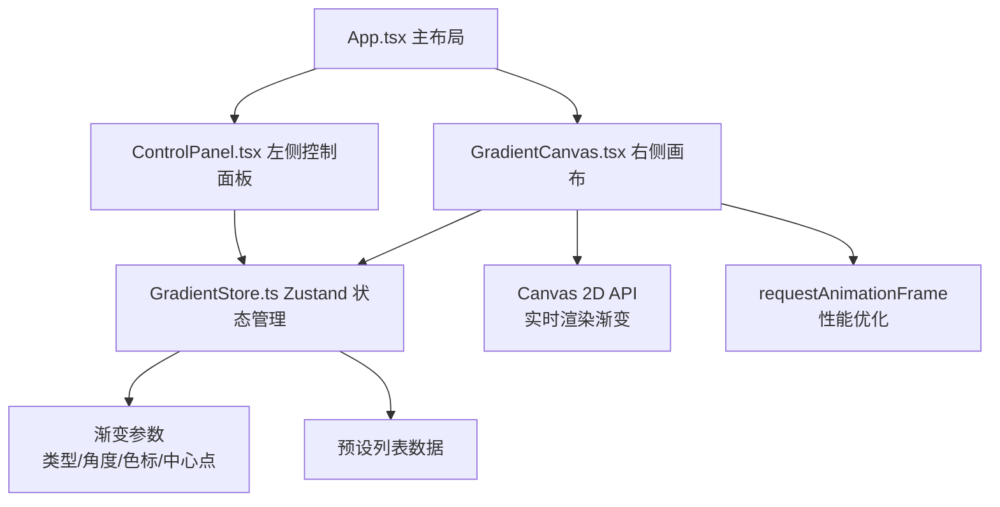

## 1. 架构设计



纯前端单页应用，采用 React 组件化架构，Zustand 管理全局渐变状态。画布组件使用 Canvas 2D API 进行实时渲染，通过 requestAnimationFrame 确保流畅度。

## 2. 技术选型

- **前端框架**：React 18 + TypeScript
- **构建工具**：Vite
- **状态管理**：Zustand
- **唯一标识**：uuid（色标 ID 生成）
- **渲染方式**：Canvas 2D API（渐变渲染 + 色标绘制）
- **样式方案**：原生 CSS（深色主题，CSS 变量统一管理）

## 3. 文件结构

```
src/
├── main.tsx              # 应用入口
├── App.tsx               # 主布局组件（左右两栏）
├── GradientCanvas.tsx    # 画布组件（渐变渲染 + 色标拖拽）
├── ControlPanel.tsx      # 左侧控制面板（参数调节 + 预设库）
└── GradientStore.ts      # Zustand 状态管理
```

根目录文件：
- `package.json` - 依赖与脚本
- `vite.config.js` - Vite 配置
- `tsconfig.json` - TypeScript 配置（严格模式，target es2020）
- `index.html` - 入口 HTML

## 4. 数据模型

### 4.1 色标数据结构

```typescript
interface ColorStop {
  id: string;       // 唯一标识（uuid）
  color: string;    // 颜色值（hex 或 rgba）
  position: number; // 位置百分比，0-100
}
```

### 4.2 渐变类型

```typescript
type GradientType = 'linear' | 'radial' | 'conic';
```

### 4.3 渐变状态

```typescript
interface GradientState {
  type: GradientType;
  angle: number;           // 线性渐变角度（度）
  centerX: number;         // 径向/圆锥渐变中心 X（百分比 0-100）
  centerY: number;         // 径向/圆锥渐变中心 Y（百分比 0-100）
  colorStops: ColorStop[]; // 色标数组
  presets: Preset[];       // 预设列表
}
```

### 4.4 预设数据

```typescript
interface Preset {
  id: string;
  name: string;
  type: GradientType;
  angle: number;
  centerX: number;
  centerY: number;
  colorStops: Omit<ColorStop, 'id'>[];
}
```

## 5. 核心方法

### 5.1 Store 方法

```typescript
// 更新渐变类型
setType(type: GradientType): void

// 更新角度
setAngle(angle: number): void

// 更新中心点
setCenter(x: number, y: number): void

// 添加色标
addColorStop(position?: number): void

// 删除色标
removeColorStop(id: string): void

// 更新色标颜色
updateColorStopColor(id: string, color: string): void

// 更新色标位置
updateColorStopPosition(id: string, position: number): void

// 应用预设
applyPreset(presetId: string): void
```

### 5.2 画布渲染方法

- `drawGradient()` - 绘制渐变背景
- `drawColorStops()` - 绘制色标拖拽点
- `handleCanvasMouseDown()` - 开始拖拽
- `handleCanvasMouseMove()` - 拖拽中更新
- `handleCanvasMouseUp()` - 结束拖拽
- `generateCSS()` - 生成 CSS 渐变代码

## 6. 性能优化策略

1. **requestAnimationFrame 驱动渲染**：所有参数变化通过 rAF 批量处理，避免高频重绘
2. **脏标记模式**：仅在参数实际变化时触发重绘
3. **离屏 Canvas**：渐变背景缓存，色标单独绘制层
4. **事件节流**：鼠标移动事件使用 rAF 节流，防止高频触发
5. **Zustand 选择器**：组件只订阅所需状态切片，减少不必要重渲染

## 7. 响应式实现

使用 CSS Media Query 实现响应式布局：
- `>= 768px`：flex 横向布局，左侧 320px 固定，右侧 flex-1
- `< 768px`：flex 纵向布局，两侧宽度 100%，画布自适应最大宽度
