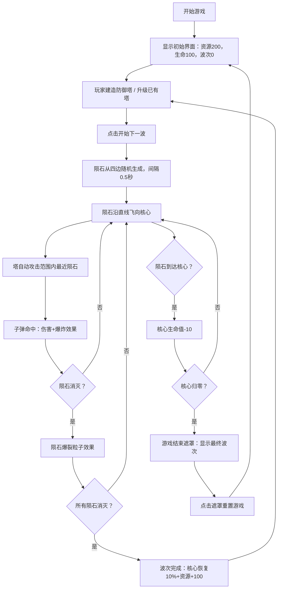

## 1. 产品概述

MeteorGuard是一款基于浏览器的塔防游戏，玩家通过建造防御塔抵御不断来袭的陨石，保护地图中央的能量核心。游戏采用波次推进制，难度随波次递增，考验玩家的策略规划和资源管理能力。

- 主要目的：提供轻松刺激的策略塔防体验，通过建造、升级防御塔抵御陨石攻击
- 目标用户：休闲游戏玩家、塔防游戏爱好者
- 产品价值：在浏览器中即可获得流畅的塔防游戏体验，无需安装额外软件，支持响应式移动端游玩

## 2. 核心功能

### 2.1 功能模块

1. **游戏主界面**：800x800px游戏地图、网格系统、能量核心、资源显示面板、建造操作面板
2. **能量核心保护系统**：核心生命值管理、陨石撞击伤害、游戏结束判定与重置
3. **波次推进系统**：陨石数量/速度/生命值递增、波次奖励（核心恢复+资源）、胜利动画
4. **防御塔建造与升级**：网格位置点击建造、塔等级系统（1级白色→2级蓝色）、资源消耗机制
5. **攻击与碰撞系统**：塔自动攻击最近陨石、子弹飞行、碰撞检测、伤害计算、爆炸粒子效果
6. **陨石路径系统**：直线飞行、第5波起随机侧移偏移、生成位置随机化
7. **游戏状态管理**：Zustand全局状态、资源自动增长、波次进度、实体生命周期

### 2.2 页面详情

| 页面名称 | 模块名称 | 功能描述 |
|-----------|-------------|---------------------|
| 游戏主界面 | 资源面板 | 显示核心生命值（红色血条）、资源数（金色数字）、当前波次（白色字体） |
| 游戏主界面 | 游戏地图 | 800x800px居中地图，灰色网格线#2A2F3A，网格交点光点 |
| 游戏主界面 | 能量核心 | 地图中央坐标(400,400)，生命值100，受陨石撞击扣血 |
| 游戏主界面 | 建造面板 | 右下角「建造防御塔」和「开始下一波」按钮，圆角8px，悬停高亮 |
| 游戏主界面 | 建造气泡 | 点击空白网格弹出确认气泡，圆角8px，深色背景带阴影 |
| 游戏主界面 | 游戏结束遮罩 | 全屏渐变遮罩，显示最终波次，点击重置游戏 |

## 3. 核心流程

玩家进入游戏 → 查看初始资源（200）和核心生命值（100）→ 点击空白网格位置建造防御塔（消耗150资源）→ 点击「开始下一波」启动第1波 → 陨石从四边生成并飞向核心 → 塔自动攻击范围内陨石 → 子弹命中造成伤害并产生爆炸效果 → 陨石到达核心扣除生命值 → 所有陨石消灭或核心归零 → 波次完成奖励（核心恢复10%+100资源）或游戏结束 → 继续下一波或重置游戏

## 4. 用户界面设计

### 4.1 设计风格

- **主色调**：深空背景#0B0E14，半透明泛光边框#1E3A5F（50%透明度）
- **强调色**：核心生命红色#FF3333，资源金色#FFD700，按钮深蓝#1E3A5F，悬停高亮#2E5A8F
- **陨石色**：橙红渐变#FF4500到#FF6347，爆炸黄色#FFD700
- **塔外观**：1级白色，2级蓝色#4B9EFF
- **按钮样式**：圆角8px，背景深蓝，悬停高亮，过渡动画0.2s ease
- **字体**：标题白色24px带蓝色文字阴影，资源数字金色16px，正文白色
- **布局风格**：地图居中70%区域，资源面板左侧，建造面板右下角，标题左上角
- **动效**：血条宽度过渡0.5s，按钮悬停0.2s，屏幕抖动0.1s，胜利动画0.5s

### 4.2 页面设计概览

| 页面名称 | 模块名称 | UI元素 |
|-----------|-------------|-------------|
| 游戏主界面 | 标题区域 | MeteorGuard白色24px，文字阴影0 2px 8px rgba(0,150,255,0.6) |
| 游戏主界面 | 资源面板 | 红色血条（200x20px），金色资源数字16px，白色波次文字 |
| 游戏主界面 | 游戏地图 | 800x800px居中，灰色网格#2A2F3A，网格交点光点，泛光边框 |
| 游戏主界面 | 能量核心 | 坐标(400,400)，发光能量球效果 |
| 游戏主界面 | 建造面板 | 右下角双按钮，间距8px，圆角8px，深蓝背景悬停高亮 |
| 游戏主界面 | 建造气泡 | 圆角8px，背景#1A1F2E，阴影0 4px 12px rgba(0,0,0,0.5) |
| 游戏主界面 | 游戏结束 | 全屏半透明白到黑渐变遮罩，游戏结束文字+最终波次 |

### 4.3 响应式

- **桌面端**：地图800x800px固定尺寸居中，按钮字号正常
- **移动端**：地图宽度缩放至屏幕宽度的90%，高度等比缩放，按钮字号缩小为14px，资源面板字号适配缩小
- **触控优化**：所有可点击元素保持足够触控区域，建造气泡和按钮适配触控操作

### 4.4 粒子与特效规范

- **子弹命中爆炸**：0.3秒黄色闪光#FFD700，半径15px，5个随机小点（半径2-4px向四周扩散）
- **陨石消灭爆裂**：0.5秒橙红色效果，10个粒子（半径3-6px随机方向扩散并逐渐消失）
- **屏幕抖动**：陨石被击中时0.1秒轻微抖动
- **胜利动画**：波次完成后地图边缘闪烁白光0.5秒
- **陨石外观**：橙红渐变#FF4500→#FF6347，半径12px圆形
- **子弹外观**：1级塔白色圆形半径4px，2级塔蓝色圆形半径4px
- **塔外观**：1级白色方形，2级蓝色#4B9EFF方形，等级视觉区分
