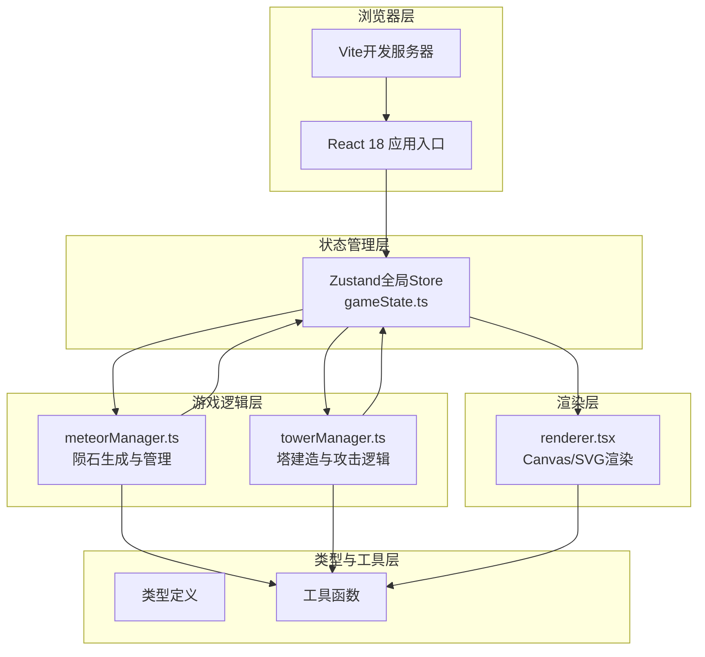

## 1. 架构设计



## 2. 技术描述

- **前端框架**：React@18 + React-DOM@18
- **构建工具**：Vite（使用@vitejs/plugin-react插件）
- **状态管理**：Zustand全局状态管理
- **开发语言**：TypeScript（严格模式，target es2020）
- **唯一标识**：uuid库
- **初始化工具**：vite-init脚手架，选择react-ts模板
- **样式方案**：原生CSS + CSS Modules（或内联样式，保持简洁），CSS变量管理设计token
- **渲染方案**：Canvas 2D API进行游戏实体渲染（性能优先，60fps要求）
- **游戏循环**：requestAnimationFrame驱动，避免setInterval

## 3. 文件结构与职责

```
auto115/
├── .trae/documents/          # 项目文档
│   ├── prd.md                # 产品需求文档
│   └── tech-architecture.md  # 技术架构文档
├── index.html                # 入口页面，深色星空背景，标题MeteorGuard
├── package.json              # 依赖与脚本配置
├── vite.config.js            # Vite + React插件配置
├── tsconfig.json             # TypeScript严格模式配置
└── src/
    ├── main.tsx              # React应用入口
    ├── App.tsx               # 根组件，集成渲染器与游戏循环
    ├── modules/
    │   ├── gameLogic/
    │   │   ├── gameState.ts  # Zustand全局Store：核心生命、资源、波次、实体列表
    │   │   ├── meteorManager.ts  # 陨石生成、位置更新、路径计算、侧移逻辑
    │   │   └── towerManager.ts   # 塔建造、升级、攻击、子弹管理、碰撞检测
    │   └── ui/
    │       ├── renderer.tsx  # Canvas渲染组件：地图、网格、核心、塔、陨石、子弹、粒子
    │       ├── ResourceBar.tsx   # 左侧资源面板组件
    │       ├── BuildPanel.tsx    # 右下角建造面板组件
    │       ├── BuildBubble.tsx   # 建造确认气泡组件
    │       └── GameOverMask.tsx  # 游戏结束遮罩组件
    ├── types/
    │   └── game.ts           # 全局类型定义：Meteor、Tower、Bullet、Particle等
    └── utils/
        └── math.ts           # 数学工具：距离计算、向量运算、坐标转换
```

## 4. 核心数据模型定义

### 4.1 实体类型

```typescript
// 坐标点
interface Point {
  x: number;
  y: number;
}

// 陨石实体
interface Meteor {
  id: string;
  x: number;
  y: number;
  hp: number;
  maxHp: number;
  speed: number;           // 单位/秒
  radius: number;          // 12px
  angle: number;           // 朝向核心的角度（弧度）
  hasSideShift: boolean;   // 是否有随机侧移
  sideShiftPhase: number;  // 侧移相位角度偏移
  sideShiftTimer: number;  // 侧移计时器
}

// 防御塔实体
interface Tower {
  id: string;
  gridX: number;           // 网格x索引
  gridY: number;           // 网格y索引
  x: number;               // 实际x坐标
  y: number;               // 实际y坐标
  level: 1 | 2;            // 等级
  range: number;           // 100px
  fireInterval: number;    // 发射间隔ms
  lastFireTime: number;    // 上次发射时间戳
  damage: number;          // 伤害
  bulletSpeed: number;     // 子弹速度
  color: string;           // 塔颜色
}

// 子弹实体
interface Bullet {
  id: string;
  x: number;
  y: number;
  targetMeteorId: string;
  speed: number;
  damage: number;
  radius: number;          // 4px
  color: string;
  vx: number;              // 速度x分量（预计算）
  vy: number;              // 速度y分量（预计算）
}

// 粒子效果实体
interface Particle {
  id: string;
  x: number;
  y: number;
  vx: number;
  vy: number;
  radius: number;
  color: string;
  life: number;            // 剩余生命值ms
  maxLife: number;         // 总生命值ms
}
```

### 4.2 游戏状态Store

```typescript
interface GameState {
  // 核心状态
  coreHp: number;           // 0-100
  coreMaxHp: number;        // 100
  corePosition: Point;      // {x:400, y:400}
  
  // 玩家资源
  resources: number;        // 初始200
  lastResourceTick: number; // 上次资源自动增加时间
  
  // 波次状态
  currentWave: number;      // 初始0（未开始）
  isWaveActive: boolean;    // 波次进行中标志
  waveMeteorTotal: number;  // 当前波总陨石数
  waveMeteorSpawned: number; // 已生成陨石数
  lastSpawnTime: number;    // 上次生成陨石时间
  isVictoryAnimating: boolean; // 胜利动画标志
  victoryAnimStart: number;    // 胜利动画开始时间
  
  // 实体列表
  meteors: Meteor[];
  towers: Tower[];
  bullets: Bullet[];
  particles: Particle[];
  
  // 屏幕抖动
  screenShake: number;      // 抖动剩余时间ms
  screenShakeStart: number; // 抖动开始时间
  
  // UI状态
  buildBubblePosition: Point | null; // 建造气泡位置
  selectedTowerId: string | null;    // 选中的塔ID
  insufficientResourceMsg: string | null; // 资源不足提示
  insufficientResourceTime: number;  // 资源不足提示开始时间
  isGameOver: boolean;      // 游戏结束标志
  finalWave: number;        // 最终到达波次
  
  // Actions
  updateCoreHp: (delta: number) => void;
  deductResources: (amount: number) => boolean;
  addResources: (amount: number) => void;
  startWave: () => void;
  completeWave: () => void;
  addMeteor: (meteor: Meteor) => void;
  removeMeteor: (id: string) => void;
  addTower: (tower: Tower) => void;
  upgradeTower: (id: string) => boolean;
  addBullet: (bullet: Bullet) => void;
  removeBullet: (id: string) => void;
  addParticles: (particles: Particle[]) => void;
  setBuildBubble: (pos: Point | null) => void;
  selectTower: (id: string | null) => void;
  showInsufficientResource: (msg: string) => void;
  triggerScreenShake: () => void;
  triggerVictoryAnimation: () => void;
  resetGame: () => void;
}
```

## 5. 核心算法与性能优化

### 5.1 游戏循环（requestAnimationFrame）

```
每帧执行流程（目标<16ms）：
1. 计算deltaTime（上次帧到当前帧的时间差）
2. 资源自动增长检查（每10秒+50）
3. 波次进行中：生成陨石（间隔0.5秒）
4. 更新陨石位置：速度*deltaTime，处理侧移偏移
5. 检查陨石是否到达核心：距离<(核心半径+陨石半径)
6. 更新塔攻击计时器：遍历塔，查找范围内最近陨石，发射子弹
7. 更新子弹位置：vx/vy*deltaTime
8. 碰撞检测：子弹与陨石距离判断（空间复杂度优化：按网格分桶）
9. 更新粒子生命周期：life-deltaTime，透明度衰减
10. 屏幕抖动效果更新
11. 资源不足提示计时
12. 胜利动画计时
13. Canvas重绘
```

### 5.2 碰撞检测优化

- 使用**空间分桶**：将800x800地图划分为100x100网格（8x8桶）
- 子弹仅与所在桶及相邻桶的陨石进行距离判断
- 距离判断优化：使用平方距离避免开方运算
- 最多50颗陨石时，单帧碰撞计算<2ms

### 5.3 性能指标

- 帧率目标：稳定60fps
- 单帧计算预算：<16ms
- 关键路径耗时分布：
  - 实体位置更新：<3ms
  - 塔攻击+碰撞检测：<5ms
  - 粒子更新：<2ms
  - Canvas渲染：<6ms

## 6. 关键常量配置

| 常量 | 值 | 说明 |
|------|-----|------|
| MAP_WIDTH | 800 | 地图宽度px |
| MAP_HEIGHT | 800 | 地图高度px |
| GRID_SIZE | 100 | 网格大小px |
| CORE_X | 400 | 核心x坐标 |
| CORE_Y | 400 | 核心y坐标 |
| CORE_RADIUS | 30 | 核心半径px |
| CORE_MIN_DIST | 50 | 塔与核心最小距离px |
| METEOR_BASE_COUNT | 5 | 第1波陨石数量 |
| METEOR_COUNT_INCREMENT | 3 | 每波陨石增加数量 |
| METEOR_BASE_SPEED | 1.5 | 初始陨石速度单位/秒 |
| METEOR_SPEED_INCREMENT | 0.3 | 每波陨石速度增加 |
| METEOR_RADIUS | 12 | 陨石半径px |
| METEOR_HP | 10 | 陨石初始生命值 |
| METEOR_MIN_DIST_CORE | 350 | 陨石生成距核心最小距离px |
| METEOR_SPAWN_INTERVAL | 500 | 陨石生成间隔ms |
| SIDE_SHIFT_START_WAVE | 5 | 侧移起始波次 |
| SIDE_SHIFT_PROB | 0.2 | 侧移概率 |
| SIDE_SHIFT_ANGLE | 0.087 | ±5度弧度值 |
| SIDE_SHIFT_DURATION | 2000 | 侧移持续ms |
| TOWER_COST | 150 | 建造塔消耗资源 |
| TOWER_UPGRADE_COST | 100 | 升级塔消耗资源 |
| TOWER_RANGE | 100 | 塔攻击范围px |
| TOWER_FIRE_INTERVAL_L1 | 2000 | 1级塔发射间隔ms |
| TOWER_FIRE_INTERVAL_L2 | 1500 | 2级塔发射间隔ms |
| TOWER_DAMAGE_L1 | 10 | 1级塔伤害 |
| TOWER_DAMAGE_L2 | 15 | 2级塔伤害 |
| BULLET_RADIUS | 4 | 子弹半径px |
| BULLET_SPEED | 5 | 子弹速度单位/秒 |
| WAVE_COMPLETE_CORE_RECOVERY | 0.1 | 波次完成核心恢复比例 |
| WAVE_COMPLETE_RESOURCE_BONUS | 100 | 波次完成资源奖励 |
| RESOURCE_TICK_INTERVAL | 10000 | 资源自动增加间隔ms |
| RESOURCE_TICK_AMOUNT | 50 | 资源自动增加数量 |
| SCREEN_SHAKE_DURATION | 100 | 屏幕抖动持续ms |
| VICTORY_ANIM_DURATION | 500 | 胜利动画持续ms |
| INSUFFICIENT_MSG_DURATION | 1000 | 资源不足提示持续ms |
