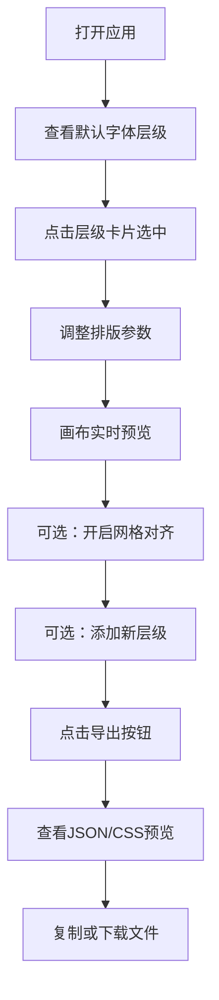

## 1. 产品概述

TypeScalePro 是一款在线字体排版规范生成器，帮助设计团队快速创建和调整字体层级系统，支持实时预览、网格对齐和规范导出，解决了传统PPT排版规范制作耗时、缺乏互动性的问题。

- 核心价值：让设计师直观地调整字体层级参数，实时预览效果，并一键导出可复用的设计规范
- 目标用户：UI设计师、品牌设计师、前端开发人员
- 产品定位：极简、专业的字体排版设计工具

## 2. 核心功能

### 2.1 用户角色
| 角色 | 注册方式 | 核心权限 |
|------|----------|----------|
| 访客用户 | 无需注册 | 完整使用所有功能，创建、调整、导出字体规范 |

### 2.2 功能模块
1. **主界面**：左侧预览画布 + 右侧设置面板 + 底部工具栏
2. **字体层级管理**：添加、编辑、选中、删除字体层级（最多6层）
3. **实时预览**：画布实时渲染选中层级的文本样式
4. **网格对齐**：可选4px/8px基底网格，辅助行高和基线调整
5. **导出功能**：支持导出JSON配置和CSS变量，一键复制或下载

### 2.3 页面详情
| 页面名称 | 模块名称 | 功能描述 |
|----------|----------|----------|
| 主页面 | 预览画布 | 实时显示选中层级的文本样式，支持背景网格，带淡入过渡动画 |
| 主页面 | 设置面板 | 字体层级卡片列表，每个卡片可展开编辑名称、字体族、字号、行高、字重、字距 |
| 主页面 | 底部工具栏 | 添加层级按钮、导出按钮，固定居中布局 |
| 主页面 | 导出模态框 | 显示JSON和CSS导出内容预览，支持复制和下载 |

## 3. 核心流程

用户打开应用 → 查看默认字体层级 → 点击右侧层级卡片选中 → 调整字号/行高/字重等参数 → 左侧画布实时预览 → 开启网格对齐辅助调整 → 添加新的层级（最多6个） → 点击导出按钮 → 查看JSON和CSS预览 → 复制或下载文件

## 4. 用户界面设计

### 4.1 设计风格
- **设计理念**：极简主义，以内容为中心，弱化界面干扰
- **主色调**：蓝色 #3B82F6（强调色），用于按钮、滑块、选中状态
- **中性色**：#FAFAFA（纯白背景）、#F0F0F0（面板背景）、#E0E0E0（边框/网格）、#D1D5DB（滑块轨道）
- **按钮风格**：圆角8px，主按钮蓝色填充白色文字，次按钮白底蓝边
- **字体**：界面文本使用系统无衬线字体，预览文本可切换10种Google Fonts
- **布局风格**：左右分栏（桌面）、上下分栏（移动端），卡片式层级列表
- **交互细节**：滑块拖动显示tooltip、选中层级卡片左侧强调色条、文本淡入过渡动画

### 4.2 页面设计概述
| 页面名称 | 模块名称 | UI元素 |
|----------|----------|--------|
| 主页面 | 预览画布 | 70%宽度，#FAFAFA背景，居中文本示例，字号行高标注，可选点状网格，0.2s淡入动画 |
| 主页面 | 设置面板 | 30%宽度，#F0F0F0背景，1px左边框，可滚动层级卡片列表 |
| 主页面 | 层级卡片 | 100%宽度，16px内边距，底部边框，悬停左侧强调色条，选中背景#EFF6FF，向下展开箭头 |
| 主页面 | 滑块控件 | #D1D5DB轨道，#3B82F6圆点，实时数值tooltip，配套数值输入框 |
| 主页面 | 底部工具栏 | 56px高度，居中布局，24px按钮间距，各120px宽度 |
| 主页面 | 导出模态框 | 半透明遮罩，居中卡片，双标签页切换JSON/CSS，复制和下载按钮 |

### 4.3 响应式设计
- **桌面端**（≥768px）：左右分栏，预览画布70%，设置面板30%
- **移动端**（<768px）：上下排列，预览画布固定高度300px，设置面板可滚动
- **触摸优化**：滑块和按钮增大点击区域，适配触摸操作

## 5. 性能约束
- 所有操作（修改属性、切换层级）响应时间≤16ms（60fps）
- 预览画布文本渲染无明显闪烁或重排
- 状态更新采用批量更新策略，避免不必要的重渲染
