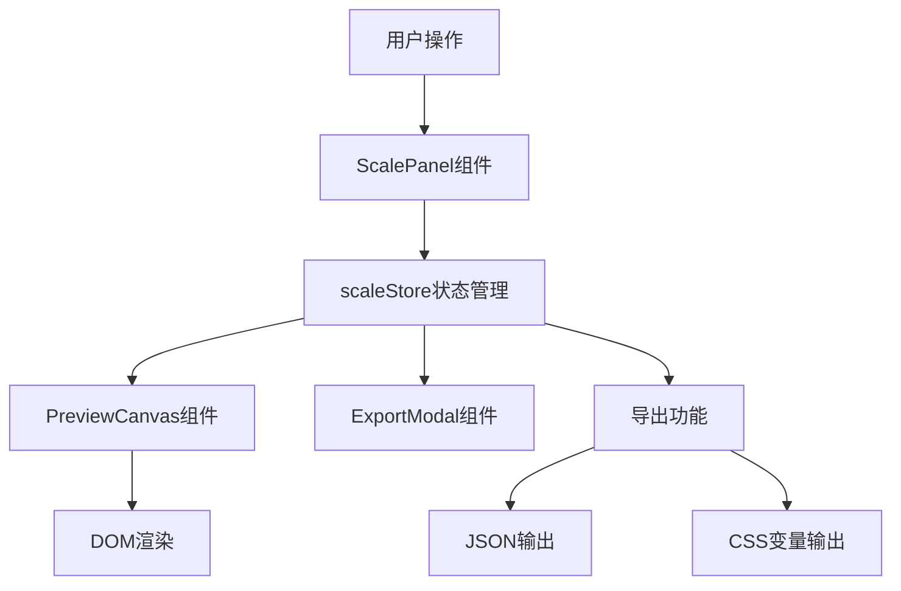

## 1. 架构设计



## 2. 技术栈描述

- **前端框架**：React@18 + TypeScript
- **构建工具**：Vite
- **状态管理**：Zustand
- **路由**：react-router-dom@6（单页应用，预留扩展）
- **唯一ID生成**：uuid
- **样式方案**：原生CSS + CSS变量（不使用Tailwind CSS，按用户需求精确控制样式）

**初始化命令**（Windows环境）：
```
npm init vite-init@latest -y . "--" --template react-ts --force
```

**依赖包**：
- react@18.2.0
- react-dom@18.2.0
- zustand@^4.5.0
- uuid@^9.0.0
- react-router-dom@^6.22.0
- @types/uuid@^9.0.0
- typescript@^5.4.0
- vite@^5.2.0
- @vitejs/plugin-react@^4.2.0

## 3. 项目文件结构

```
auto117/
├── .trae/
│   └── documents/
│       ├── PRD_TypeScalePro.md
│       └── TechArch_TypeScalePro.md
├── index.html
├── package.json
├── tsconfig.json
├── vite.config.js
└── src/
    ├── main.tsx                    # 入口文件，渲染App并注入全局样式
    ├── App.tsx                     # 根组件，布局容器
    ├── store/
    │   └── scaleStore.ts           # Zustand状态管理
    ├── components/
    │   ├── PreviewCanvas.tsx       # 左侧预览画布
    │   ├── ScalePanel.tsx          # 右侧设置面板
    │   ├── ScaleCard.tsx           # 字体层级卡片（子组件）
    │   ├── SliderControl.tsx       # 滑块控件（子组件）
    │   ├── Toolbar.tsx             # 底部工具栏
    │   └── ExportModal.tsx         # 导出模态框
    ├── types/
    │   └── index.ts                # TypeScript类型定义
    ├── utils/
    │   └── fontList.ts             # Google Fonts预置列表
    └── styles/
        └── globals.css             # 全局样式
```

**文件调用关系**：
1. `main.tsx` → 渲染 `App.tsx`
2. `App.tsx` → 组合 `PreviewCanvas`、`ScalePanel`、`Toolbar`、`ExportModal`
3. `ScalePanel.tsx` → 渲染多个 `ScaleCard.tsx`，每个 `ScaleCard` 使用 `SliderControl.tsx`
4. 所有组件通过 `scaleStore.ts` 共享状态
5. `ExportModal.tsx` 从 `scaleStore.ts` 读取数据生成导出内容

**数据流向**：
- 用户操作 → `ScalePanel`/`Toolbar` → 调用 `scaleStore` 更新方法 → 状态变更 → `PreviewCanvas`/`ScalePanel` 重渲染

## 4. 核心数据模型

### 4.1 TypeScript类型定义

```typescript
// 字体层级接口
interface FontScaleLevel {
  id: string;
  name: string;           // 层级名称，如"H1"
  fontFamily: string;     // 字体族
  fontSize: number;       // 字号（px），范围16-96
  lineHeight: number;     // 行高，范围1.0-2.0
  fontWeight: number;     // 字重，范围100-900
  letterSpacing: number;  // 字距（em），范围-0.05到0.15
}

// 导出配置接口
interface ExportConfig {
  levels: FontScaleLevel[];
  generatedAt: string;
}

// 网格配置
type GridBase = 4 | 8 | null;
```

### 4.2 Store状态结构

```typescript
interface ScaleStore {
  // 状态
  levels: FontScaleLevel[];
  selectedLevelId: string | null;
  gridBase: GridBase;
  showExportModal: boolean;
  
  // 操作方法
  addLevel: () => void;
  updateLevel: (id: string, updates: Partial<FontScaleLevel>) => void;
  selectLevel: (id: string) => void;
  setGridBase: (base: GridBase) => void;
  toggleExportModal: () => void;
  getExportJSON: () => string;
  getExportCSS: () => string;
}
```

### 4.3 初始数据

```typescript
// 默认3个层级：H1, H2, Body
const defaultLevels: FontScaleLevel[] = [
  {
    id: uuid(),
    name: 'H1',
    fontFamily: 'Inter',
    fontSize: 48,
    lineHeight: 1.2,
    fontWeight: 700,
    letterSpacing: 0,
  },
  {
    id: uuid(),
    name: 'H2',
    fontFamily: 'Inter',
    fontSize: 32,
    lineHeight: 1.3,
    fontWeight: 600,
    letterSpacing: 0,
  },
  {
    id: uuid(),
    name: 'Body',
    fontFamily: 'Inter',
    fontSize: 16,
    lineHeight: 1.6,
    fontWeight: 400,
    letterSpacing: 0,
  },
];
```

## 5. 核心组件说明

### 5.1 PreviewCanvas.tsx
- 职责：实时渲染选中层级的文本样式
- 监听：`selectedLevelId` 和对应层级的所有属性
- 渲染内容：
  - 可选的点状背景网格（CSS radial-gradient）
  - 文本示例："The quick brown fox jumps over the lazy dog 0123456789"
  - 底部标注：字号和行高数值
- 动画：切换层级时 opacity 0→1，0.2s 过渡

### 5.2 ScalePanel.tsx
- 职责：渲染字体层级卡片列表
- 监听：`levels` 数组、`selectedLevelId`
- 包含：
  - 网格对齐切换按钮（4px/8px/关闭）
  - ScaleCard 列表，最多6个

### 5.3 ScaleCard.tsx
- 职责：单个字体层级的编辑界面
- Props：`level: FontScaleLevel`, `isSelected: boolean`
- 状态：`isExpanded: boolean`（选中时自动展开）
- 包含：
  - 名称输入框
  - 字体族下拉选择（10种Google Fonts）
  - 6个SliderControl（字号、行高、字重、字距）

### 5.4 SliderControl.tsx
- 职责：可复用的滑块+输入框控件
- Props：`label`, `value`, `min`, `max`, `step`, `onChange`, `unit?`
- 交互：拖动滑块时显示tooltip，输入框支持直接输入数值

### 5.5 ExportModal.tsx
- 职责：显示导出内容预览，支持复制和下载
- 内容：
  - 标签页切换：JSON / CSS
  - 代码块显示导出内容
  - 一键复制按钮
  - 下载.json文件按钮

## 6. 性能优化策略

1. **状态选择优化**：使用 Zustand 的 selector 精确订阅需要的状态，避免不必要的重渲染
2. **批量更新**：滑块拖动时使用 `requestAnimationFrame` 批量更新状态
3. **CSS过渡优化**：仅对 opacity 和 transform 做过渡，避免触发布局重排
4. **Memo优化**：使用 `React.memo` 包裹 ScaleCard 和 SliderControl，props 未变化时跳过渲染
5. **字体预加载**：提前预加载Google Fonts，避免切换字体时的FOIT
6. **CSS变量缓存**：将常用颜色值定义为CSS变量，便于维护和渲染优化
