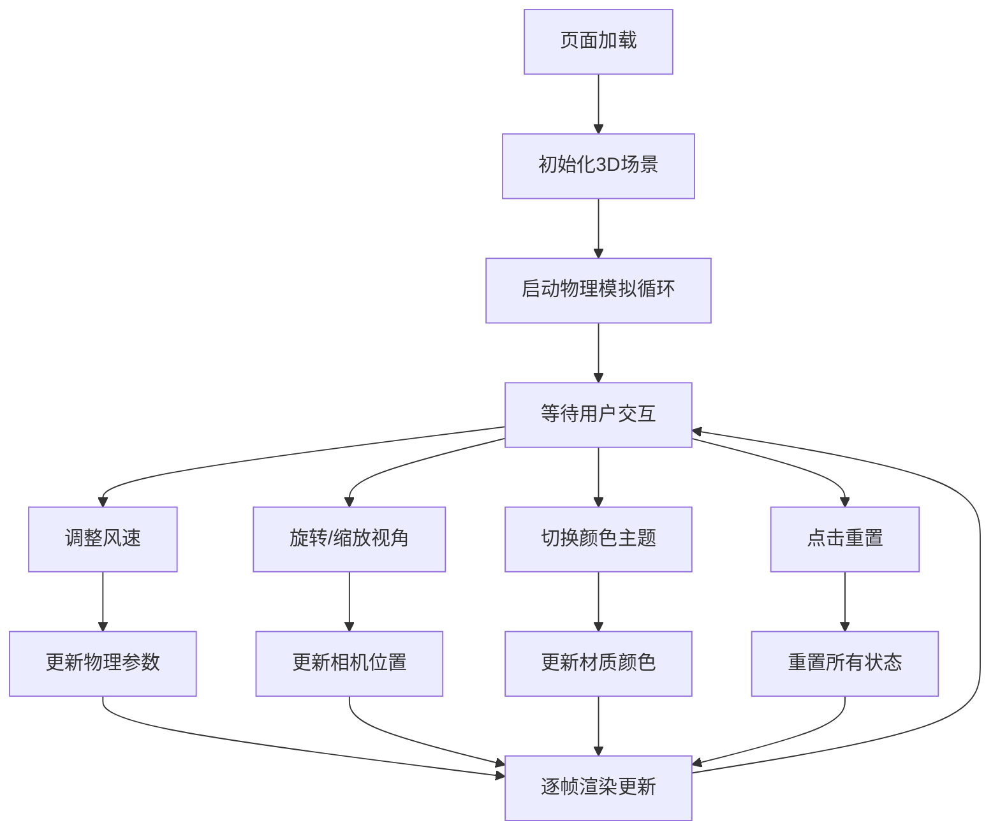

## 1. 产品概述

本产品是一个基于WebGL的三维旗帜物理模拟交互可视化应用，旨在解决物理教学或游戏开发中难以直观展示流体与柔性体交互过程的问题。用户可以通过调整风速、旋转视角等交互方式，实时观察旗帜在不同风力条件下的动态飘动效果。

- 主要用途：物理教学演示、游戏开发参考、交互式科学可视化
- 目标用户：物理教师、学生、游戏开发者、3D可视化爱好者
- 市场价值：提供直观、可交互的柔性体物理模拟教学工具

## 2. 核心功能

### 2.2 功能模块

1. **3D场景渲染模块**：包含旗帜、支柱、底座的三维模型渲染
2. **物理模拟引擎**：基于弹簧质点模型的旗帜物理仿真
3. **交互控制面板**：风速调节、重置、帧率显示、颜色主题切换
4. **视角控制系统**：鼠标拖拽旋转、滚轮缩放，带平滑阻尼

### 2.3 页面详情

| 页面名称 | 模块名称 | 功能描述 |
|-----------|-------------|---------------------|
| 主页面 | 3D场景渲染 | 实时渲染旗帜飘动动画，支持鼠标交互 |
| 主页面 | 控制面板 | 风速滑块（0-20）、重置按钮、帧率显示、颜色主题切换 |
| 主页面 | 物理引擎 | 弹簧质点模型计算，风力、重力、弹性力模拟 |

## 3. 核心流程

用户进入页面后，首先看到默认风速（0）下静止的旗帜。用户可以：
1. 拖动风速滑块调整风力强度，观察旗帜飘动幅度变化
2. 点击颜色主题切换按钮，观察旗帜颜色过渡效果
3. 鼠标拖拽旋转视角，滚轮缩放观察细节
4. 点击重置按钮恢复初始状态
5. 帧率实时显示，性能下降时自动降低网格精度

## 4. 用户界面设计

### 4.1 设计风格

- 主色调：深蓝色渐变背景（#0A0E27 → #1B2141）
- 控制面板：灰白色半透明（#F1F5F9），圆角8px
- 旗帜颜色：红黄渐变（无风）→ 蓝紫渐变（大风），带0.3秒过渡
- 支柱：深灰色圆柱体（#333333）
- 底座：灰色圆形（#555555）
- 交互反馈：滑块手柄颜色变化、平滑动画过渡

### 4.2 页面设计概述

| 页面名称 | 模块名称 | UI元素 |
|-----------|-------------|-------------|
| 主页面 | 3D场景 | 居中全屏canvas，旗帜、支柱、底座模型，实时物理动画 |
| 主页面 | 控制面板 | 左上角固定定位，风速滑块、重置按钮、FPS显示、主题切换按钮 |
| 主页面 | 交互提示 | 鼠标操作时的视觉反馈 |

### 4.3 响应性

- 桌面端优先设计，全屏自适应
- Canvas自动填满可用空间，保持正确宽高比
- 控制面板在各种分辨率下保持左上角位置
- 支持鼠标和触摸操作

### 4.4 3D场景指导

- **环境**：深蓝色渐变背景，营造科技感氛围
- **光照**：环境光 + 方向光，开启阴影投射，增强立体感
- **相机**：透视相机75度FOV，初始位置居中，距离旗帜适当
- **构图**：旗帜位于场景中央，支柱和底座在左侧，留有观察空间
- **交互**：OrbitControls带阻尼效果，旋转缩放平滑自然
- **性能**：帧率监控，低于25FPS时自动降低网格细分（20x16 → 14x10）
- **材质**：MeshStandardMaterial，支持动态颜色渐变和纹理动画
