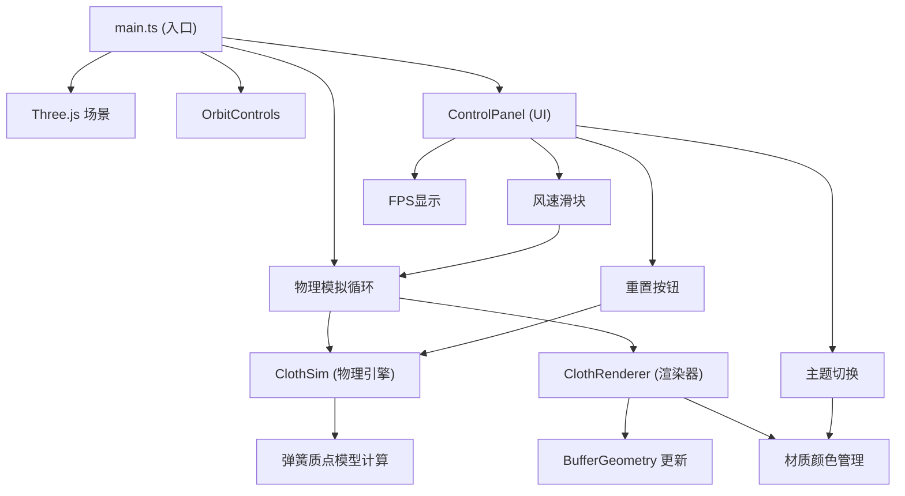

## 1. 架构设计



## 2. 技术描述

- **前端**：TypeScript + Three.js + Vite
- **构建工具**：Vite 5.x
- **3D引擎**：three@0.160.0
- **控制器**：three/addons/controls/OrbitControls.js
- **语言**：TypeScript 5.x (严格模式，target ES2020)
- **后端**：无（纯前端应用）
- **数据库**：无

## 3. 项目文件结构

| 文件路径 | 说明 |
|---------|------|
| `package.json` | 项目依赖配置，three@0.160.0，启动脚本 |
| `vite.config.js` | Vite 基础配置 |
| `tsconfig.json` | TypeScript 严格模式配置，target ES2020 |
| `index.html` | 入口页面，全屏背景，meta viewport |
| `src/main.ts` | 主入口，场景初始化、相机、渲染器、生命周期循环 |
| `src/clothSim.ts` | 旗帜物理引擎，ClothSim类 |
| `src/renderer.ts` | 渲染逻辑，ClothRenderer类 |
| `src/controlPanel.ts` | UI控制面板，ControlPanel类 |

## 4. 核心类与接口

### 4.1 ClothSim 类

```typescript
class ClothSim {
    constructor(width: number, height: number, segmentsX: number, segmentsY: number);
    initGrid(): void;                    // 生成网格顶点和索引
    update(deltaTime: number, windSpeed: number): Float32Array;  // 逐帧更新物理
    reset(): void;                       // 重置模拟状态
    resize(segmentsX: number, segmentsY: number): void;  // 调整网格精度
}
```

**物理参数**：
- 旗帜尺寸：3单位宽 × 2单位高
- 网格细分：默认20×16，低性能模式14×10
- 重力：-0.5 单位/秒²（Y轴向下）
- 弹簧系数：1.2
- 风力方向：X轴正方向，强度随风速线性映射

### 4.2 ClothRenderer 类

```typescript
class ClothRenderer {
    constructor(scene: THREE.Scene);
    buildMesh(vertices: Float32Array, segmentsX: number, segmentsY: number): void;
    updateMesh(vertices: Float32Array): void;
    setColorPalette(palette: ColorPalette, duration: number): void;  // 0.3秒过渡
    dispose(): void;
}
```

**颜色主题**：
- 无风主题：红黄渐变 (#FF6B35 → #FFD93D)
- 大风主题：蓝紫渐变 (#4ECDC4 → #A855F7)

### 4.3 ControlPanel 类

```typescript
class ControlPanel {
    constructor(container: HTMLElement, callbacks: ControlPanelCallbacks);
    setFPS(fps: number): void;
    setWindSpeed(speed: number): void;
    dispose(): void;
}
```

## 5. 性能优化策略

1. **帧率监控**：每秒更新FPS显示
2. **动态降级**：FPS < 25时，网格从20×16降至14×10
3. **BufferGeometry**：使用顶点缓冲区，仅更新position属性
4. **阻尼平滑**：相机控制阻尼系数0.85，防止抖动
5. **requestAnimationFrame**：使用浏览器原生动画循环

## 6. 运行方式

```bash
npm install
npm run dev
```
