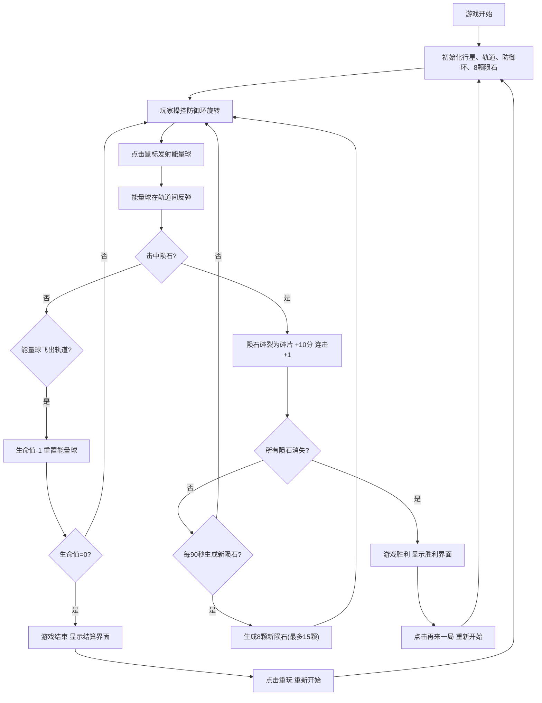

## 1. 产品概述

OrbitBreaker 是一款太空主题打砖块游戏，玩家在行星轨道上操控防御环反弹能量球，击碎环绕行星的陨石带。游戏融合了经典打砖块玩法与太空科幻美学，提供紧张刺激的轨道防御体验。

- 核心玩法：控制旋转防御环反弹能量球，击碎轨道上的陨石
- 目标用户：休闲游戏玩家、太空科幻爱好者
- 产品价值：带来独特的轨道式打砖块体验，兼具策略性与视觉美感

## 2. 核心特性

### 2.1 功能模块

1. **游戏主界面**：Canvas 游戏画布、顶部状态栏 UI
2. **防御环操控**：键盘左右箭头控制旋转，鼠标点击发射能量球
3. **陨石系统**：陨石生成、公转运动、碰撞碎裂、碎片粒子效果
4. **计分系统**：分数累计、连击计数、生命值管理
5. **游戏状态**：进行中、胜利、失败三种状态切换

### 2.2 页面详情

| 页面名称 | 模块名称 | 功能描述 |
|---------|---------|---------|
| 游戏主界面 | 状态栏 | 显示分数、剩余陨石数、连击数、生命值 |
| 游戏主界面 | 游戏画布 | 行星、轨道、防御环、能量球、陨石的实时渲染 |
| 游戏结束界面 | 结束遮罩 | 半透明遮罩、最终分数、重玩按钮 |
| 胜利界面 | 胜利遮罩 | 金色发光文字、"轨道已清空"、再来一局按钮 |

## 3. 核心流程

## 4. 用户界面设计

### 4.1 设计风格

- **主色调**：深空蓝紫 (#4C51BF → #805AD5)，橙红陨石 (#DC2626 → #F59E0B)
- **背景色**：深空黑 (#0B0E14)
- **文字色**：浅灰白 (#E2E8F0)
- **强调色**：白色半透明防御环、金色胜利文字
- **字体**：等宽字体 (monospace)，营造科幻终端感
- **整体风格**：太空科幻、极简精致、发光特效

### 4.2 页面设计概述

| 页面名称 | 模块名称 | UI 元素 |
|---------|---------|--------|
| 游戏主界面 | 状态栏 | 半透明黑底 (#00000080)、内边距 12px、等宽字体、四栏布局 |
| 游戏主界面 | 行星 | 蓝紫色径向渐变、光晕效果、半径 60px、居中 |
| 游戏主界面 | 轨道环 | 三条半透明紫色圆环 (#6366F180)、半径 200/300/400px |
| 游戏主界面 | 防御环 | 白色 90° 半圆弧、线宽 6px、发光阴影、可旋转 |
| 游戏主界面 | 能量球 | 白色小圆、直径 8px、发射闪光特效 |
| 游戏主界面 | 陨石 | 暗红到橙黄渐变、直径 30-60px、公转运动 |
| 游戏结束 | 结束遮罩 | 半透明黑色 (#00000080)、居中白色文字、圆角按钮 |
| 胜利界面 | 胜利遮罩 | 半透明深蓝 (#1E3A8A80)、金色发光文字、圆角 16px |

### 4.3 响应式设计

- 桌面端优先，Canvas 固定 800x800px
- 页面居中布局，两侧留白
- 键盘操作（左右箭头）+ 鼠标操作（点击发射）

### 4.4 动画与特效

- **防御环**：平滑旋转过渡、发光阴影
- **能量球**：发射时 0.1 秒白色闪光
- **陨石碎裂**：3-5 个碎片向随机方向飞散，1.5 秒渐隐
- **生命值归零**：红色到灰色闪烁动画，间隔 0.3 秒
- **胜利文字**：金色发光效果
- **游戏循环**：requestAnimationFrame，60FPS 稳定运行
