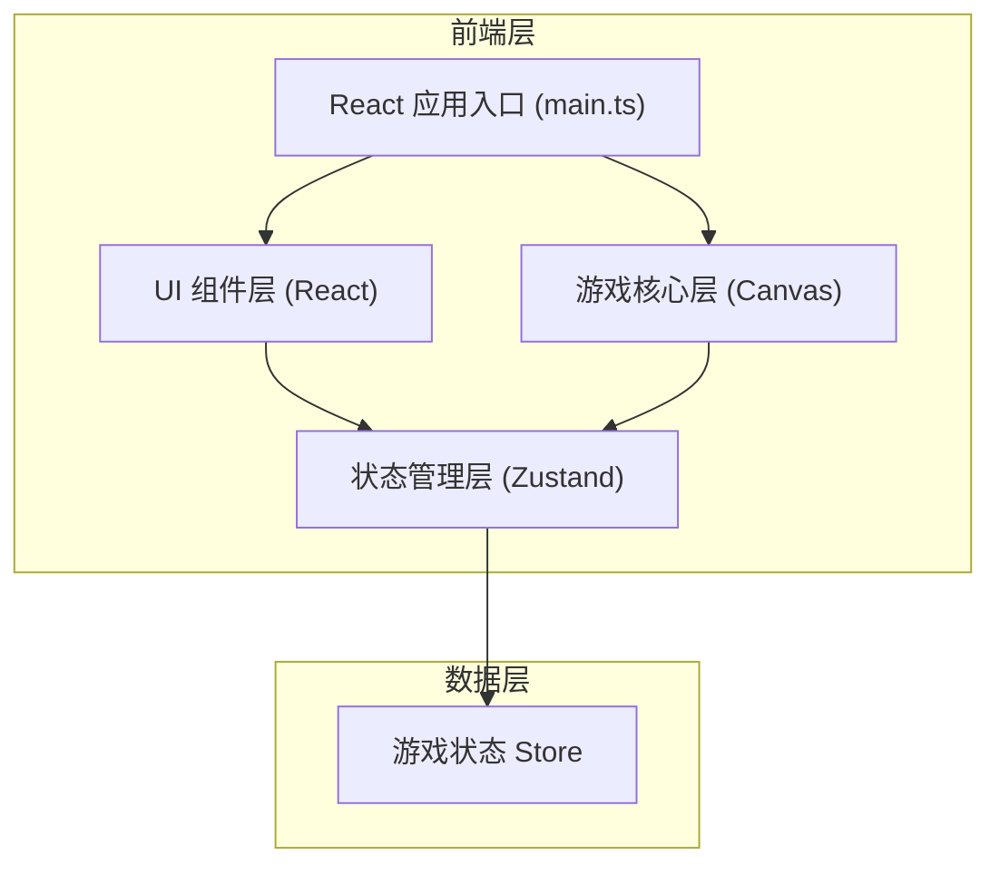

## 1. 架构设计



## 2. 技术描述

- **前端框架**：React@18 + TypeScript
- **构建工具**：Vite
- **状态管理**：Zustand
- **渲染技术**：HTML5 Canvas 2D
- **游戏循环**：requestAnimationFrame
- **样式方案**：原生 CSS

## 3. 项目结构

```
.
├── index.html              # 入口页面
├── package.json            # 依赖配置
├── vite.config.js          # Vite 配置
├── tsconfig.json           # TypeScript 配置
└── src/
    ├── main.tsx            # React 应用入口
    ├── styles.css          # 全局样式
    ├── game-core.ts        # 游戏核心逻辑 (Canvas 渲染、物理引擎)
    ├── ui-controller.ts    # UI 状态管理 (Zustand store)
    └── components/
        ├── GameCanvas.tsx  # Canvas 游戏画布组件
        ├── StatusBar.tsx   # 顶部状态栏组件
        ├── GameOver.tsx    # 游戏结束遮罩
        └── Victory.tsx     # 胜利界面遮罩
```

## 4. 核心数据模型

### 4.1 游戏状态 (Zustand Store)

```typescript
interface GameState {
  score: number;
  lives: number;
  combo: number;
  lastHitTime: number;
  asteroidsRemaining: number;
  gameStatus: 'playing' | 'gameover' | 'victory';
  
  incrementScore: (points: number) => void;
  decrementLife: () => void;
  incrementCombo: () => void;
  resetCombo: () => void;
  setAsteroidsRemaining: (count: number) => void;
  setGameStatus: (status: 'playing' | 'gameover' | 'victory') => void;
  resetGame: () => void;
}
```

### 4.2 游戏实体

```typescript
interface Vector2 {
  x: number;
  y: number;
}

interface DefenseRing {
  angle: number;      // 当前角度 (弧度)
  angularSpeed: number; // 角速度 (弧度/秒)
  arcLength: number;  // 弧长 (弧度)
  radius: number;     // 轨道半径
}

interface EnergyBall {
  position: Vector2;
  velocity: Vector2;
  speed: number;
  radius: number;
  active: boolean;
  flashTime: number;  // 发射闪光剩余时间
}

interface Asteroid {
  id: string;
  position: Vector2;
  radius: number;
  orbitRadius: number;
  orbitAngle: number;
  orbitSpeed: number; // 公转角速度
  color: string;
}

interface Fragment {
  id: string;
  position: Vector2;
  velocity: Vector2;
  radius: number;
  color: string;
  lifetime: number;   // 剩余存活时间 (秒)
  maxLifetime: number;
}
```

## 5. 核心模块说明

### 5.1 game-core.ts
- 行星与轨道渲染
- 防御环角速度控制
- 能量球物理运动
- 陨石生成与公转
- 碰撞检测算法
- 碎片粒子系统
- requestAnimationFrame 游戏循环

### 5.2 ui-controller.ts (Zustand Store)
- 分数、生命值、连击数状态管理
- 游戏状态切换
- 提供 React hooks 访问状态

### 5.3 GameCanvas.tsx
- Canvas 元素挂载
- 键盘/鼠标事件监听
- 游戏循环驱动
- 调用 game-core 渲染

### 5.4 StatusBar.tsx
- 顶部状态栏 UI
- 分数、陨石数、连击、生命值显示
- 生命值闪烁动画

### 5.5 GameOver.tsx / Victory.tsx
- 游戏结束/胜利遮罩
- 最终分数展示
- 重玩按钮

## 6. 性能要求

- 帧率：60 FPS
- 单帧计算时间：≤ 4ms
- 渲染方式：Canvas 2D 即时模式
- 优化策略：
  - 对象池模式复用碎片对象
  - 空间分区优化碰撞检测
  - 避免每帧创建新对象
  - 使用 requestAnimationFrame 而非 setInterval
