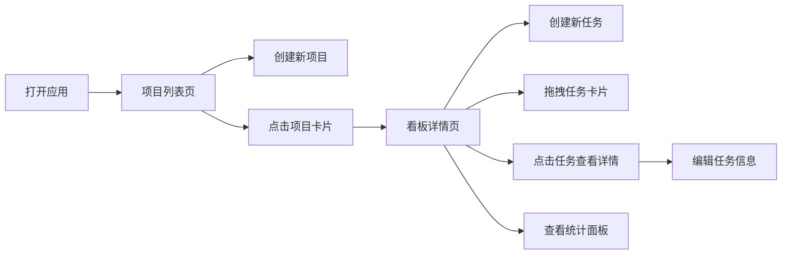

## 1. 产品概述
TaskFlow是一款轻量级项目协作与看板管理应用，专为团队协作设计，帮助团队高效管理项目进度和任务分配。
- 主要用途：项目管理、任务分配、进度追踪、团队协作
- 目标用户：软件开发团队、产品团队、项目管理团队
- 产品价值：通过直观的看板视图和实时统计，提升团队协作效率，透明化项目进度

## 2. 核心功能

### 2.1 用户角色
| 角色 | 注册方式 | 核心权限 |
|------|----------|----------|
| 普通用户 | 无需注册，直接使用 | 创建项目、创建任务、分配任务、拖拽调整进度、查看统计 |

### 2.2 功能模块
1. **项目列表页**：项目卡片展示、新建项目、项目进度概览
2. **看板详情页**：三列任务看板、任务拖拽、任务详情编辑
3. **统计面板**：成员工作量统计、项目进度统计、柱状图可视化

### 2.3 页面详情
| 页面名称 | 模块名称 | 功能描述 |
|-----------|-----------|----------------|
| 项目列表页 | 项目卡片 | 展示项目名称、任务总数、完成进度条，悬停动效，点击进入看板 |
| 项目列表页 | 新建项目 | 顶部输入框输入项目名称，点击按钮创建新项目 |
| 看板详情页 | 任务列 | 三列布局（待办/进行中/已完成），支持水平滚动 |
| 看板详情页 | 任务卡片 | 拖拽调整进度，点击查看详情，支持编辑 |
| 看板详情页 | 任务详情模态框 | 编辑任务标题、描述、负责人、截止日期 |
| 统计面板 | 柱状图统计 | 按成员展示各状态任务数量，实时更新 |

## 3. 核心流程
用户打开应用 → 查看项目列表 → 点击项目进入看板 → 创建/拖拽任务 → 查看任务详情 → 编辑任务信息 → 查看统计面板

## 4. 用户界面设计

### 4.1 设计风格
- 主色：#007AFF
- 背景色：#F5F5FA
- 卡片背景：#FFFFFF
- 文字颜色：#333333
- 按钮风格：圆角8px，主色背景白色文字，悬停过渡0.2s
- 布局：顶部导航栏 + 卡片式布局
- 字体：现代无衬线字体，清晰的层级结构
- 动画：0.3s平滑过渡，拖拽缩放反馈

### 4.2 页面设计概述
| 页面名称 | 模块名称 | UI元素 |
|-----------|-----------|----------|
| 项目列表页 | 导航栏 | 高度56px，白底阴影，左侧Logo右侧新建按钮 |
| 项目列表页 | 项目卡片 | 280x160px，圆角12px，阴影过渡，进度条展示 |
| 看板详情页 | 任务列 | 最小300px宽，三色背景，间距16px |
| 看板详情页 | 任务卡片 | 拖拽时缩放1.05半透明，阴影提升 |
| 看板详情页 | 模态框 | 600px宽，圆角16px，居中显示，最大高度80vh |
| 统计面板 | 柱状图 | 高度300px，三色柱状图，悬停显示详情 |

### 4.3 响应式
- Desktop-first设计
- 窗口宽度小于768px时，任务列宽度100%上下堆叠
- 触控优化，支持移动端操作

### 4.4 性能要求
- 拖拽卡顿不超过16ms（保证60FPS）
- 统计面板数据更新后100ms内完成重新渲染
