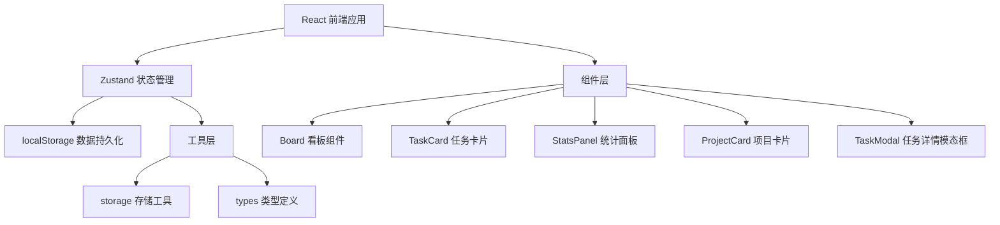
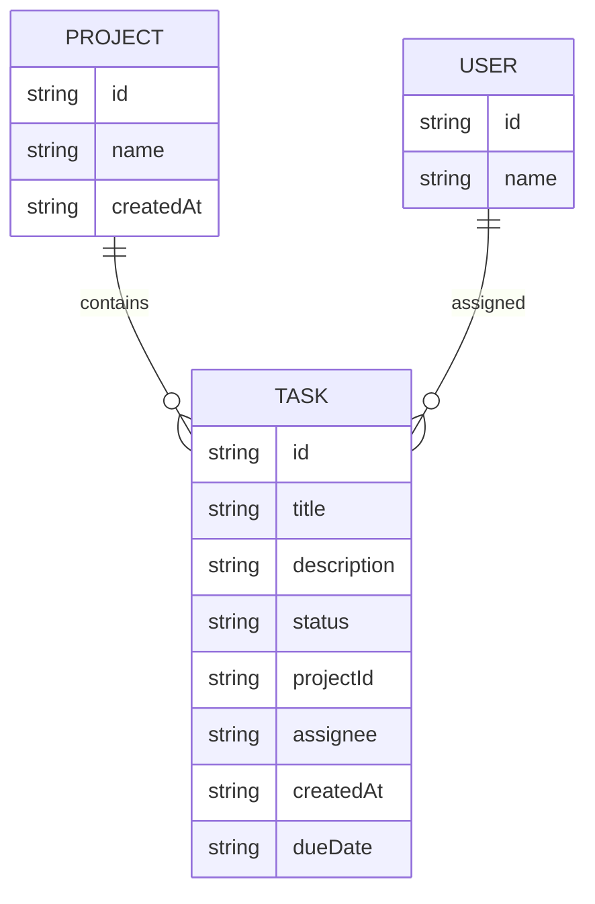

## 1. 架构设计



## 2. 技术描述
- 前端：React@18 + TypeScript + Vite
- 状态管理：Zustand
- 图表库：Recharts
- 数据持久化：localStorage
- 唯一ID：uuid
- 构建工具：Vite

## 3. 路由定义
| 路由 | 用途 |
|-------|------|
| / | 项目列表首页 |
| /project/:id | 项目看板详情页 |

## 4. 数据模型

### 4.1 数据模型定义



### 4.2 类型定义

```typescript
interface User {
  id: string;
  name: string;
}

interface Project {
  id: string;
  name: string;
  createdAt: string;
}

interface Task {
  id: string;
  title: string;
  description: string;
  status: 'todo' | 'in-progress' | 'done';
  projectId: string;
  assignee: string;
  createdAt: string;
  dueDate: string;
}
```

## 5. 项目文件结构

```
d:\P\tasks\auto15/
├── package.json
├── vite.config.js
├── tsconfig.json
├── index.html
└── src/
    ├── types/
    │   └── index.ts
    ├── store/
    │   └── taskStore.ts
    ├── components/
    │   ├── Board.tsx
    │   ├── TaskCard.tsx
    │   └── StatsPanel.tsx
    ├── utils/
    │   └── storage.ts
    ├── App.tsx
    └── main.tsx
```

## 6. 核心模块说明

### 6.1 状态管理 (taskStore.ts)
- 项目增删改查
- 任务增删改查
- 任务状态更新
- 成员管理
- localStorage 持久化

### 6.2 看板组件 (Board.tsx)
- 三列任务展示
- 拖拽事件处理
- 任务创建表单
- 项目信息展示

### 6.3 任务卡片 (TaskCard.tsx)
- 任务内容渲染
- 拖拽支持
- 点击打开详情

### 6.4 统计面板 (StatsPanel.tsx)
- Recharts 柱状图
- 成员任务统计
- 实时数据更新

### 6.5 存储工具 (storage.ts)
- localStorage 封装
- 数据序列化/反序列化
