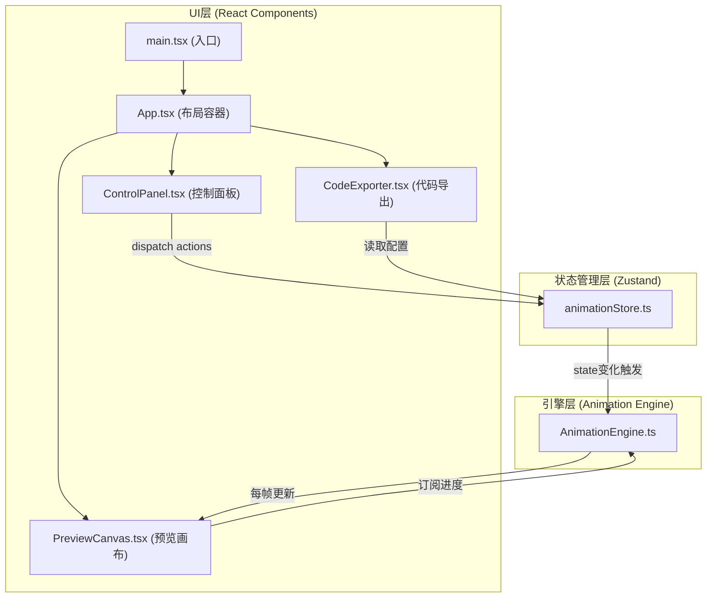

# MotionLab - 技术架构文档

## 1. 架构设计



### 文件调用关系

```
main.tsx ──渲染──▶ App.tsx
  ├── ControlPanel.tsx ──调用──▶ animationStore (setBezierParams / addKeyframe / ...)
  ├── PreviewCanvas.tsx ──订阅──▶ AnimationEngine (progress updates)
  └── CodeExporter.tsx ──读取──▶ animationStore (getState → generateCSS)

animationStore.ts
  └── state变更时 ──通知──▶ AnimationEngine.reset()

AnimationEngine.ts
  ├── requestAnimationFrame 循环
  ├── cubic-bezier 数值求解
  └── 每帧推送进度 → PreviewCanvas
```

---

## 2. 技术选型说明

| 分类 | 技术 | 版本 | 用途 |
|-----|------|------|------|
| 构建工具 | Vite | latest | 快速开发与构建 |
| 前端框架 | React | 18.x | UI组件化开发 |
| 状态管理 | Zustand | latest | 轻量全局状态管理 |
| 语言 | TypeScript | latest | 类型安全开发 |
| 工具库 | uuid | latest | 关键帧唯一ID生成 |

### 初始化方式

使用 Vite 官方模板初始化：
```bash
npm create vite@latest . -- --template react-ts
```

---

## 3. 模块定义与类型

### 3.1 核心数据类型

```typescript
// src/types/index.ts

export interface BezierCurve {
  id: string;
  name: string;
  x1: number;
  y1: number;
  x2: number;
  y2: number;
}

export interface Keyframe {
  id: string;
  time: number;        // 0-100 (%)
  position: number;    // 0-100 (%) - 横向位置
  opacity: number;     // 0-1
}

export interface AnimationTrack {
  curveId: string;
  duration: number;    // ms
  keyframes: Keyframe[];
}

export interface AnimationState {
  tracks: AnimationTrack[];
  selectedTrackId: string | null;
  globalDuration: number;
  isExportPanelOpen: boolean;
  // actions
  selectTrack: (id: string | null) => void;
  updateBezier: (id: string, params: Partial<Omit<BezierCurve, 'id'>>) => void;
  addKeyframe: (trackId: string, kf: Omit<Keyframe, 'id'>) => void;
  updateKeyframe: (trackId: string, kfId: string, patch: Partial<Keyframe>) => void;
  removeKeyframe: (trackId: string, kfId: string) => void;
  setGlobalDuration: (ms: number) => void;
  toggleExportPanel: (open?: boolean) => void;
  generateCSS: () => string;
}
```

---

## 4. 目录结构

```
d:\P\tasks\auto16\
├── .trae\documents\           # 文档目录
│   ├── PRD.md
│   └── Architecture.md
├── index.html                 # Vite入口HTML
├── package.json               # 依赖与脚本
├── vite.config.ts             # Vite配置
├── tsconfig.json              # TS配置（strict, es2020, bundler）
└── src\
    ├── main.tsx               # 应用入口
    ├── App.tsx                # 根布局组件
    ├── types\
    │   └── index.ts           # 全局类型定义
    ├── store\
    │   └── animationStore.ts  # Zustand store
    ├── engine\
    │   └── AnimationEngine.ts # 动画引擎（rAF循环）
    ├── components\
    │   ├── ControlPanel.tsx   # 左侧控制面板
    │   ├── PreviewCanvas.tsx  # 中间预览区
    │   └── CodeExporter.tsx   # 右侧导出面板
    └── styles\
        └── globals.css        # 全局样式与CSS变量
```

---

## 5. 性能保障设计

### 5.1 动画循环

- 使用 **单个 requestAnimationFrame** 循环驱动4条曲线，而非每曲线独立rAF
- 每帧仅做一次时间计算，批量更新所有DOM元素
- 使用 **document.visibilitychange** 监听，标签页隐藏时立即 `cancelAnimationFrame` 并 `paused=true`，恢复时从起点重置

### 5.2 FPS监控

- 内部维护帧率计算器：每100ms统计一次帧间隔，输出移动平均FPS
- FPS低于55时仅做视觉标记，不主动降帧（保持用户体验优先）

### 5.3 关键帧拖动

- 关键帧菱形使用 `transform: translate()` 而非 `left/top`，触发GPU合成
- 拖动事件使用 `pointer events`，避免重复注册
- 16ms以内响应：节流非必须的store更新，仅在 `pointerup` 时写入最终位置

---

## 6. CSS @keyframes 生成算法

```typescript
function generateCSS(track: AnimationTrack): string {
  // 1. 按 time 升序排序关键帧
  // 2. 输出 @keyframes motionlab-{id} { ... }
  // 3. 每个关键帧输出 transform: translateX() 和 opacity
  // 4. animation-timing-function 使用 cubic-bezier(x1,y1,x2,y2)
  // 5. 缩进 2 空格
}
```
