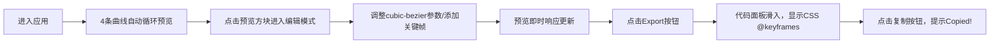

# MotionLab - CSS动画曲线对比工具 产品需求文档

## 1. 产品概述

MotionLab是一款面向前端开发者的CSS动画调试与对比工具，提供可视化的贝塞尔曲线编辑、多曲线并排预览和关键帧序列管理功能，帮助开发者快速试验、对比不同动画参数组合，并一键导出可复用的CSS代码。

- 目标用户：前端工程师、UI动效设计师
- 核心价值：降低动画参数调试成本，提升动效开发效率

---

## 2. 核心功能

### 2.1 功能模块

| 模块名称 | 核心能力 |
|---------|---------|
| 多曲线并排预览 | 4条默认曲线同时运动，实时对比不同缓动效果 |
| 自定义曲线编辑 | cubic-bezier四参数微调，即时预览反馈 |
| 关键帧序列编辑 | 时间轴可视化增删改关键帧，支持位置与透明度属性 |
| 实时性能监控 | FPS计数器，保证动画流畅运行 |
| CSS代码导出 | 生成格式化的@keyframes代码，一键复制 |

### 2.2 页面详情

| 页面名称 | 模块名称 | 功能描述 |
|---------|---------|---------|
| 主应用页 | 控制面板 | 曲线参数编辑区、时长滑块、关键帧时间轴、Export按钮 |
| 主应用页 | 预览画布 | 多曲线并排动画预览区、轨迹虚线、进度数字、FPS计数器 |
| 主应用页 | 代码导出面板 | 右侧滑入面板，显示格式化CSS代码，支持复制 |

---

## 3. 核心流程

### 3.1 主用户流程

### 3.2 数据流向说明

- 用户操作 → ControlPanel组件 → Zustand store更新 → AnimationEngine重新计算 → PreviewCanvas渲染更新
- Export按钮点击 → 从store读取完整配置 → CodeExporter格式化CSS → 面板动画展示

---

## 4. 用户界面设计

### 4.1 设计风格

- **主题**：深色科技风（Dark Mode）
- **主背景**：#1E1E2E
- **卡片背景**：#2A2A3A，圆角12px
- **主色调**：青色 #00E5FF
- **强调色**：金色 #FFD700
- **渐变方块颜色**：#64FFDA → #FF6B6B
- **字体**：现代无衬线字体 + monospace等宽字体
- **布局**：Flex布局，左侧固定360px控制面板 + 右侧自适应预览区

### 4.2 界面元素设计

| 元素 | 样式规范 |
|-----|---------|
| 预览方块 | 40×40px，圆角8px，颜色渐变，轨迹虚线#A0A0B0 |
| 选中方块边框 | 金色#FFD700，线宽2px |
| 关键帧标记 | 菱形10×10px，青色#00E5FF，可拖动 |
| 按钮（Export） | 背景#6366F1，白色文字，圆角8px，悬停亮度×1.2 |
| 输入框焦点 | 青色发光边框，模糊半径4px |
| FPS计数器 | 12px #888，半透明黑背景#00000050，圆角4px |
| 代码块 | 背景#1E1E2E，14px monospace，缩进2空格 |

### 4.3 响应式适配

- **桌面端（≥900px）**：左侧360px控制面板完全展开
- **平板/窄屏（<900px）**：控制面板折叠为60px图标条，点击抽屉展开
- **最小宽度**：768px
- **尺寸缩放**：所有间距与字号使用 `clamp()` 函数等比适配

### 4.4 交互动效

- 所有按钮/输入框悬停：0.2s微光动画（半透明白色叠加层）
- 代码导出面板：右侧滑入，0.3s ease-out
- 复制成功提示：Copied! 持续2秒
- 轨迹虚线末端：实时圆点，颜色与方块同步
