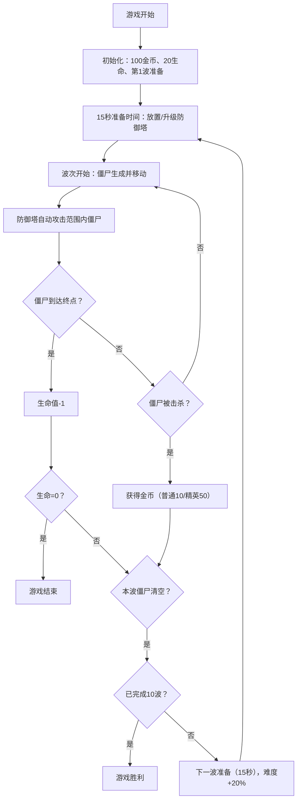

## 1. 产品概述

僵尸生存塔防游戏是一款基于浏览器的3D塔防游戏，玩家在固定据点通过建造和升级防御塔来抵御多波僵尸进攻，管理资源并制定策略布局。

- 核心玩法：10x10网格地图上放置三种防御塔，抵御沿预设路径前进的僵尸群
- 目标用户：休闲策略游戏爱好者
- 市场价值：提供流畅的3D塔防体验，无需下载即可在浏览器中游玩

## 2. 核心功能

### 2.1 用户角色
无需注册，单玩家游戏。

### 2.2 功能模块
1. **游戏主场景**：10x10网格地图、防御塔放置、僵尸移动、战斗系统
2. **防御塔系统**：三种塔类型（机枪塔、火焰塔、减速塔）、放置、升级、攻击动画
3. **经济系统**：金币获取、消耗、升级费用计算
4. **波次系统**：10波僵尸、难度递增、精英僵尸、倒计时
5. **UI系统**：塔选择工具栏、信息栏、波次面板、升级弹窗、移动端适配

### 2.3 页面详情
| 页面名称 | 模块名称 | 功能描述 |
|-----------|-------------|---------------------|
| 游戏主页面 | 3D场景模块 | Three.js渲染10x10网格、防御塔、僵尸、子弹/火焰特效 |
| 游戏主页面 | 塔选择工具栏 | 三种塔类型选择，点击选中高亮，显示费用 |
| 游戏主页面 | 顶部信息栏 | 显示当前波次、金币数量、生命值 |
| 游戏主页面 | 右侧波次面板 | 显示剩余僵尸数量、类型统计 |
| 游戏主页面 | 升级弹窗 | 点击塔后显示，可升级（最高3级），显示属性变化 |
| 游戏主页面 | 移动端菜单 | 宽度<1024px时折叠为侧滑菜单 |

## 3. 核心流程

玩家进入游戏后，初始100金币，15秒准备时间。玩家选择塔类型并点击网格放置（消耗金币）。波次开始后，僵尸从左侧沿路径向右移动，防御塔自动攻击范围内僵尸。击杀僵尸获得金币，玩家可升级已有塔或放置新塔。共10波，每波难度递增，生命值归零则游戏结束。

## 4. 用户界面设计

### 4.1 设计风格
- **主色调**：深色军事风格，背景 #0D0D1A，面板 #1A1A2E，边框 #2A2A3A
- **强调色**：#00FF88（成功/选中），#FF4444（警示/伤害）
- **字体**：monospace 科技感字体
- **按钮风格**：圆角，按下缩放0.95，0.1s过渡
- **布局**：左侧塔工具栏（200px）+ 中央游戏区 + 右侧信息面板（250px）+ 顶部信息栏（60px）

### 4.2 页面设计概述
| 页面名称 | 模块名称 | UI元素 |
|-----------|-------------|-------------|
| 游戏主页面 | 3D场景 | 10x10网格（#2A2A3A线宽1px），半透明塔底座，僵尸、塔、特效 |
| 游戏主页面 | 塔工具栏 | 图标+名称，选中时#00FF88 2px边框，圆角12px，间距16px |
| 游戏主页面 | 顶部信息栏 | 波次、金币、生命值，32px大字倒计时脉冲动画 |
| 游戏主页面 | 升级弹窗 | 居中，#1A1A2E背景，圆角16px，宽度400px |
| 游戏主页面 | 移动端菜单 | 左滑60%宽度，包含所有控件，0.3s滑动动画 |

### 4.3 响应性
- 桌面端（≥1024px）：左侧工具栏 + 中央游戏区 + 右侧面板
- 移动端（<1024px）：所有UI折叠到侧滑菜单，中央全宽显示游戏区
- 触摸优化：按钮最小尺寸44px，触摸反馈

### 4.4 3D场景指引
- **环境**：深色背景，雾化效果增强深度感
- **光照**：环境光 + 方向光，营造军事氛围
- **相机**：正交投影，45度俯视角
- **特效**：
  - 子弹/火焰拖尾：20px长度，半透明渐变
  - 击中闪白：0.1s
  - 死亡淡出：0.5s，脚下圆环扩散（#FF0000，5px→30px，0.3s）
  - 枪口闪光：#FFFF00，0.1s缩放1.0→0.5
  - 升级时塔外观变化：机枪塔炮管变长变粗、火焰塔变亮、减速塔光环变大
