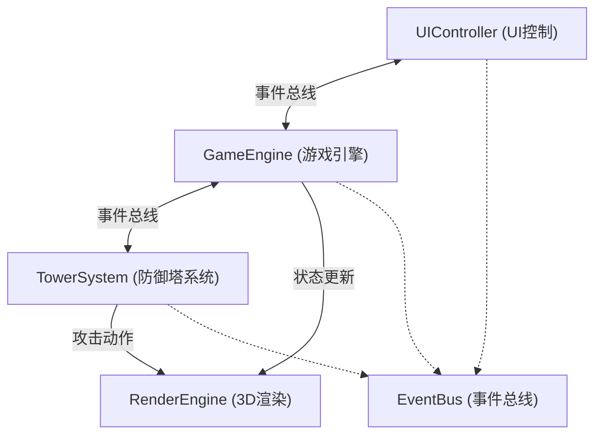

## 1. 架构设计

纯前端3D塔防游戏，采用模块化架构，通过事件总线实现模块间解耦通信。



## 2. 技术描述

- **前端框架**：原生 TypeScript + Three.js@0.160
- **构建工具**：Vite
- **无后端**：纯前端游戏，数据全部在内存中管理
- **事件总线**：发布订阅模式实现模块通信

## 3. 目录结构

```
├── package.json          # 依赖与脚本
├── vite.config.js        # Vite配置
├── tsconfig.json         # TypeScript配置
├── index.html            # 入口HTML
└── src/
    ├── eventBus.ts       # 事件总线
    ├── gameEngine.ts     # 游戏主循环、波次、僵尸、战斗逻辑
    ├── towerSystem.ts    # 防御塔放置、攻击、升级
    ├── renderEngine.ts   # Three.js 3D渲染
    └── uiController.ts   # HTML/CSS UI控制
```

## 4. 模块接口定义

### 4.1 事件总线事件类型
```typescript
// 游戏事件
GAME_START: 'game:start'
GAME_PAUSE: 'game:pause'
GAME_OVER: 'game:over'
WAVE_START: 'wave:start'
WAVE_END: 'wave:end'
WAVE_COUNTDOWN: 'wave:countdown'

// 塔事件
TOWER_PLACE: 'tower:place'
TOWER_UPGRADE: 'tower:upgrade'
TOWER_SELECT: 'tower:select'
TOWER_ATTACK: 'tower:attack'

// 僵尸事件
ZOMBIE_SPAWN: 'zombie:spawn'
ZOMBIE_HIT: 'zombie:hit'
ZOMBIE_DEATH: 'zombie:death'
ZOMBIE_REACH_END: 'zombie:reachEnd'

// UI事件
UI_TOWER_SELECTED: 'ui:towerSelected'
UI_UPGRADE_CONFIRM: 'ui:upgradeConfirm'
UI_GOLD_UPDATE: 'ui:goldUpdate'
UI_LIVES_UPDATE: 'ui:livesUpdate'
UI_WAVE_UPDATE: 'ui:waveUpdate'
```

### 4.2 数据模型

#### 防御塔配置
```typescript
interface TowerConfig {
  type: 'machinegun' | 'flame' | 'slow'
  name: string
  cost: number
  range: number      // 格数
  damage: number
  attackSpeed: number // 次/秒
  color: number
}

interface Tower extends TowerConfig {
  id: string
  gridX: number
  gridY: number
  level: number      // 1-3
  lastAttackTime: number
}
```

#### 僵尸配置
```typescript
interface ZombieConfig {
  type: 'normal' | 'elite'
  health: number
  speed: number      // 格/秒
  reward: number
  scale: number
}

interface Zombie extends ZombieConfig {
  id: string
  currentHealth: number
  pathIndex: number  // 当前路径点索引
  progress: number   // 当前路径段进度 0-1
  x: number          // 世界坐标
  y: number
  isDying: boolean
  deathTime: number
}
```

## 5. 核心算法

### 5.1 网格坐标转换
```
世界坐标 → 网格坐标：
gridX = Math.floor((worldX + GRID_SIZE / 2) / CELL_SIZE)
gridY = Math.floor((worldZ + GRID_SIZE / 2) / CELL_SIZE)

网格坐标 → 世界坐标：
worldX = gridX * CELL_SIZE
worldZ = gridY * CELL_SIZE
```

### 5.2 塔攻击逻辑
- 每帧检查：当前时间 - 上次攻击时间 ≥ 1/攻击速度
- 目标选择：范围内最靠前（路径进度最大）的僵尸
- 伤害计算：基础伤害 × (1 + 0.3 × (等级-1))
- 攻速计算：基础攻速 × (1 + 0.15 × (等级-1))

### 5.3 僵尸移动
- 预设路径点数组，僵尸沿路径线性插值移动
- 速度 = 基础速度 × (1 + 0.1 × (波次-1))
- 每帧更新：progress += speed × deltaTime / 段长度

### 5.4 碰撞检测
- 塔射程：欧氏距离 ≤ 射程 × 格子大小
- 减速效果：减速塔攻击后，僵尸速度 × 0.5，持续2秒

## 6. 性能优化

- **对象池**：僵尸、子弹、特效对象复用，避免频繁创建销毁
- **空间分区**：网格索引，塔只需检查附近网格的僵尸
- **渲染优化**：
  - 使用精灵（Sprite）渲染2D Billboard效果
  - 合并几何体减少Draw Call
  - 限制同屏特效数量
- **游戏循环**：固定时间步长更新，可变帧率渲染
- **60FPS目标**：每帧逻辑更新控制在16ms内
