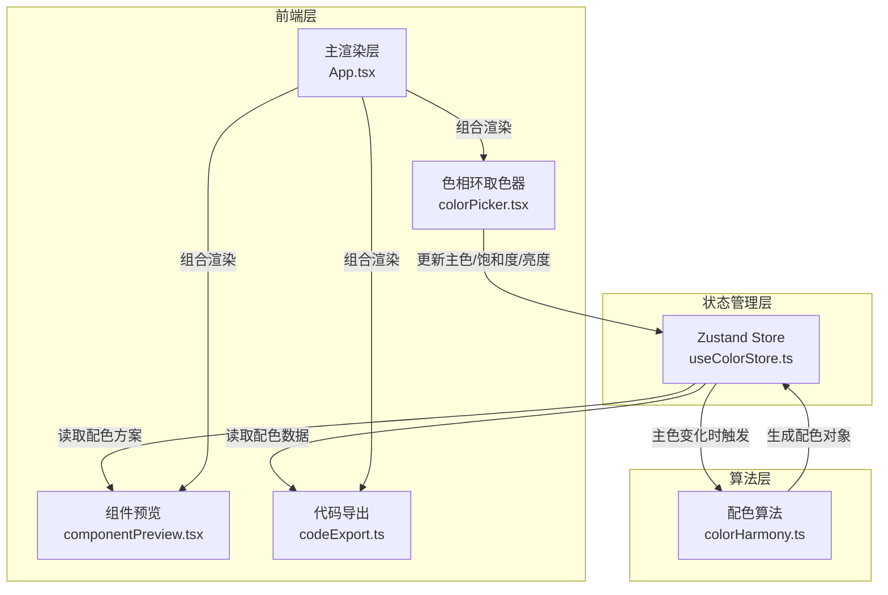

## 1. 架构设计



## 2. 技术说明

- 前端：React@18 + TypeScript + Vite
- 状态管理：Zustand（管理主色、配色方案类型、预览状态、收藏列表）
- 颜色计算：chroma-js（色相环坐标转换、HSL操作、颜色变体生成）
- 样式方案：Tailwind CSS + 内联样式（色相环使用圆锥渐变需动态生成）
- 初始化工具：vite-init (react-ts模板)
- 后端：无
- 数据库：无（收藏数据存储在Zustand store内存中）

## 3. 路由定义

| 路由 | 用途 |
|------|------|
| / | 单页应用，包含所有功能模块 |

## 4. 数据模型

### 4.1 Store数据结构

```typescript
interface ColorScheme {
  primary: string;
  secondary: string[];
  type: 'triadic' | 'complementary' | 'analogous' | 'splitComplementary';
}

interface SavedScheme {
  id: string;
  name: string;
  primary: string;
  secondary: string[];
  type: ColorScheme['type'];
}

interface ColorStoreState {
  primaryColor: string;
  hue: number;
  saturation: number;
  lightness: number;
  schemeType: ColorScheme['type'];
  colorScheme: ColorScheme;
  savedSchemes: SavedScheme[];
  setHue: (hue: number) => void;
  setSaturation: (sat: number) => void;
  setLightness: (light: number) => void;
  setSchemeType: (type: ColorScheme['type']) => void;
  saveScheme: (name: string) => void;
  removeScheme: (id: string) => void;
  applyScheme: (scheme: SavedScheme) => void;
}
```

## 5. 文件结构

```
├── package.json
├── vite.config.js
├── tsconfig.json
├── index.html
├── src/
│   ├── store/
│   │   └── useColorStore.ts
│   ├── modules/
│   │   ├── colorHarmony.ts
│   │   ├── colorPicker.tsx
│   │   ├── componentPreview.tsx
│   │   └── codeExport.ts
│   ├── App.tsx
│   ├── main.tsx
│   └── index.css
```
