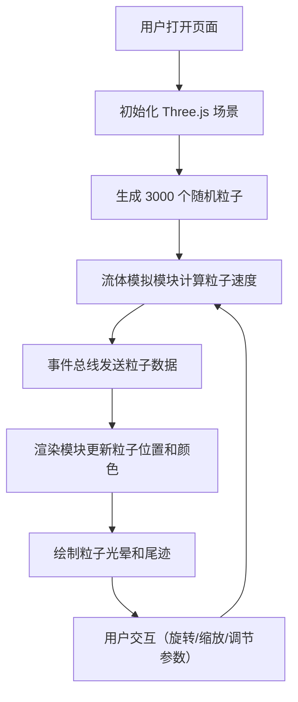

## 1. 产品概述

VortexViz 是一个基于浏览器的 3D 风场流场可视化工具，将天气预报中的风速和风向数据转化为可交互探索的动态粒子流场。用户可以自由旋转、缩放视角，直观感受不同区域的涡流和风场强度变化。

- 核心价值：将抽象的气象数据转化为直观、沉浸式的 3D 可视化体验
- 目标用户：气象爱好者、数据可视化从业者、教育工作者
- 技术亮点：基于 Three.js 的实时粒子系统 + 双线性插值流体模拟

## 2. 核心功能

### 2.1 功能模块

1. **3D 流场场景**：200km×200km 矩形区域，网格地面，3000 个粒子动态流动
2. **流体模拟**：双线性插值计算粒子速度，模拟真实风场流动效果
3. **交互控制**：轨道控制（旋转/缩放），迷你地图概览
4. **控制面板**：场景参数和风场参数实时调节
5. **事件总线**：模块间解耦通信机制

### 2.2 页面详情

| 页面名称 | 模块名称 | 功能描述 |
|----------|----------|----------|
| 主页面 | 3D 场景模块 | 全屏 Canvas 渲染粒子流场，支持鼠标拖拽旋转、滚轮缩放 |
| 主页面 | 迷你地图模块 | 左下角 100×100px 热力图，显示粒子密度分布 |
| 主页面 | 控制面板模块 | 右侧 280px 折叠面板，调节粒子数量、尾迹长度、风场强度、涡流强度 |

## 3. 核心流程

## 4. 用户界面设计

### 4.1 设计风格

- **主题**：深色科技感，沉浸式数据可视化
- **背景色**：#0A0A1A（深蓝黑）
- **主色调**：#00D4FF（科技蓝）
- **粒子颜色渐变**：
  - 0-5 km/h: #2D9CDB (蓝)
  - 5-15 km/h: #27AE60 (绿)
  - 15-25 km/h: #F2994A (橙)
  - 25+ km/h: #EB5757 (红)
- **字体**：无衬线字体，数值标签使用 #00D4FF 高亮
- **面板**：#1E1E2E 深色背景，10px 圆角
- **动效**：面板展开旋转动画 0.3s ease，粒子光晕效果

### 4.2 页面设计概述

| 页面名称 | 模块名称 | UI 元素 |
|----------|----------|---------|
| 主页面 | 3D 场景 | 全屏 Canvas，网格地面（#4A5A6A，1px线宽，10km间距），粒子带光晕 |
| 主页面 | 迷你地图 | 左下角 100×100px，半透明黑底，热力图粒子密度 |
| 主页面 | 控制面板 | 右侧 280px，两组折叠面板（场景设置/风场设置），滑块控件 |

### 4.3 响应式设计

- 桌面端优先，全屏 Canvas 自适应窗口大小
- 控制面板固定右侧 280px 宽度
- 迷你地图固定左下角
- 轨道控制支持鼠标和触摸操作

### 4.4 3D 场景指引

- **环境**：深色背景，无 HDRI，突出粒子系统
- **光照**：环境光 + 粒子自发光
- **相机**：PerspectiveCamera，初始 45° 俯视视角
- **控制**：OrbitControls，阻尼系数 0.1
- **粒子系统**：Points + ShaderMaterial，尾迹使用多帧位置缓存
- **性能**：目标 55+ FPS，超 4000 粒子自动降级渲染模式
