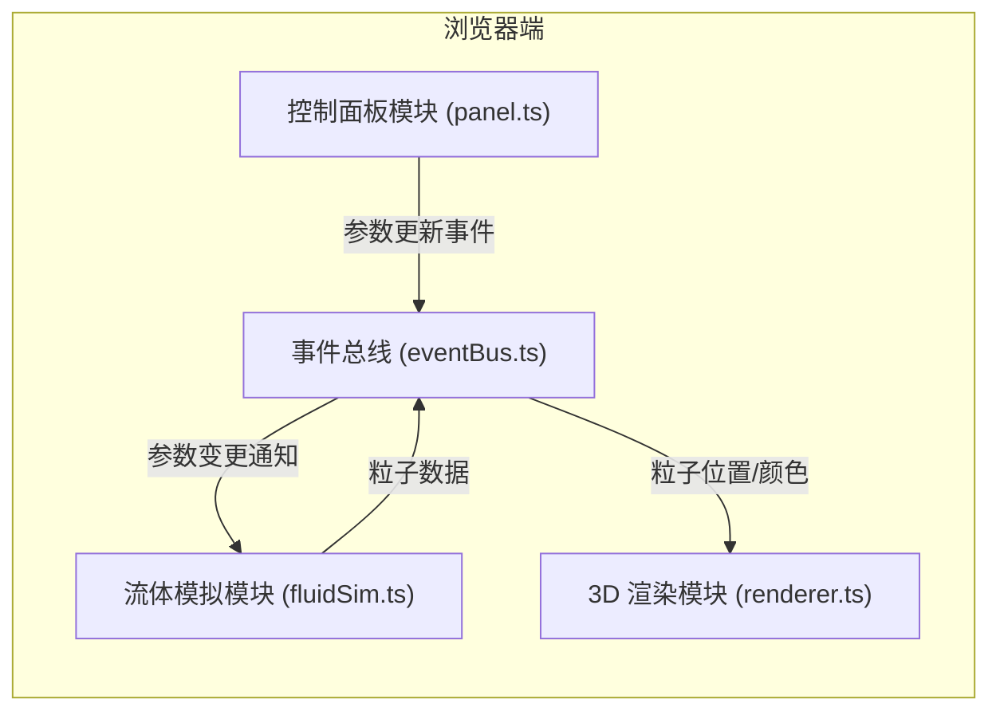

## 1. 架构设计



## 2. 技术栈说明

- **前端框架**：原生 TypeScript + Three.js（无 React/Vue 框架，纯 Canvas 渲染）
- **构建工具**：Vite
- **3D 引擎**：Three.js @0.160
- **编程语言**：TypeScript（严格模式，target ES2020）
- **样式**：原生 CSS（深色科技感主题）
- **通信模式**：发布-订阅事件总线

## 3. 文件结构

| 文件路径 | 职责说明 |
|----------|----------|
| `package.json` | 项目依赖与脚本配置 |
| `index.html` | 入口页面，全屏 Canvas |
| `tsconfig.json` | TypeScript 配置（严格模式） |
| `vite.config.js` | Vite 构建配置 |
| `src/eventBus.ts` | 事件总线模块：emit/on 方法 |
| `src/fluidSim.ts` | 流体模拟模块：粒子位置、双线性插值速度计算 |
| `src/renderer.ts` | 3D 渲染模块：Three.js 场景、相机、轨道控制、迷你地图 |
| `src/panel.ts` | UI 控制面板：滑块控件、折叠面板、参数调节 |

## 4. 模块接口定义

### 4.1 事件总线 (EventBus)

```typescript
interface EventBus {
  on(event: string, callback: Function): void;
  emit(event: string, data?: any): void;
}
```

**事件列表：**

| 事件名 | 发送方 | 接收方 | 数据说明 |
|--------|--------|--------|----------|
| `particles:update` | fluidSim | renderer | 粒子位置数组 + 速度颜色数组 |
| `params:scene` | panel | fluidSim | { particleCount, trailLength } |
| `params:wind` | panel | fluidSim | { windStrength, vortexStrength } |

### 4.2 流体模拟模块 (FluidSim)

```typescript
interface ParticleData {
  positions: Float32Array;    // x,y,z 坐标
  colors: Float32Array;       // r,g,b 颜色
  speeds: Float32Array;       // 速度大小
}

class FluidSim {
  constructor(eventBus: EventBus, areaSize: number);
  setParticleCount(count: number): void;
  setTrailLength(length: number): void;
  setWindStrength(strength: number): void;
  setVortexStrength(strength: number): void;
  update(deltaTime: number): void;
}
```

### 4.3 渲染模块 (Renderer)

```typescript
class Renderer {
  constructor(container: HTMLElement, eventBus: EventBus);
  updateParticles(data: ParticleData): void;
  resize(): void;
}
```

## 5. 核心算法

### 5.1 双线性插值速度计算

在 200km×200km 区域内布置网格风速数据点，对每个粒子位置进行双线性插值得到当前速度：

```
v(x,y) = (1-u)(1-v)*v00 + u(1-v)*v10 + (1-u)v*v01 + uv*v11
```

其中 u, v 为粒子在网格单元内的归一化坐标。

### 5.2 HSL 颜色插值

根据风速在色阶间进行 HSL 插值，实现平滑颜色过渡：
- 0-5 km/h: #2D9CDB (HSL: 204, 70%, 52%)
- 5-15 km/h: #27AE60 (HSL: 145, 63%, 42%)
- 15-25 km/h: #F2994A (HSL: 32, 85%, 62%)
- 25+ km/h: #EB5757 (HSL: 6, 81%, 63%)

### 5.3 涡流扰动

在基础风场上叠加涡流扰动，使用正弦函数生成旋转速度场：
```
vortex = sin(x * freq) * cos(y * freq) * strength
```

## 6. 性能优化策略

1. **粒子系统复用**：使用 THREE.Points 批量渲染，而非独立 Mesh
2. **尾迹优化**：使用位置历史数组 + 透明度渐变，最多 8 帧尾迹
3. **自动降级**：粒子数 > 4000 时关闭尾迹、减小粒子尺寸
4. **帧率监控**：保持 55+ FPS，必要时降低模拟精度
5. **缓冲区复用**：TypedArray 预先分配，避免频繁 GC
