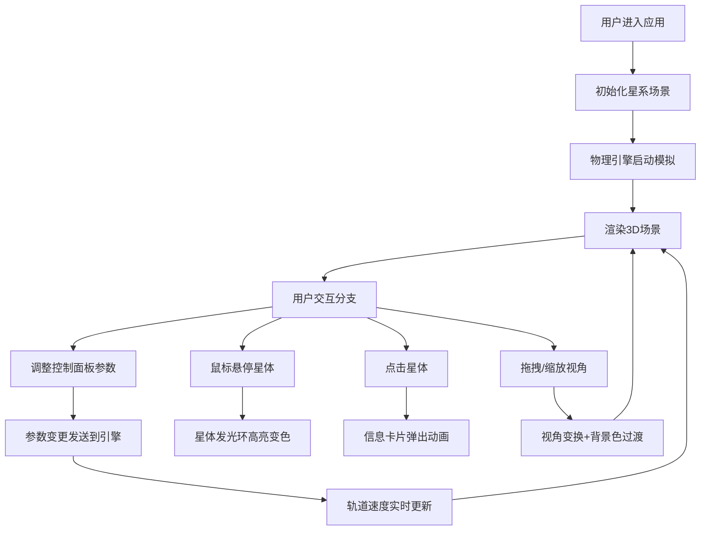

## 1. 产品概述

StellarSandbox 是一个在浏览器中运行的3D宇宙星系沙盒模拟工具，用户可以通过交互式方式探索星系运动规律，调整物理参数来观察星体轨迹变化。

- 目标用户：天文爱好者、物理学习者、教育工作者
- 产品价值：将抽象的引力物理定律可视化，提供沉浸式的星系探索体验

## 2. 核心功能

### 2.1 功能模块
1. **3D星系场景**：恒星+行星系统渲染，轨道可视化，星空背景
2. **物理引擎模拟**：引力计算，星体运动轨迹实时更新
3. **控制面板**：引力参数调节，星体参数显示
4. **信息展示**：星体详细信息卡片，悬停高亮效果
5. **视角交互**：拖拽旋转、平移、缩放控制

### 2.2 页面详情
| 页面名称 | 模块名称 | 功能描述 |
|---------|---------|---------|
| 主场景 | 3D渲染引擎 | 全屏3D星系渲染，星体网格创建，光照系统 |
| 主场景 | 物理引擎 | 引力常数计算，行星公转，参数实时响应 |
| 主场景 | 控制面板 | dat.gui参数调节面板，引力常数G、恒星质量滑块 |
| 主场景 | 信息卡片 | 点击行星弹出详情，包含名称、质量、轨道半径、公转周期 |
| 主场景 | 视角控制 | 鼠标拖拽旋转、右键平移、滚轮缩放、背景色过渡 |

## 3. 核心流程

## 4. 用户界面设计

### 4.1 设计风格
- 主色调：深紫 `#0A001A` → 深蓝 `#001A3D` 渐变背景
- 强调色：青色 `#00E5FF`（滑块、高亮）、橙色 `#FFAA00`（恒星发光）、青绿 `#00FFAA`（悬停）
- 面板背景：半透明暗色 `rgba(20,20,40,0.85)`，毛玻璃效果
- 字体：现代无衬线字体，浅色 `#E0E0E0`
- 视觉风格：暗色调空间主题，强调发光效果和深度感

### 4.2 页面设计概览
| 页面名称 | 模块名称 | UI元素 |
|---------|---------|--------|
| 主场景 | 3D画布 | 全屏渲染，渐变星空背景，200颗闪烁星星 |
| 主场景 | 控制面板 | 右上角280px宽，圆角10px，青色主题滑块，显示当前参数值 |
| 主场景 | 信息卡片 | 中央偏右300px宽，毛玻璃`rgba(0,0,0,0.7)`，圆角16px，内边距20px，底部滑入动画 |
| 主场景 | 响应式按钮 | <768px时左上角折叠按钮，点击展开面板 |

### 4.3 响应式设计
- 桌面端（≥768px）：控制面板常驻右上角
- 移动端（<768px）：控制面板折叠为左上角按钮，点击展开覆盖层
- 触摸优化：支持单指旋转、双指缩放

### 4.4 3D场景指导
- 环境：深空渐变背景（深紫到深蓝），200颗随机分布闪烁星点
- 光照：恒星作为点光源，自发光强度1.5，颜色#FFAA00
- 相机：PerspectiveCamera，初始位置可观察整个星系
- 交互：OrbitControls 控制视角，左键旋转、右键平移、滚轮缩放
- 动画：行星匀速公转，悬停发光环放大变色（0.3s过渡），背景色随旋转平滑过渡（2s）
- 性能目标：稳定50FPS以上，点击响应<100ms
