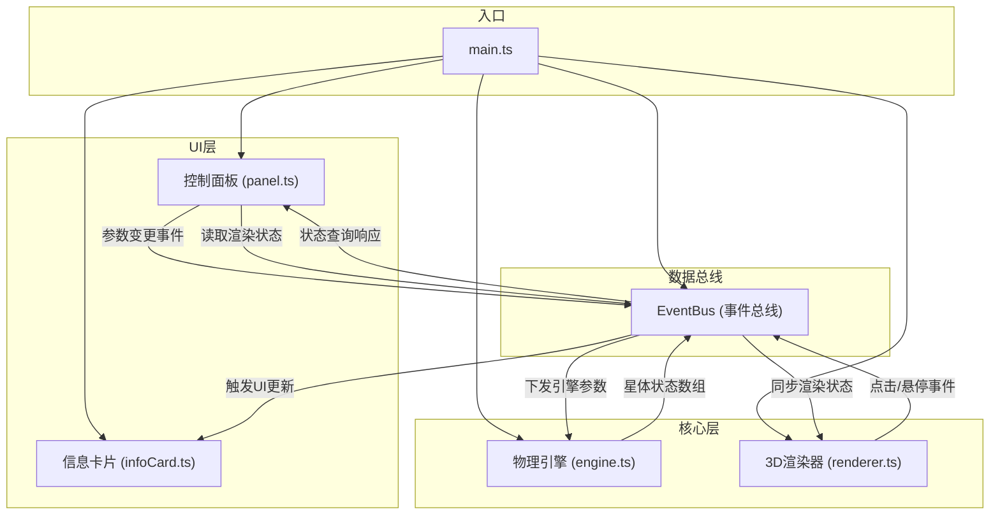

## 1. 架构设计



## 2. 技术栈说明
- 前端框架：原生 TypeScript（无UI框架）
- 构建工具：Vite 5.x
- 3D渲染：Three.js 0.160.0
- 物理模拟：自研轻量引力引擎（基于牛顿万有引力定律）
- UI控制：dat.gui（参数滑块）+ GSAP（动画缓动）
- 通信模式：发布-订阅事件总线（EventBus）
- 类型系统：TypeScript 严格模式（strict: true）

## 3. 文件结构与调用关系

```
src/
├── main.ts                    # 应用入口，初始化所有模块，创建EventBus
├── core/
│   ├── engine.ts              # 物理引擎：引力计算、星体位置更新
│   │   └── 输入：EventBus('params:update')
│   │   └── 输出：EventBus('bodies:update')
│   └── renderer.ts            # 3D渲染器：场景/相机/光照/网格
│       └── 输入：EventBus('bodies:update')
│       └── 输出：EventBus('body:hover', 'body:click', 'camera:rotate')
├── ui/
│   ├── panel.ts               # dat.gui控制面板
│   │   └── 输入：EventBus('bodies:update', 'body:select')
│   │   └── 输出：EventBus('params:update')
│   └── infoCard.ts            # 星体信息卡片（GSAP动画）
│       └── 输入：EventBus('body:click')
│       └── 输出：DOM渲染
└── styles/
    └── main.css               # 全局样式（面板、卡片、响应式）
```

**数据流向：**
1. 用户调节面板滑块 → panel.ts → `params:update` → engine.ts 更新引力参数
2. engine.ts 每帧计算 → `bodies:update` → renderer.ts 更新网格位置
3. renderer.ts 检测点击 → `body:click` → infoCard.ts 弹出卡片
4. renderer.ts 检测悬停 → `body:hover` → 发光环变色动画
5. renderer.ts 检测相机旋转 → `camera:rotate` → 背景色渐变过渡

## 4. 核心数据模型

### 4.1 星体数据结构 (CelestialBody)
```typescript
interface CelestialBody {
  id: string;
  name: string;
  type: 'star' | 'planet';
  mass: number;           // 质量（影响引力）
  radius: number;         // 视觉半径
  color: string;          // 颜色
  position: { x: number; y: number; z: number };
  velocity: { x: number; y: number; z: number };
  orbitRadius: number;    // 轨道半径
  orbitAngle: number;     // 当前轨道角度
  orbitSpeed: number;     // 公转角速度
  emissiveIntensity?: number;  // 自发光强度（仅恒星）
}
```

### 4.2 物理参数 (PhysicsParams)
```typescript
interface PhysicsParams {
  gravitationalConstant: number;  // 引力常数 G (0.1-2.0)
  starMass: number;               // 恒星质量 (1-10)
}
```

### 4.3 事件总线事件定义
```typescript
type EventMap = {
  'params:update': PhysicsParams;
  'bodies:update': CelestialBody[];
  'body:hover': { bodyId: string | null; position?: { x: number; y: number } };
  'body:click': { body: CelestialBody; screenPosition: { x: number; y: number } };
  'body:select': { bodyId: string | null };
  'camera:rotate': { isRotating: boolean; progress: number };
};
```

## 5. 性能优化策略
- 星体网格缓存：使用 InstancedMesh 优化大量星体渲染（当前场景规模小可先用独立Mesh）
- 物理模拟固定步长：使用固定时间步长（16.67ms）保证物理稳定性
- 事件节流：鼠标移动/悬停事件使用 RAF 节流
- Raycaster 优化：限制检测对象为行星 Mesh，减少碰撞检测开销
- 星空粒子：使用 Points + BufferGeometry 批量渲染200颗星点
- GSAP 动画：硬件加速 CSS transform/opacity 属性
