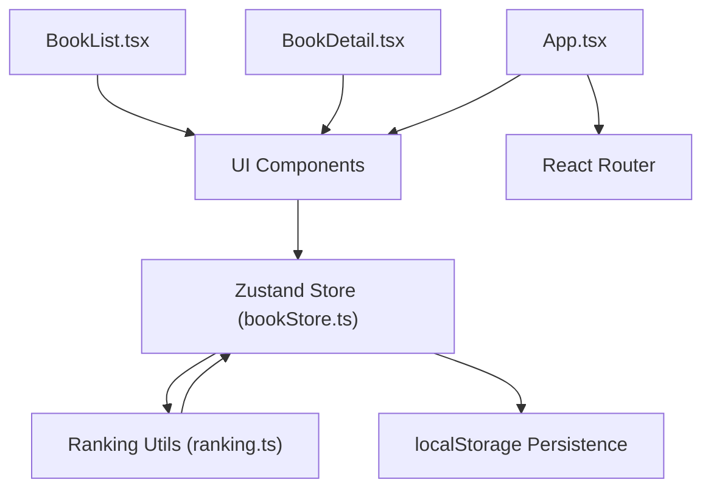
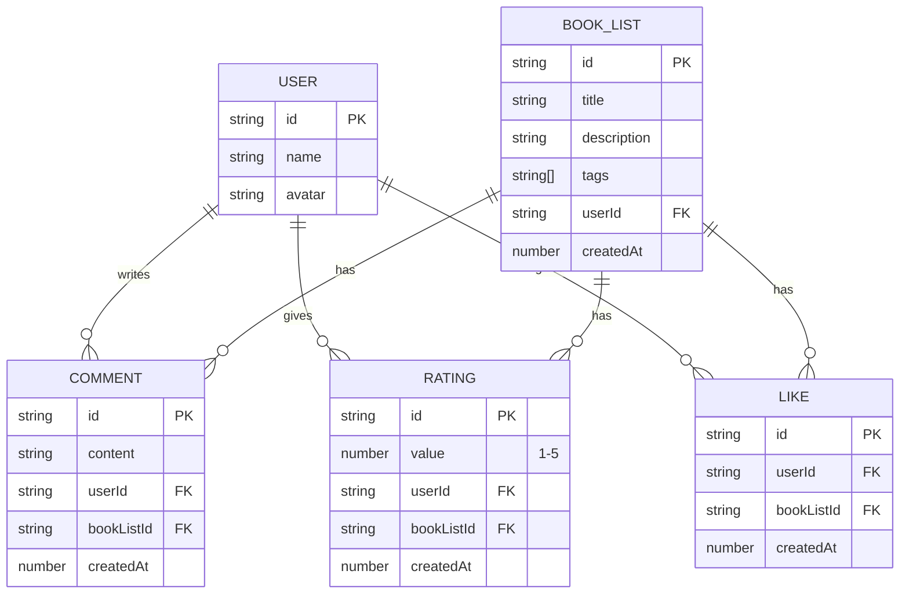

## 1. 架构设计



**数据流向说明**：
- 所有UI组件通过 `bookStore.ts` 作为唯一数据通道进行交互
- `ranking.ts` 作为纯函数工具模块，被store调用计算热度排名
- Store 自动同步数据到 localStorage 实现持久化
- 组件间通信全部通过 Store 进行，无直接组件间传值

## 2. 技术描述

- **前端框架**：React@18 + TypeScript
- **构建工具**：Vite
- **状态管理**：Zustand
- **路由**：React Router DOM（hash路由，无需服务端配置）
- **图表**：Recharts
- **唯一ID生成**：uuid
- **数据持久化**：localStorage（后端模拟）
- **样式方案**：TailwindCSS 3（CSS-in-Class，原子化CSS）
- **初始化工具**：npm create vite@latest

## 3. 目录结构

```
src/
├── App.tsx                 # 主应用组件，路由配置
├── main.tsx               # 应用入口
├── index.css              # 全局样式，Tailwind配置
├── store/
│   └── bookStore.ts       # Zustand状态管理
├── components/
│   ├── BookList.tsx       # 书单列表/排行榜页面
│   ├── BookDetail.tsx     # 书单详情页面
│   ├── BookCard.tsx       # 书单卡片组件
│   ├── StarRating.tsx     # 星级评分组件
│   ├── CreateBookModal.tsx # 创建书单弹窗
│   └── Sidebar.tsx        # 左侧导航组件
└── utils/
    └── ranking.ts         # 热度排名计算工具
```

## 4. 数据模型

### 4.1 实体关系图



### 4.2 TypeScript 类型定义

```typescript
interface User {
  id: string;
  name: string;
  avatar: string;
}

interface BookList {
  id: string;
  title: string;
  description: string;
  tags: string[];
  userId: string;
  createdAt: number;
}

interface Comment {
  id: string;
  content: string;
  userId: string;
  bookListId: string;
  createdAt: number;
}

interface Rating {
  id: string;
  value: number;
  userId: string;
  bookListId: string;
  createdAt: number;
}

interface Like {
  id: string;
  userId: string;
  bookListId: string;
  createdAt: number;
}

interface BookListWithStats extends BookList {
  averageRating: number;
  commentCount: number;
  likeCount: number;
  hotScore: number;
  userHasLiked: boolean;
  userRating: number | null;
}
```

## 5. Store 状态设计

```typescript
interface BookStore {
  // 状态
  bookLists: BookList[];
  comments: Comment[];
  ratings: Rating[];
  likes: Like[];
  currentUser: User;
  rankedBookLists: BookListWithStats[];
  
  // 操作方法
  createBookList: (data: Omit<BookList, 'id' | 'userId' | 'createdAt'>) => void;
  addComment: (bookListId: string, content: string) => void;
  addRating: (bookListId: string, value: number) => void;
  toggleLike: (bookListId: string) => void;
  refreshRanking: () => void;
  
  // 持久化
  persist: () => void;
  hydrate: () => void;
}
```

## 6. 热度计算算法

**热度值公式**：
```
热度值 = 平均评分 × 10 + 评论数 × 2 + 点赞数 × 1
```

**ranking.ts 核心函数**：
```typescript
// 计算单本书单的热度值
function calculateHotScore(bookList: BookList, ratings: Rating[], comments: Comment[], likes: Like[]): number

// 计算书单的统计数据（平均评分、评论数等）
function calculateBookListStats(bookList: BookList, ratings: Rating[], comments: Comment[], likes: Like[], currentUserId: string): BookListWithStats

// 对书单列表按热度排序
function sortByHotScore(bookLists: BookList[], ratings: Rating[], comments: Comment[], likes: Like[], currentUserId: string): BookListWithStats[]
```

## 7. 性能优化方案

1. **数据持久化防抖**：Store 更新后延迟 300ms 写入 localStorage，避免频繁写入
2. **排行榜 memo 优化**：使用 useMemo 缓存排序结果，仅在依赖数据变化时重新计算
3. **列表虚拟化**：排行榜仅渲染前10条，避免不必要的DOM操作
4. **CSS 过渡优化**：使用 transform 和 opacity 属性实现动画，触发 GPU 加速
5. **React.memo**：对卡片组件使用 memo，避免不必要的重渲染
6. **localStorage 预加载**：应用启动时并行读取所有数据，避免阻塞首屏渲染

## 8. 核心模块调用关系

```
App.tsx (路由)
├── Sidebar.tsx (导航)
├── / → BookList.tsx (书单列表)
│   ├── CreateBookModal.tsx (创建书单)
│   └── BookCard.tsx × N (书单卡片)
│       └── StarRating.tsx (评分展示)
└── /book/:id → BookDetail.tsx (书单详情)
    ├── StarRating.tsx (评分交互)
    └── CommentList.tsx (评论列表)
        └── CommentItem.tsx × N (单条评论)

Store 调用关系：
bookStore.ts → ranking.ts (计算热度)
bookStore.ts → localStorage (持久化)
所有组件 → bookStore.ts (读写数据)
```
