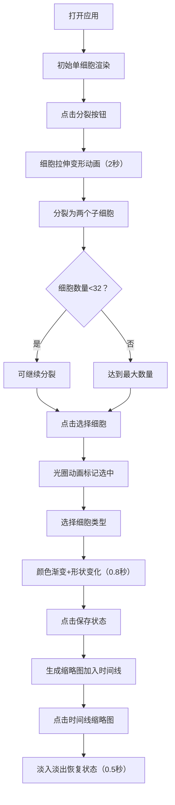

## 1. 产品概述

本产品是一个基于浏览器的3D细胞分裂与分化可视化模拟器，专为生物教学和科普场景设计，解决难以直观展示细胞从单细胞到多细胞团簇、再分化出不同功能细胞群的复杂过程的问题。通过交互式3D场景，用户可以观察和控制细胞分裂过程，标记不同类型的细胞，并保存/回放关键状态。

## 2. 核心功能

### 2.1 用户角色
| 角色 | 注册方式 | 核心权限 |
|------|----------|----------|
| 普通用户 | 无需注册，直接访问 | 操作细胞分裂、分化、状态保存与回放 |

### 2.2 功能模块
1. **3D场景主界面**：细胞实时渲染、视角控制、交互选择
2. **操作控制面板**：分裂按钮、细胞类型选择、分裂间隔设置
3. **时间线管理**：状态保存、缩略图展示、状态回放

### 2.3 页面详情
| 页面名称 | 模块名称 | 功能描述 |
|---------|---------|----------|
| 主界面 | 3D场景渲染 | 实时渲染细胞模型，支持拖拽旋转、滚动缩放，显示辅助网格和星点背景 |
| 主界面 | 细胞交互 | 点击选择细胞（光圈动画），观察细胞分裂动画（2秒拉伸变形，easeInOutCubic缓动） |
| 控制面板 | 分裂控制 | 大圆形分裂按钮，支持设置分裂间隔（1-5秒），最多分裂至32个细胞 |
| 控制面板 | 类型选择 | 神经细胞、肌肉细胞、上皮细胞三种类型标记，不同颜色和形状变化 |
| 控制面板 | 时间线 | 保存当前状态（最多10个），缩略图展示，点击恢复状态（淡入淡出动画） |

## 3. 核心流程

用户打开应用 → 查看初始单细胞 → 点击分裂按钮 → 观察细胞分裂动画 → 多次分裂形成细胞团 → 点击选择单个细胞 → 选择细胞类型进行标记 → 观察细胞颜色和形状变化 → 点击保存按钮记录状态 → 在时间线点击缩略图回放状态

## 4. 用户界面设计

### 4.1 设计风格
- **主色调**：深色主题，背景深蓝渐变（#0A0A1A → #1A1A2E）
- **强调色**：分裂按钮紫色（#673AB7），选中光圈橙色（#FFA500）
- **细胞类型色**：神经#E91E63，肌肉#4CAF50，上皮#2196F3
- **控制面板**：背景#1E1E2E，圆角12px，阴影0 8px 24px rgba(0,0,0,0.4)
- **按钮样式**：大圆形分裂按钮（直径60px），按下内发光效果
- **字体**：现代无衬线字体，清晰可读
- **动效**：所有交互元素0.2秒过渡，细胞分裂2秒easeInOutCubic，状态恢复0.5秒淡入淡出

### 4.2 页面设计概述
| 页面名称 | 模块名称 | UI元素 |
|---------|---------|--------|
| 主界面 | 3D场景区域 | 占70%宽度，细胞模型，辅助网格（#3C4F5C，间距5，透明度0.2），100颗星点闪烁 |
| 主界面 | 控制面板 | 宽度340px，从上到下：操作区（分裂按钮+间隔设置）、类型选择区（三个圆形图标）、时间线区（水平滚动缩略图），分隔线#3C3C4C |
| 控制面板 | 分裂按钮 | 大圆形，#673AB7，hover过渡，点击scale 0.95动画100ms，按下内发光#9575CD |
| 控制面板 | 类型选择器 | 三个圆形图标水平排列，选中时底部滑条动画，颜色对应细胞类型 |
| 控制面板 | 时间线 | 水平可滚动，每格80px，缩略图60x60px，圆角8px，背景#2C2C3A |

### 4.3 响应式
- **桌面端**：左侧3D场景（70%），右侧控制面板（340px固定宽度）
- **移动端**（<768px）：控制面板移至下方，高度自适应，3D场景占满上方空间

### 4.4 3D场景指导
- **环境**：深蓝渐变背景，100颗随机星点（大小0.1-0.3，闪烁周期3-5秒）
- **光照**：环境光+方向光组合，细胞表面有微弱高光
- **相机**：PerspectiveCamera，OrbitControls控制，zoom速度0.5
- **细胞模型**：球形主体半透明渐变，核心小深色球体，表面噪点纹理
- **动画**：分裂时2秒拉伸变形（easeInOutCubic），分化时0.8秒颜色渐变和形状变形
- **后处理**：细胞选中时橙色光圈脉动（1.5Hz）
- **性能**：32个细胞时帧率≥30fps，交互延迟≤100ms
