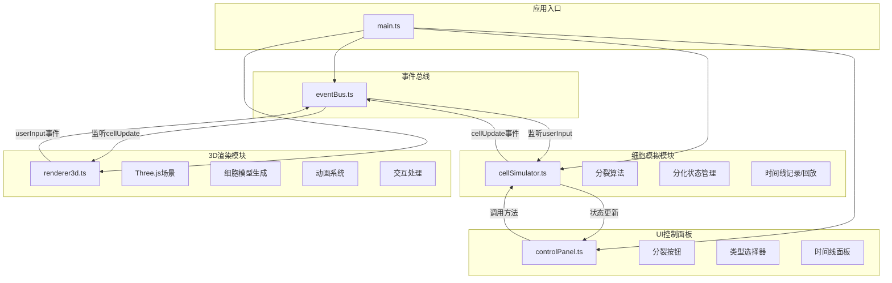

## 1. 架构设计



## 2. 技术描述

- **前端框架**：原生TypeScript + Vite（无React/Vue，用户明确要求）
- **3D引擎**：Three.js @0.160.0
- **项目结构**：
  - `src/eventBus.ts` - 事件总线，模块间通信
  - `src/modules/cellSimulator.ts` - 细胞模拟逻辑
  - `src/modules/renderer3d.ts` - Three.js 3D渲染
  - `src/ui/controlPanel.ts` - HTML控制面板
  - `src/main.ts` - 应用入口
- **构建工具**：Vite 5.x
- **开发语言**：TypeScript 5.x（严格模式，target ES2020）

## 3. 核心数据结构

### 3.1 事件类型定义
```typescript
enum EventType {
  CELL_CREATED = 'cell:created',
  CELL_UPDATED = 'cell:updated',
  CELL_SELECTED = 'cell:selected',
  CELL_DIFFERENTIATED = 'cell:differentiated',
  SPLIT_STARTED = 'split:started',
  SPLIT_COMPLETED = 'split:completed',
  RECORD_SAVED = 'record:saved',
  RECORD_RESTORED = 'record:restored',
  USER_INPUT = 'user:input'
}
```

### 3.2 细胞数据模型
```typescript
interface CellData {
  id: string;
  position: { x: number; y: number; z: number };
  color: string;
  type: 'default' | 'neuron' | 'muscle' | 'epithelial';
  scale: { x: number; y: number; z: number };
  parentId?: string;
  generation: number;
}
```

### 3.3 时间线记录
```typescript
interface RecordData {
  id: string;
  timestamp: number;
  cells: CellData[];
  splitCount: number;
  thumbnail?: string;
}
```

## 4. 模块接口定义

### 4.1 CellSimulator 接口
```typescript
interface ICellSimulator {
  splitCell(): Promise<void>;
  differentiateCell(cellId: string, type: CellType): void;
  selectCell(cellId: string | null): void;
  saveRecord(): string;
  restoreRecord(recordId: string): Promise<void>;
  getCells(): CellData[];
  getSelectedCellId(): string | null;
  getRecords(): RecordData[];
  getSplitInterval(): number;
  setSplitInterval(seconds: number): void;
  canSplit(): boolean;
}
```

### 4.2 Renderer3D 接口
```typescript
interface IRenderer3D {
  init(container: HTMLElement): void;
  updateCell(cellData: CellData): void;
  removeCell(cellId: string): void;
  selectCell(cellId: string | null): void;
  startSplitAnimation(parentId: string): Promise<void>;
  startDifferentiationAnimation(cellId: string): Promise<void>;
  fadeTransition(duration: number): Promise<void>;
  resize(): void;
  dispose(): void;
}
```

## 5. 性能优化策略

1. **对象池**：细胞Mesh对象池，避免频繁创建销毁
2. **实例化**：对于相同类型细胞，考虑使用InstancedMesh
3. **材质复用**：相同属性细胞共享材质实例
4. **动画优化**：使用requestAnimationFrame，避免不必要的重绘
5. **事件节流**：高频事件（如鼠标移动）进行节流处理
6. **WebGL优化**：合理设置像素比，减少绘制调用

## 6. 目录结构

```
auto21/
├── package.json
├── vite.config.js
├── tsconfig.json
├── index.html
└── src/
    ├── main.ts
    ├── eventBus.ts
    ├── modules/
    │   ├── cellSimulator.ts
    │   └── renderer3d.ts
    └── ui/
        └── controlPanel.ts
```
