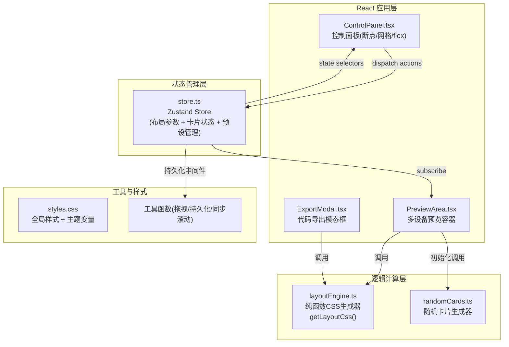

## 1. 架构设计



## 2. 技术描述

- **前端框架**：React@18 + ReactDOM@18
- **构建工具**：Vite (vite.config.js + React插件)
- **语言**：TypeScript (严格模式，target es2020，moduleResolution bundler)
- **状态管理**：Zustand (含persist中间件做localStorage持久化)
- **工具库**：uuid（卡片唯一标识）、lodash.debounce（滚动同步防抖）
- **图标库**：lucide-react
- **样式方案**：原生CSS + CSS变量，文件 src/styles.css

## 3. 状态管理设计 (Zustand Store)

```typescript
// src/store.ts 核心类型
interface Breakpoint { id: string; value: number; color: string; label: string }
interface GridConfig { columns: number; gap: number; margin: number }
interface FlexConfig { grow: number; shrink: number; basis: number }
interface Card { id: string; width: number; height: number; title: string; content: string }
type PresetId = 'blog2' | 'blog3' | 'ecommerce' | 'dashboard' | 'gallery'
interface PreviewCards { mobile: Card[]; tablet: Card[]; desktop: Card[] }

interface LayoutState {
  breakpoints: Breakpoint[]
  grid: GridConfig
  flex: FlexConfig
  cards: PreviewCards
  activePreset: PresetId | null
  controlPanelCollapsed: boolean

  // Actions
  addBreakpoint: () => void
  removeBreakpoint: (id: string) => void
  updateBreakpoint: (id: string, patch: Partial<Breakpoint>) => void
  reorderBreakpoints: (fromIndex: number, toIndex: number) => void
  setGrid: (patch: Partial<GridConfig>) => void
  setFlex: (patch: Partial<FlexConfig>) => void
  loadPreset: (id: PresetId) => void
  addCard: (device: 'mobile' | 'tablet' | 'desktop') => void
  removeCard: (device: keyof PreviewCards, id: string) => void
  reorderCard: (device: keyof PreviewCards, from: number, to: number) => void
  togglePanel: () => void
}
```

## 4. 模块职责与文件结构

```
auto24/
├── package.json               # 依赖: react@18, react-dom@18, zustand, uuid, lodash.debounce, lucide-react
├── vite.config.js             # Vite + React插件配置
├── tsconfig.json              # 严格模式 TS 配置
├── index.html                 # Vite 入口 HTML
└── src/
    ├── main.tsx               # React 入口
    ├── App.tsx                # 根组件 (布局: ControlPanel + PreviewArea + ExportModal)
    ├── store.ts               # Zustand store（含 persist 中间件）
    ├── layoutEngine.ts        # 纯函数模块: 参数→CSS字符串
    ├── styles.css             # 全局样式 + CSS变量 + 动画关键帧
    ├── utils/
    │   └── randomCards.ts     # 随机卡片数据生成器
    └── components/
        ├── ControlPanel.tsx       # 左侧控制面板(含三个子面板)
        ├── PreviewArea.tsx        # 右侧三设备预览容器
        ├── ExportModal.tsx        # CSS导出模态框(语法高亮)
        ├── DeviceFrame.tsx        # 可复用设备边框组件
        ├── CardItem.tsx           # 可拖拽卡片组件
        ├── ContextMenu.tsx        # 右键菜单组件
        └── PresetToolbar.tsx      # 预设模板工具栏
```

## 5. 核心算法与纯函数 (layoutEngine.ts)

```typescript
// layoutEngine 导出两个纯函数:

/** 生成内联样式对象(供PreviewArea应用到卡片容器) */
export function getContainerStyles(params: {
  grid: GridConfig
  flex: FlexConfig
  deviceWidth: number
  breakpoints: Breakpoint[]
}): React.CSSProperties

/** 生成完整可导出的CSS代码字符串(含断点@media规则) */
export function generateFullCss(params: {
  breakpoints: Breakpoint[]
  grid: GridConfig
  flex: FlexConfig
}): string
```

- 生成逻辑：基于 breakpoints 数组排序后生成每个 `@media (min-width: Xpx)` 规则块
- 网格规则：`display:grid; grid-template-columns: repeat(N, 1fr); gap: Gpx; padding: Mpx;`
- 弹性规则：`.flex-item { flex: G S B; }`

## 6. 数据模型与持久化

- **持久化 Key**：`responsive-layout-tool:v1`
- **持久化内容**：Zustand store 的完整 state（不含瞬时UI状态如拖拽中标记）
- **序列化**：Zustand persist 中间件默认 JSON.stringify/parse
- **性能**：localStorage 读写通过 debounce 50ms 合并，单次读写 ≤5ms

## 7. 性能保障策略

1. **Zustand 选择器**：组件使用精细的 state selector，避免无关状态导致重渲染
2. **React.memo**：CardItem、DeviceFrame 等子组件用 memo 包裹
3. **useMemo/useCallback**：layoutEngine 调用、事件处理函数用 hooks 缓存
4. **debounce 滚动同步**：lodash.debounce 50ms 防抖滚动事件
5. **requestAnimationFrame**：拖拽视觉更新通过 rAF 节流
6. **CSS transition**：所有视觉过渡使用硬件加速的 CSS 动画而非 JS
