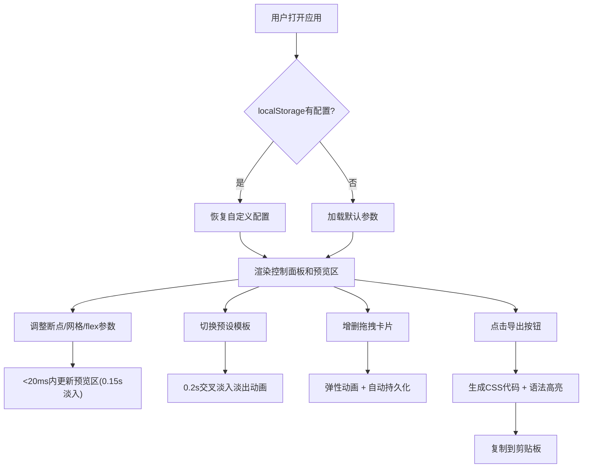

## 1. 产品概述

响应式布局调试工具是一个面向前端开发者的效率工具，解决在开发响应式网页时手动调整CSS断点、网格系统和弹性布局参数效率低、难以直观对比不同方案效果的问题。通过多设备实时预览和一键代码导出，帮助开发者快速验证和迭代布局策略。

- 目标用户：前端工程师、UI设计师
- 核心价值：将数小时的手动调试时间缩短至分钟级，提供直观的多屏同步预览

## 2. 核心功能

### 2.1 功能模块

1. **布局编辑与实时预览**：左侧控制面板（断点管理、网格配置、弹性布局参数），右侧多设备实时预览
2. **多设备模拟对比**：手机竖屏(375px)、平板竖屏(768px)、桌面(1280px)三个预览区同步滚动
3. **预设模板导入**：5种预设布局模板（博客两栏/三栏、电商网格、仪表盘、图库瀑布流）
4. **CSS代码导出**：自动生成带语法高亮的CSS代码，支持一键复制
5. **布局自定义与保存**：卡片增删拖拽、自定义配置自动持久化到localStorage

### 2.2 页面详情

| 页面名称 | 模块名称 | 功能描述 |
|-----------|-------------|---------------------|
| 主页 | 控制面板 | 折叠式面板，包含断点管理、网格配置、弹性布局三个子面板，所有参数实时联动预览 |
| 主页 | 多设备预览区 | 上中下布局：手机(上) + 平板/桌面(下并排)，同步滚动，卡片可拖拽排序 |
| 主页 | 导出模态框 | 展示生成的CSS代码（语法高亮），支持复制到剪贴板 |
| 主页 | 预设模板工具栏 | 5个预设模板快速切换按钮，带交叉淡入淡出动画 |
| 主页 | 卡片操作 | 添加卡片按钮、右键删除菜单、长按拖拽排序 |

## 3. 核心流程

用户打开应用 → 从localStorage恢复配置（或使用默认）→ 调整控制面板参数（滑块/输入框/拖拽）→ 实时查看三个预览区变化 → 切换预设模板快速验证方案 → 自定义卡片内容（增删拖拽）→ 点击导出按钮 → 在模态框中查看并复制CSS代码 → 所有操作自动保存。

## 4. 用户界面设计

### 4.1 设计风格

- **主色调**：蓝色 #3B82F6（悬停 #2563EB），灰色 #6B7280，绿色 #10B981，红色 #EF4444
- **背景色**：整体 #F3F4F6，控制面板 #FFFFFF，预览区设备背景 #F9FAFB
- **按钮风格**：圆角6px，圆形按钮直径28px，悬停阴影加深，所有可交互元素 transition: all 0.15s ease
- **字体**：Fira Code等宽字体用于代码展示，系统字体用于UI文本
- **卡片风格**：圆角8px，白色背景，small box-shadow (0 1px 3px rgba(0,0,0,0.1))
- **图标**：使用 Lucide React 图标库

### 4.2 页面设计概览

| 页面名称 | 模块名称 | UI元素 |
|-----------|-------------|-------------|
| 主页 | 控制面板 | 320px宽白色面板，三个可折叠子面板，滑块/输入框/色盘，滚轮调值 |
| 主页 | 手机预览 | 375px宽圆角12px设备边框(2px #D1D5DB)，背景#F9FAFB |
| 主页 | 平板/桌面预览 | 768px/1280px，并排各50%，1px虚线#E5E7EB分隔 |
| 主页 | 导出模态框 | 640px宽，半透明黑色背景#00000066，圆角12px，可滚动 |
| 主页 | 右键菜单 | 深色背景#1F2937，圆角4px，悬停#374151 |

### 4.3 响应式设计

- Desktop-first设计
- **<1200px**：三个预览区改为上下垂直排布
- **<900px**：控制面板收起为顶部48px导航栏，点击展开为全屏遮罩面板
- 所有数值输入框支持鼠标滚轮调整（步长1px），获得焦点时边框高亮(#3B82F6 2px)

### 4.4 动画与微交互

- 参数变化更新：0.1s内完成，0.15s淡入动画 (transition: all 0.15s ease)
- 预设模板切换：0.2s交叉淡入淡出 (opacity 0→1 + transform scale 0.98→1)
- 卡片拖拽：透明度0.8，浅蓝色虚线框#93C5FD放置提示
- 卡片放置：0.15s弹性动画 (scale 0.95→1.05→1)
- 卡片删除：缩小到0 + opacity淡出，0.2s后移除DOM
- 同步滚动延迟 ≤50ms，渲染时间 ≤20ms

## 5. 性能指标

| 指标 | 要求 |
|------|------|
| 预览区重渲染时间 | ≤20ms (performance.now()测量) |
| 三屏同步滚动延迟 | ≤50ms |
| localStorage读写 | ≤5ms |
| 参数更新到预览响应 | ≤100ms |
