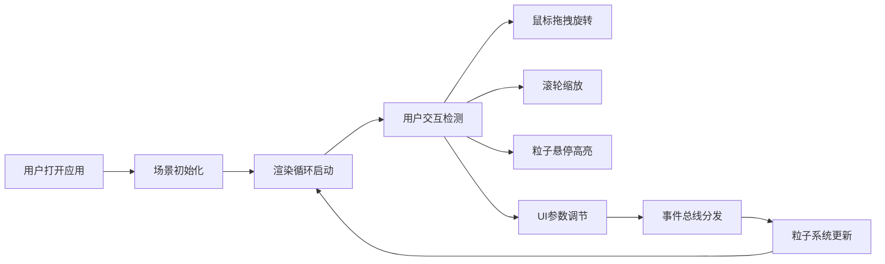

## 1. 产品概述

AuroraWave 是一款基于 WebGL 的 3D 极光粒子波动可视化应用，通过实时粒子系统模拟极光的动态波动与色彩渐变效果，支持鼠标交互和参数调节，为用户提供沉浸式的极光视觉体验。

- 主要用途：视觉艺术展示、科学可视化演示、交互设计参考
- 目标用户：设计师、开发者、视觉艺术爱好者
- 产品价值：在浏览器中呈现高质量 3D 极光效果，支持实时参数调节与交互

## 2. 核心功能

### 2.1 功能模块

1. **粒子极光波动模拟**：5000 个粒子的动态波动、颜色渐变、大小闪烁
2. **鼠标交互与视角控制**：拖拽旋转、滚轮缩放、粒子悬停效果
3. **UI 参数调节面板**：波幅、波速、粒子数量、颜色主题调节
4. **性能监控与优化**：帧率显示、增量更新策略、平滑过渡

### 2.2 页面详情

| 页面名称 | 模块名称 | 功能描述 |
|---------|---------|---------|
| 主页 | 3D 场景渲染 | 极光粒子系统、星空背景、网格地面 |
| 主页 | FPS 监控面板 | 左上角实时帧率显示，低于 55 FPS 时红色闪烁 |
| 主页 | 参数控制面板 | 右侧半透明面板，包含滑块和下拉菜单 |

## 3. 核心流程

用户打开应用 → 场景初始化（粒子系统、相机、光照） → 实时渲染循环 → 用户交互（拖拽/缩放/悬停） → 参数调节（通过事件总线） → 粒子系统更新 → 渲染更新

## 4. 用户界面设计

### 4.1 设计风格

- **主色调**：深空蓝紫渐变背景，鲜艳极光粒子色彩
- **辅色调**：珊瑚红 (#FF6B6B) 作为 UI 控件强调色
- **文字色**：浅灰色 (#C0C0C0) 用于标签，绿色 (#00FF88) 用于 FPS
- **UI 面板**：半透明深色背景 (#1A1A2E, 透明度 0.85)，圆角 12px
- **滑块样式**：轨道高 4px，按钮直径 16px，颜色 #FF6B6B
- **字体**：现代无衬线字体，清晰易读

### 4.2 页面设计概述

| 页面名称 | 模块名称 | UI 元素 |
|---------|---------|---------|
| 主页 | 3D 场景 | 全屏 Canvas，极光粒子波动，星空背景，网格地面 |
| 主页 | FPS 面板 | 左上角，半透明黑底，绿色数值，低于阈值变红闪烁 |
| 主页 | 控制面板 | 右侧固定 280px，半透明深色，包含四个控制项 |

### 4.3 响应式

- 桌面端优先设计
- 控制面板固定右侧，不随窗口缩放改变宽度
- Canvas 自适应窗口大小
- 支持窗口 resize 事件实时调整

### 4.4 3D 场景指引

- **环境**：深空渐变背景（顶部 #0A0A2E，底部 #1A1A3E），无光源依赖
- **光照**：粒子使用自发光材质，无需场景光源
- **相机**：透视相机，初始距离 15 单位，拖拽旋转，滚轮缩放
- **组成**：极光粒子群为视觉焦点，星空和网格地面提供空间参照
- **交互**：鼠标拖拽旋转视角，滚轮缩放，悬停粒子高亮
- **后处理**：粒子光晕效果通过材质实现，保证性能
- **资源**：纯程序化生成，无外部资源依赖
