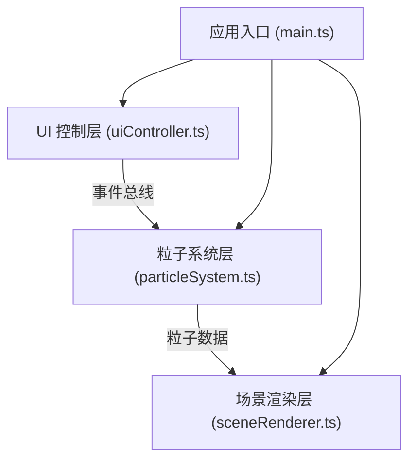

## 1. 架构设计



采用模块化三层架构：
- **UI 控制层**：处理用户输入，通过事件总线发送参数变更
- **粒子系统层**：管理粒子状态，执行波动计算和颜色渐变
- **场景渲染层**：管理 Three.js 场景、相机、渲染循环

## 2. 技术描述

- **前端框架**：原生 TypeScript + Three.js（无 React/Vue 框架，保持轻量）
- **构建工具**：Vite 5.x
- **3D 引擎**：Three.js @0.160
- **动画库**：GSAP @3.12.5（用于缓动动画）
- **语言**：TypeScript（严格模式，target ES2020）

## 3. 模块定义

### 3.1 文件结构

| 文件 | 职责 |
|------|------|
| `src/main.ts` | 应用入口，初始化各模块，启动渲染循环 |
| `src/particleSystem.ts` | 粒子系统模块：粒子创建、更新、颜色/大小计算 |
| `src/sceneRenderer.ts` | 场景渲染模块：Three.js 场景、相机、渲染器管理 |
| `src/uiController.ts` | UI 控制模块：控制面板 DOM 操作、事件绑定、事件总线 |
| `src/eventBus.ts` | 事件总线：模块间通信 |
| `index.html` | 入口页面，Canvas 容器和 UI 面板 |

### 3.2 事件总线事件

| 事件名 | 数据 | 发送方 | 接收方 |
|--------|------|--------|--------|
| `param:amplitude` | `number` | UI 控制 | 粒子系统 |
| `param:speed` | `number` | UI 控制 | 粒子系统 |
| `param:count` | `number` | UI 控制 | 粒子系统 |
| `param:colorTheme` | `string` | UI 控制 | 粒子系统 |

## 4. 数据模型

### 4.1 粒子数据结构

```typescript
interface Particle {
  x: number;
  y: number;
  z: number;
  baseY: number;
  size: number;
  baseSize: number;
  color: { r: number; g: number; b: number };
  brightness: number;
  fadeOpacity: number;
  phase: number;
}
```

### 4.2 粒子系统参数

```typescript
interface ParticleParams {
  amplitude: number;      // 波幅，默认 0.5
  speed: number;          // 波速，默认 0.8
  count: number;          // 粒子数量，默认 5000
  colorTheme: string;     // 颜色主题，默认 'aurora'
}
```

## 5. 性能优化策略

1. **粒子增量更新**：粒子数量变化时，增加的粒子淡入，减少的粒子淡出，过渡 0.2 秒
2. **BufferGeometry**：使用 THREE.BufferGeometry 批量渲染粒子，减少 draw call
3. **PointsMaterial**：使用点精灵材质，单 draw call 渲染所有粒子
4. **动画帧率控制**：使用 requestAnimationFrame，基于 deltaTime 更新
5. **离屏粒子剔除**：可视范围外的粒子跳过计算（可选优化）

## 6. 颜色主题定义

| 主题名称 | 颜色渐变（从低到高） |
|---------|-------------------|
| 极光蓝紫粉 | #0033FF → #9900FF → #FF00CC |
| 火焰红橙黄 | #FF0000 → #FF6600 → #FFFF00 |
| 海洋蓝绿青 | #0066FF → #00CC99 → #00FFFF |
