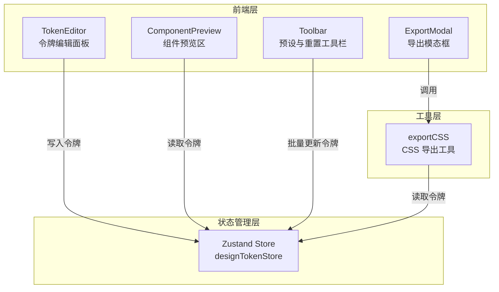

## 1. 架构设计



## 2. 技术说明

- 前端框架：React@18 + TypeScript
- 构建工具：Vite
- 状态管理：Zustand
- 颜色处理：chroma-js
- 唯一标识：uuid
- CSS 方案：CSS Modules + CSS 自定义属性
- 初始化工具：vite-init（react-ts 模板）

## 3. 路由定义

| 路由 | 用途 |
|------|------|
| / | 主页面，包含令牌编辑、组件预览、预设重置、导出功能 |

## 4. 数据模型

### 4.1 设计令牌数据结构

```typescript
interface ColorToken {
  name: string;
  hue: number;       // 0-360
  saturation: number; // 0-100
  lightness: number;  // 0-100
  value: string;      // HSL 计算结果
}

interface SpacingToken {
  name: string;
  value: number;      // 0-48px
}

interface BorderRadiusToken {
  name: string;
  value: number;      // 0-48px
}

interface ShadowToken {
  name: string;
  blur: number;       // 0-32px
  offsetX: number;    // 0-16px
  offsetY: number;    // 0-16px
  value: string;      // 计算结果
}

interface DesignTokens {
  colors: Record<string, ColorToken>;
  spacing: Record<string, SpacingToken>;
  borderRadius: Record<string, BorderRadiusToken>;
  shadows: Record<string, ShadowToken>;
}
```

### 4.2 数据流向

- **写入方向**：TokenEditor → Zustand Store ← Toolbar（预设/重置）
- **读取方向**：Zustand Store → ComponentPreview（渲染）、Zustand Store → exportCSS（导出）
- **实时性**：所有 store 更新通过 Zustand 的订阅机制，确保 16ms 内反映到 UI

## 5. 文件结构与调用关系

```
src/
├── store/
│   └── designTokenStore.ts    # Zustand store，维护令牌数据
├── components/
│   ├── TokenEditor.tsx         # 令牌编辑面板 → 写入 store
│   ├── ComponentPreview.tsx    # 组件预览区 → 读取 store
│   ├── Toolbar.tsx             # 预设与重置 → 批量更新 store
│   └── ExportModal.tsx         # 导出模态框 → 调用 exportCSS
├── utils/
│   └── exportCSS.ts            # CSS 导出工具 → 读取 store
├── App.tsx                     # 主布局组件
└── main.tsx                    # 入口文件
```
