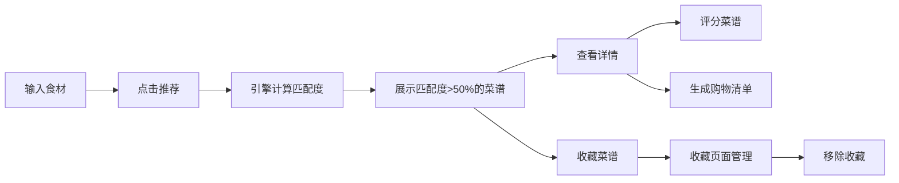

## 1. 产品概述

RecipeCraft 是一款智能菜谱推荐应用，帮助用户根据冰箱现有食材发现可制作的美食，同时提供菜谱收藏、评分和购物清单功能。

- 主要功能：食材输入匹配、菜谱推荐、收藏管理、评分系统、购物清单生成
- 目标用户：家庭主妇、烹饪爱好者、忙碌的上班族
- 产品价值：减少食材浪费、激发烹饪灵感、简化购物流程

## 2. 核心功能

### 2.1 功能模块

1. **菜谱推荐页**：食材输入区、推荐按钮、菜谱卡片列表
2. **收藏管理页**：收藏菜谱网格展示、移除收藏功能
3. **菜谱详情弹窗**：完整步骤展示、评分系统、购物清单生成

### 2.2 页面详情

| 页面名称 | 模块名称 | 功能描述 |
|-----------|-------------|---------------------|
| 菜谱推荐页 | 食材输入区 | 文本输入框回车生成食材标签、标签删除、宽度320px固定不滚动 |
| 菜谱推荐页 | 推荐按钮 | 全宽48px高、蓝色背景、hover渐变光晕动画 |
| 菜谱推荐页 | 菜谱卡片列表 | 卡片式布局、匹配度进度条、食材标签、收藏按钮、详情按钮 |
| 收藏管理页 | 收藏网格 | 三列网格布局、卡片样式与推荐页一致、移除收藏按钮（带动画） |
| 详情弹窗 | 步骤展示 | 3-6个步骤、序号圆圈、虚线分隔 |
| 详情弹窗 | 评分区域 | 五颗星星、渐变色、点击波纹动画、实时更新平均分 |
| 导航栏 | 顶部导航 | 高度56px、深色背景、两个导航标签切换、高亮指示器 |

## 3. 核心流程

用户在食材输入区输入冰箱现有食材，按回车生成标签；点击推荐按钮，引擎计算匹配度并展示超过50%的菜谱；用户可点击收藏菜谱、查看详情、进行评分；收藏页面管理已收藏菜谱并可移除；详情页可生成缺失食材的购物清单。

## 4. 用户界面设计

### 4.1 设计风格

- 主色调：蓝色 #4A90D9、绿色 #6DBE63、紫色 #9B59B6（高匹配度）、红色 #E74C3C（收藏/警告）
- 辅助色：浅灰 #F9F9F9、#F5F5F5、#F0F0F0、#E0E0E0、#CCCCCC
- 文字色：深灰 #333、白色 #FFFFFF
- 按钮样式：圆角 8-16px，hover 状态有阴影加深和颜色变化
- 字体：无衬线系统字体，标题加粗，正文常规
- 布局风格：卡片式布局、圆角设计、柔和阴影层级
- 动画：所有过渡 0.2-0.5s，使用 ease-in-out 缓动

### 4.2 页面设计概述

| 页面名称 | 模块名称 | UI 元素 |
|-----------|-------------|-------------|
| 推荐页 | 食材标签 | 背景 #6DBE63、白色文字、圆角 8px、删除按钮 |
| 推荐页 | 推荐按钮 | 背景 #4A90D9、hover #3A7BC8、渐变光晕 0.3s |
| 推荐页 | 菜谱卡片 | 白色背景、圆角 16px、阴影 hover 加深、宽 280px |
| 推荐页 | 匹配度进度条 | 高 8px、圆角 4px、颜色随匹配度变化、展开动画 0.5s |
| 详情弹窗 | 步骤圆圈 | 宽高 48px、背景 #F0F0F0、白色加粗文字、虚线分隔 |
| 详情弹窗 | 评分星星 | 26px、渐变金色、波纹动画 0.4s |
| 收藏页 | 移除按钮 | 红色背景、全宽、圆角 8px、缩小消失动画 0.3s |
| 导航栏 | 高亮指示器 | 底部 2px 蓝色条 |

### 4.3 响应式设计

- Desktop-first，移动端适配
- 屏幕 < 768px 时：
  - 左侧输入区改为顶部横条（100%宽，自适应高度）
  - 推荐卡片改为单列（宽度95%居中）
  - 导航按钮文字改为 Unicode 图标符号
