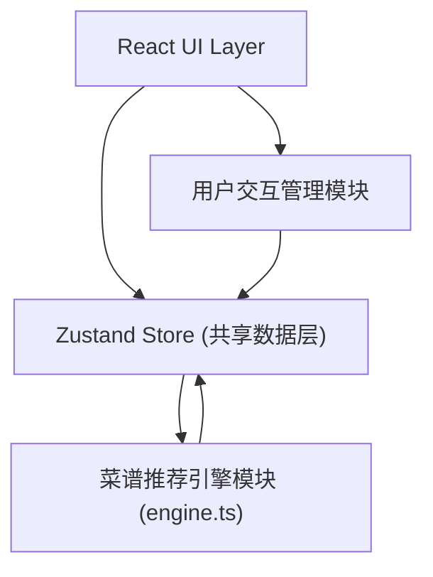

## 1. 架构设计



## 2. 技术描述

- 前端框架：React@18 + TypeScript
- 构建工具：Vite
- 状态管理：Zustand
- 工具库：uuid
- 样式方案：原生 CSS（CSS Variables + 全局样式）
- 无后端，所有数据存储在前端内存中

## 3. 路由/页面定义

| 页面 | 组件 | 说明 |
|-------|---------|------|
| 菜谱推荐页 | RecipePage | 主页，食材输入 + 推荐列表 |
| 收藏管理页 | FavoritesPage | 展示已收藏菜谱网格 |
| 详情弹窗 | RecipeDetail | 展示步骤、评分、购物清单 |

注：使用 Zustand 中的导航状态切换页面，不使用 react-router。

## 4. 数据模型

### 4.1 核心类型定义

```typescript
interface Recipe {
  id: string;
  name: string;
  ingredients: string[];
  steps: string[];
}

interface MatchedRecipe extends Recipe {
  matchPercentage: number;
  averageRating: number;
}

interface RatingRecord {
  recipeId: string;
  scores: number[];
}

interface ShoppingItem {
  recipeId: string;
  recipeName: string;
  missingIngredients: string[];
}

interface AppState {
  ingredients: string[];
  recommendedRecipes: MatchedRecipe[];
  favoriteRecipes: string[];
  ratings: Record<string, number[]>;
  shoppingList: ShoppingItem[];
  currentPage: 'recommend' | 'favorites';
}
```

### 4.2 Store 方法

- `addIngredient(name: string)`: 添加食材
- `removeIngredient(name: string)`: 移除食材
- `calculateRecommendations()`: 触发推荐计算
- `saveRecipe(recipeId: string)`: 收藏菜谱（上限50个）
- `removeRecipe(recipeId: string)`: 移除收藏
- `rateRecipe(recipeId: string, score: number)`: 评分并更新平均分

## 5. 文件结构

```
src/
├── store.ts           # Zustand store，共享数据层
├── engine.ts          # 菜谱推荐引擎模块
├── App.tsx            # 根组件，页面路由
├── RecipePage.tsx     # 推荐页
├── FavoritesPage.tsx  # 收藏页
├── RecipeDetail.tsx   # 详情弹窗
└── style.css          # 全局样式
```

根目录配置文件：package.json、vite.config.js、tsconfig.json、index.html
