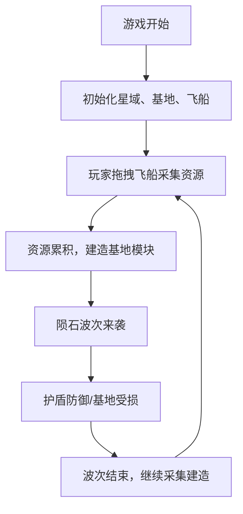
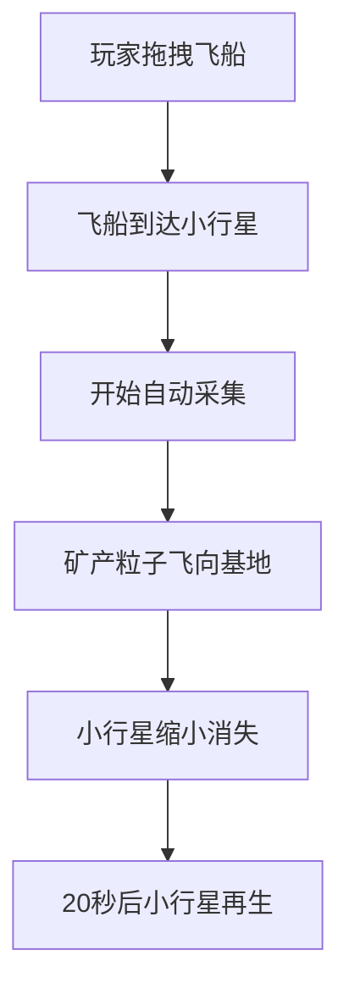
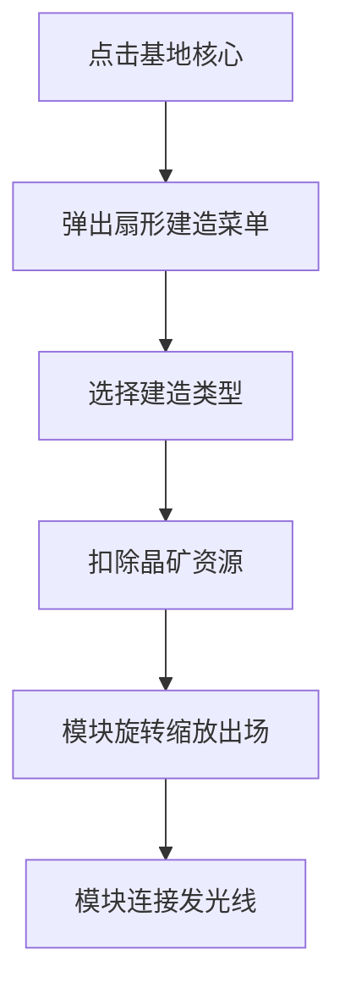

## 1. 产品概述

深空资源采集与基地建设策略游戏，玩家在广袤的星域中管理资源、建造模块化基地并抵御周期性陨石袭击。

- 核心玩法：资源采集 + 基地建设 + 波次防御
- 目标用户：休闲策略游戏爱好者
- 产品价值：提供沉浸式的深空探索与基地管理体验

## 2. 核心功能

### 2.1 功能模块

1. **资源采集系统**：拖拽采集飞船到小行星上自动采集矿产，矿产以粒子效果飞向基地核心
2. **基地建造系统**：点击基地核心弹出扇形建造菜单，可建造能量塔、护盾发生器、仓库
3. **陨石防御系统**：每60秒触发陨石波次，护盾发生器可抵御陨石攻击
4. **资源管理UI**：顶部资源栏显示晶矿数量、能量槽、波次倒计时

### 2.2 功能详情

| 功能模块 | 子功能 | 功能描述 |
|---------|--------|----------|
| 资源采集 | 飞船拖拽 | 鼠标拖拽采集飞船到小行星残骸上开始采集 |
| 资源采集 | 小行星再生 | 小行星采集后缩小消失，20秒后再生 |
| 资源采集 | 粒子尾迹 | 矿产飞向基地时有粒子尾迹效果，持续0.5秒 |
| 基地建造 | 建造菜单 | 点击基地核心弹出三个扇形建造按钮 |
| 基地建造 | 模块出场动画 | 建造时模块从中心旋转缩放出场，0.4秒easeOutBack |
| 基地建造 | 模块连接 | 模块之间通过发光连接线相连，带闪烁动画 |
| 基地建造 | 能量塔 | 消耗50晶矿，提升全模块效率10% |
| 基地建造 | 护盾发生器 | 消耗80晶矿，周期性抵御陨石 |
| 基地建造 | 仓库 | 消耗30晶矿，增加矿产容量20 |
| 陨石防御 | 波次生成 | 每60秒触发一次陨石袭击，3-5颗陨石 |
| 陨石防御 | 陨石轨迹 | 陨石从顶部和右侧生成，抛物线轨迹飞向基地 |
| 陨石防御 | 护盾效果 | 护盾发生器激活时显示半透明蓝色护盾 |
| 陨石防御 | 爆炸效果 | 陨石撞击护盾产生爆破碎片粒子 |
| 资源UI | 晶矿显示 | 黄色数字显示晶矿数量，带脉冲动画 |
| 资源UI | 能量槽 | 绿色渐变能量条，随时间自动增长 |
| 资源UI | 倒计时 | 流星图标+剩余秒数，精确到0.1秒 |

## 3. 核心流程

### 3.1 游戏主循环

### 3.2 采集流程

### 3.3 建造流程

## 4. 用户界面设计

### 4.1 设计风格

- **主题风格**：深空暗色主题，科技感十足
- **主色调**：深空蓝 #0A1020（背景）、亮蓝色 #00BFFF（高光）、黄色（资源）
- **辅助色**：半透明深蓝 #1A2A4A、灰褐色 #5A4A3A（小行星）、棕色 #8B4513（陨石）
- **视觉效果**：星点粒子背景、发光边框、脉冲动画、粒子系统

### 4.2 游戏场景设计

| 元素 | 样式描述 |
|------|----------|
| 星域背景 | 800x600 2D俯视图，50个随机亮星+5个闪烁亮星，边界发光渐变 |
| 基地核心 | 圆形，半径40px，半透明深蓝色 #1A2A4A，带脉冲光效 |
| 采集飞船 | 可拖拽，联动动画 |
| 矿物采集场 | 矩形 60x40px，联动动画 |
| 小行星残骸 | 10-20个随机分布，直径10-20px，灰褐色 #5A4A3A，噪点纹理 |
| 建造菜单 | 三个扇形按钮，半径50/70/90px，半透明背景，悬浮放大1.05倍 |
| 护盾 | 圆环形，半径60px，透明度0.3，持续闪烁 |
| 资源栏 | 顶部40px高，半透明背景 #0A1020B0 |

### 4.3 动效设计

- **资源数值变化**：缩放脉冲动画，变大1.1倍后恢复，持续0.2秒
- **模块建造**：旋转缩放出场，0.4秒 easeOutBack
- **连接线**：颜色 #00BFFF，线宽2px，闪烁周期1秒
- **陨石撞击**：4-8个碎片粒子，持续0.3秒
- **统一缓动**：所有交互使用0.2-0.3秒缓动动画

### 4.4 响应式

- 桌面端优先，Canvas固定800x600尺寸
- 页面居中显示，背景为深色
- 不涉及移动端适配

## 5. 性能要求

- 目标帧率：60FPS
- 粒子数量上限：50个
- 动画流畅度：陨石撞击和建造动画需保持流畅
- 渲染方式：HTML5 Canvas 2D上下文
