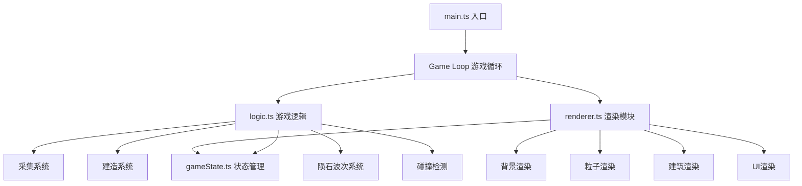

## 1. 架构设计



## 2. 技术描述

- **前端框架**：纯 TypeScript + HTML5 Canvas 2D
- **构建工具**：Vite（默认配置，无需额外插件）
- **状态管理**：自定义 gameState 模块（getter/setter 模式）
- **渲染引擎**：Canvas 2D Context（不使用 Three.js 或 WebGL）
- **动画系统**：基于 requestAnimationFrame 的游戏循环
- **粒子系统**：自定义粒子管理器，限制最大50个粒子

## 3. 项目结构

```
auto29/
├── package.json          # 项目依赖与脚本
├── vite.config.js        # Vite 构建配置
├── tsconfig.json         # TypeScript 配置
├── index.html            # 入口页面
└── src/
    ├── main.ts           # 入口文件：Canvas初始化、游戏循环
    ├── gameState.ts      # 游戏状态管理
    ├── renderer.ts       # 渲染模块
    └── logic.ts          # 游戏逻辑
```

## 4. 模块职责

### 4.1 main.ts
- 初始化 Canvas 元素，设置尺寸为 800x600
- 设置页面样式，使 Canvas 居中显示
- 创建 GameState、Renderer、Logic 实例
- 启动 requestAnimationFrame 游戏循环
- 处理用户输入（鼠标事件）

### 4.2 gameState.ts
- 管理所有游戏状态数据
- 资源数据：晶矿数量、能量值、仓库容量
- 建筑数据：基地核心、能量塔、护盾发生器、仓库列表
- 实体数据：飞船、小行星、陨石、粒子列表
- 波次数据：倒计时、波次数、护盾状态
- 提供 getter/setter 和更新方法

### 4.3 renderer.ts
- 绘制星域背景（星点、边界渐变）
- 绘制基地核心、建筑模块
- 绘制飞船、小行星
- 绘制陨石及拖尾效果
- 绘制粒子系统
- 绘制护盾效果
- 绘制建造菜单
- 绘制顶部资源UI栏
- 所有绘制从 gameState 读取数据

### 4.4 logic.ts
- 采集逻辑：飞船与小行星的采集交互
- 建造逻辑：建造菜单交互、模块放置、资源扣除
- 陨石波次：波次生成、陨石运动、碰撞检测
- 护盾系统：护盾激活、生命值管理、恢复逻辑
- 粒子更新：粒子生命周期管理
- 资源更新：能量增长、容量限制
- 更新 gameState 数据

## 5. 核心数据模型

### 5.1 游戏状态接口

```typescript
interface GameState {
  resources: {
    crystals: number;
    energy: number;
    maxEnergy: number;
    storageCapacity: number;
  };
  base: {
    x: number;
    y: number;
    radius: number;
  };
  ship: {
    x: number;
    y: number;
    isDragging: boolean;
    isCollecting: boolean;
    targetAsteroid: number | null;
  };
  asteroids: Asteroid[];
  buildings: Building[];
  meteors: Meteor[];
  particles: Particle[];
  wave: {
    timer: number;
    waveNumber: number;
    isActive: boolean;
  };
  shield: {
    active: boolean;
    health: number;
    maxHealth: number;
    regenRate: number;
  };
  buildMenu: {
    open: boolean;
    selected: string | null;
  };
  efficiency: number;
}
```

### 5.2 实体类型

```typescript
interface Asteroid {
  id: number;
  x: number;
  y: number;
  radius: number;
  resources: number;
  maxResources: number;
  respawnTimer: number;
  active: boolean;
}

interface Building {
  id: number;
  type: 'energyTower' | 'shieldGenerator' | 'warehouse';
  x: number;
  y: number;
  angle: number;
  scale: number;
  buildProgress: number;
}

interface Meteor {
  id: number;
  x: number;
  y: number;
  vx: number;
  vy: number;
  radius: number;
  rotation: number;
  trail: Particle[];
}

interface Particle {
  id: number;
  x: number;
  y: number;
  vx: number;
  vy: number;
  life: number;
  maxLife: number;
  color: string;
  size: number;
  type: 'resource' | 'explosion' | 'trail' | 'star';
}
```

## 6. 性能优化策略

- **对象池**：粒子对象复用，避免频繁创建销毁
- **渲染优化**：离屏Canvas缓存静态背景
- **状态最小化**：只在数据变化时触发重绘相关部分
- **粒子限制**：最大50个粒子，超出时优先淘汰旧粒子
- **碰撞优化**：空间分区或简单距离检测（因实体数量少）
