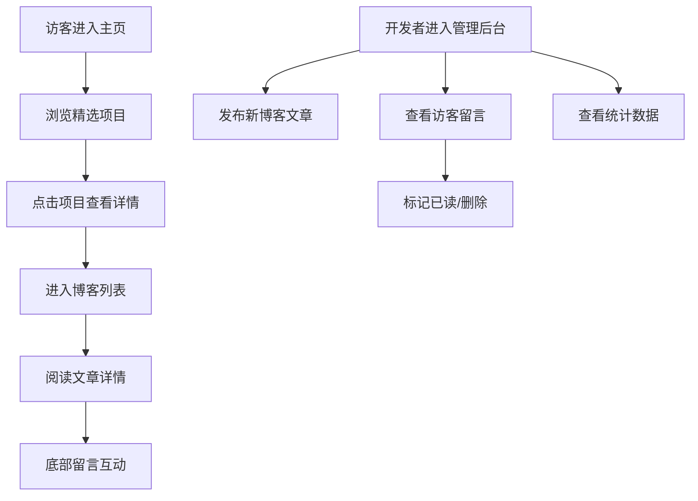

## 1. 产品概述

DevPortfolio 是一款面向个人开发者的作品集与博客展示应用，旨在帮助开发者创建个性化主页、展示项目作品、发布技术博客，并通过留言互动与数据统计模块构建完整的个人品牌展示平台。目标用户为独立开发者、自由职业者和技术博主，核心价值在于一站式展示技术能力与创作内容。

## 2. 核心功能

### 2.1 用户角色

| 角色 | 注册方式 | 核心权限 |
|------|----------|----------|
| 开发者（管理员） | 无需注册，默认身份 | 管理项目、发布文章、查看留言、查看统计 |
| 访客 | 无需注册 | 浏览主页、阅读文章、提交留言 |

### 2.2 功能模块

1. **个人主页**：头像、姓名、标语、精选项目卡片网格
2. **项目展示**：3列网格展示项目卡片，含缩略图、标题、描述、标签和技术栈
3. **博客文章**：Markdown编辑器实时预览、文章列表、文章详情、前后导航
4. **留言反馈**：访客留言提交、加载/成功/失败动画、管理后台查看/标记已读/删除
5. **统计概览**：月度发布数柱状图、月度留言数折线图、技术栈饼图、入场动画
6. **主题切换**：亮色/暗色模式切换、0.4秒渐变过渡

### 2.3 页面详情

| 页面名称 | 模块名称 | 功能描述 |
|----------|----------|----------|
| 个人主页 | 个人简介区 | 圆形头像120px、姓名、Markdown标语 |
| 个人主页 | 精选项目网格 | 3列6个项目卡片，含缩略图200x150、标题、描述、标签、技术栈图表 |
| 博客列表页 | 文章列表 | 按发布时间倒序，显示标题、摘要、发布日期、阅读用时 |
| 博客详情页 | 文章内容 | Markdown渲染、前后文章导航、留言区 |
| 博客编辑页 | Markdown编辑器 | 实时预览、发布新文章 |
| 留言页面 | 留言表单 | 昵称、邮箱、内容输入，提交动画反馈 |
| 留言页面 | 留言列表 | 展示所有已审核留言 |
| 管理后台 | 留言管理 | 查看所有留言、标记已读、删除 |
| 管理后台 | 统计面板 | 柱状图、折线图、饼图、入场动画 |
| 通用 | 侧边栏 | 固定280px、个人简介、技术栈标签云 |
| 通用 | 顶部导航 | Logo、菜单链接、亮暗模式切换 |

## 3. 核心流程

**访客浏览流程**：访客进入主页 → 浏览精选项目 → 点击项目查看详情 → 进入博客列表 → 阅读文章详情 → 底部留言互动

**开发者管理流程**：开发者进入管理后台 → 发布新博客文章 → 查看访客留言 → 标记已读/删除 → 查看统计数据

## 4. 界面设计

### 4.1 设计风格

- **主色调**：#6C63FF（主按钮、聚焦边框、品牌色）
- **亮色模式**：背景#F8F9FA、卡片#FFFFFF、文字#212529、侧边栏#F0F1F3
- **暗色模式**：背景#1A1D23、卡片#2D313A、文字#E9ECEF、侧边栏#252830
- **按钮风格**：圆角8px、主色填充、hover亮度+10%、点击scale(0.95) 0.1s
- **卡片风格**：圆角12px、阴影0 2px 8px rgba(0,0,0,0.08)、hover阴影加深+上移4px 0.3s
- **输入框**：聚焦时边框主色+发光效果box-shadow 0 0 0 3px rgba(108,99,255,0.2)
- **字体**：标题使用 Outfit（现代几何感），正文使用 Source Sans 3（高可读性）
- **布局**：左侧280px固定侧边栏 + 右侧内容区

### 4.2 页面设计概览

| 页面名称 | 模块名称 | UI元素 |
|----------|----------|--------|
| 个人主页 | 个人简介区 | 圆形头像居中、姓名大字、Markdown标语、渐入动画 |
| 个人主页 | 项目网格 | 3列CSS Grid、卡片悬停上移+阴影加深、标签圆角徽章 |
| 博客列表 | 文章卡片 | 标题加粗、摘要灰色、日期和用时小字图标、悬停上移 |
| 博客详情 | 文章内容 | Markdown渲染排版、代码块高亮、前后导航箭头 |
| 博客编辑 | 编辑器 | 左右分栏编辑+预览、工具栏、发布按钮 |
| 留言页面 | 留言表单 | 三行输入+文本域、提交按钮带动画状态 |
| 管理后台 | 留言管理 | 列表式留言卡片、已读/未读标记、删除按钮 |
| 管理后台 | 统计面板 | Recharts图表、底部淡入动画0.6s |
| 通用 | 侧边栏 | 固定定位、简介+标签云、暗色背景 |
| 通用 | Header | 固定顶部、Logo+导航+模式切换 |

### 4.3 响应式设计

- 桌面优先设计，768px为断点
- 小于768px：侧边栏转为顶部折叠菜单（汉堡按钮触发）、卡片网格变单列、字体缩小
- 触摸优化：按钮最小44px点击区域、表单输入适配移动端键盘

### 4.4 动画设计

- 主题切换：背景和文字色0.4s渐变过渡
- 卡片悬停：translateY(-4px) + 阴影加深，持续0.3s
- 按钮点击：scale(0.95)，持续0.1s
- 图表入场：从底部向上淡入，持续0.6s
- 留言提交：旋转圆圈加载 → 绿色对勾成功 → 红色抖动失败
