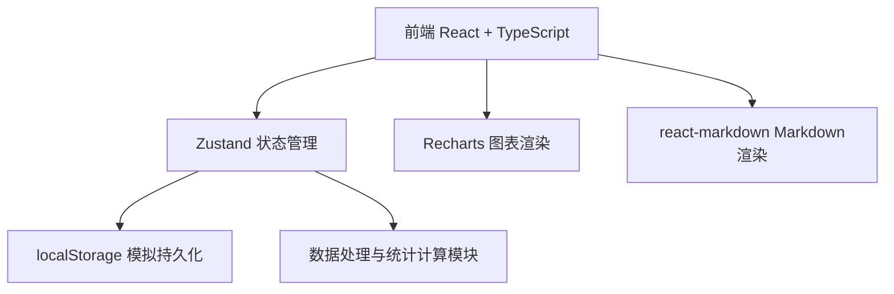
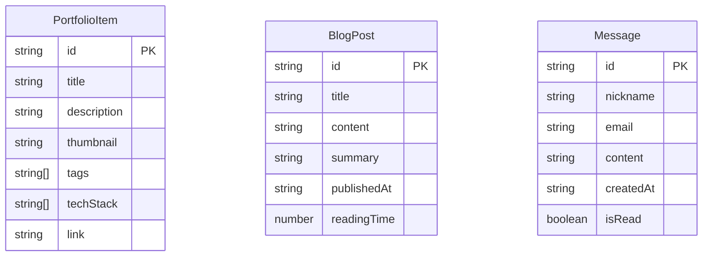

## 1. 架构设计



纯前端架构，无后端服务，所有数据通过localStorage持久化，状态通过Zustand集中管理。

## 2. 技术说明

- **前端**：React@18 + TypeScript + Vite
- **初始化工具**：vite-init (react-ts模板)
- **状态管理**：Zustand
- **样式方案**：Tailwind CSS + CSS自定义属性（主题变量）
- **路由**：react-router-dom
- **图表**：Recharts
- **Markdown渲染**：react-markdown
- **唯一ID生成**：uuid
- **后端**：无（localStorage模拟数据持久化）
- **数据库**：无（localStorage模拟）

## 3. 路由定义

| 路由 | 用途 |
|------|------|
| `/` | 个人主页，展示简介和精选项目 |
| `/portfolio` | 项目列表页，展示所有项目 |
| `/blog` | 博客列表页，展示所有文章 |
| `/blog/new` | 新建博客文章页 |
| `/blog/:id` | 博客详情页，展示文章内容和留言 |
| `/messages` | 留言页面，提交和查看留言 |
| `/admin` | 管理后台，留言管理和统计面板 |

## 4. API定义

无后端API，所有数据操作通过Zustand store与localStorage交互。

### TypeScript类型定义

```typescript
interface PortfolioItem {
  id: string;
  title: string;
  description: string;
  thumbnail: string;
  tags: string[];
  techStack: string[];
  link?: string;
}

interface BlogPost {
  id: string;
  title: string;
  content: string;
  summary: string;
  publishedAt: string;
  readingTime: number;
}

interface Message {
  id: string;
  nickname: string;
  email: string;
  content: string;
  createdAt: string;
  isRead: boolean;
}

interface AppStats {
  monthlyPosts: { month: string; count: number }[];
  monthlyMessages: { month: string; count: number }[];
  techStackFreq: { name: string; value: number }[];
}
```

## 5. 数据模型

### 5.1 数据模型定义



### 5.2 数据存储

- 所有数据存储在localStorage中
- 键名规范：`devportfolio_portfolio`、`devportfolio_blog`、`devportfolio_messages`
- 首次访问时初始化种子数据
- 统计数据由独立计算模块从原始数据动态生成
