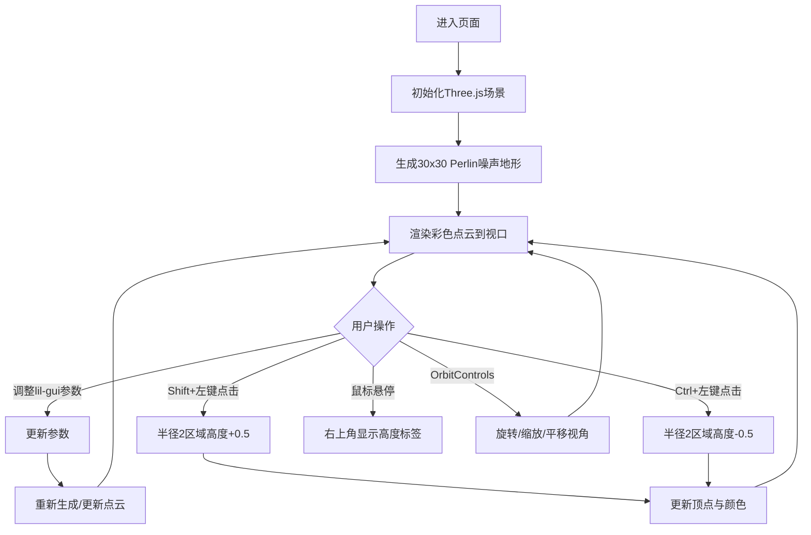

## 1. 产品概述
DepthCanvas是一个基于Web的3D点云地形编辑器，用户可通过鼠标交互和参数面板实时生成、修改随机地形高度图，以彩色点云形式立体呈现。
- 主要面向创意设计师、游戏开发者和教育工作者，用于快速原型制作、地形可视化和教学演示
- 目标价值：在浏览器中提供直观、高性能、沉浸式的3D地形创作体验

## 2. 核心功能

### 2.1 功能模块
1. **主编辑页面**：3D点云渲染视口、参数控制面板、高度显示标签

### 2.2 页面详情
| 页面名称 | 模块名称 | 功能描述 |
|-----------|-------------|---------------------|
| 主编辑页面 | 3D点云渲染视口 | 渲染彩色点云地形，支持OrbitControls旋转/缩放/平移 |
| 主编辑页面 | 控制面板 | lil-gui参数面板，含分辨率、高度幅度、颜色渐变、重置按钮 |
| 主编辑页面 | 高度显示标签 | 鼠标悬停时在右上角显示当前点高度数值 |
| 主编辑页面 | 地形编辑交互 | Shift+左键升高地形，Ctrl+左键降低地形 |

## 3. 核心流程
用户打开页面后，初始显示30x30网格Perlin噪声生成的彩色点云地形。用户可通过OrbitControls自由浏览视角，使用lil-gui面板调整分辨率、高度幅度、渐变颜色，或通过Shift/Ctrl+左键编辑局部地形高度。鼠标悬停可查看具体点的高度值。

## 4. 用户界面设计

### 4.1 设计风格
- 主背景色：深空黑色 #0A0A0A
- 控制面板背景：半透明深色 #1A1A2EEE，圆角8px，内边距12px
- 点云颜色渐变：深蓝 #0A0A3A → 海绿 #2E8B57 → 纯白 #FFFFFF，三次缓动
- 文字颜色：标题 #CCCCCC，标签 #AAAAAA，高度值 #FFFFFF
- 字体：14px无衬线字体
- 布局：全屏沉浸式3D视口，左上角浮动控制面板，右上角浮动高度标签
- 动效：控制面板从上方滑入（0.3秒缓出）

### 4.2 页面设计概述
| 页面名称 | 模块名称 | UI元素 |
|-----------|-------------|-------------|
| 主编辑页面 | 3D视口 | 全屏黑色背景Three.js Canvas，彩色点云 |
| 主编辑页面 | 控制面板 | lil-gui面板（分辨率滑块、高度滑块、颜色选择器x2、重置按钮），滑入动画 |
| 主编辑页面 | 高度标签 | 右上角半透明黑底标签，白色14px字体 |

### 4.3 响应性
- 桌面端优先，Canvas自适应窗口尺寸
- 鼠标为主要输入设备，支持三键滚轮

### 4.4 3D场景指导
- 环境：深空黑背景，无雾效，沉浸感强
- 光照：默认环境光保证点云颜色准确
- 相机：PerspectiveCamera，配合OrbitControls阻尼0.05
- 点云材质：PointsMaterial，点大小0.15，顶点着色
- 性能：50x50(2500点) ≥30fps，更新响应 ≤200ms
