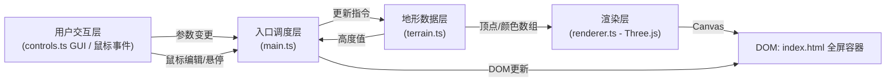

## 1. 架构设计



## 2. 技术描述
- 前端：TypeScript + Three.js@0.160 + lil-gui@0.18
- 构建工具：Vite 5
- 纯前端项目，无后端
- 模块划分：
  - `src/main.ts`：入口调度，串联交互、数据、渲染
  - `src/terrain.ts`：Perlin噪声、高度图、顶点/颜色生成
  - `src/renderer.ts`：Three.js场景、相机、OrbitControls、点云对象
  - `src/controls.ts`：lil-gui面板封装，事件分发

## 3. 路由定义
纯单页面，无多路由
| 路由 | 用途 |
|-------|---------|
| / | 主编辑页面（唯一页面） |

## 4. 数据模型

### 4.1 地形参数类型
```typescript
interface TerrainParams {
  resolution: number;    // 分辨率 10-50 步长5
  amplitude: number;     // 高度幅度 0-5 步长0.1
  startColor: string;    // 渐变起点颜色
  endColor: string;      // 渐变终点颜色
  cellSize: number;      // 格子宽度 0.5
  frequency: number;     // Perlin噪声频率 0.1
}
```

### 4.2 地形顶点数据
```typescript
interface TerrainData {
  positions: Float32Array;  // 顶点位置 xyz 扁平数组
  colors: Float32Array;     // 顶点颜色 rgb 扁平数组
  heights: Float32Array;    // 高度值（单通道，索引对应顶点）
  count: number;            // 顶点总数
}
```

## 5. 核心模块职责
- **terrain.ts**
  - 内置简化Perlin噪声实现
  - `generate(resolution, amplitude)` 生成初始高度图
  - `editHeight(x, z, radius, delta, minH, maxH)` 局部编辑
  - `updateColors(startColor, endColor, heights)` 颜色重映射（ease-in-out-cubic）
  - 输出 Float32Array 供 THREE.BufferGeometry 使用
- **renderer.ts**
  - 初始化 THREE.Scene / PerspectiveCamera / WebGLRenderer
  - OrbitControls（enableDamping=true, dampingFactor=0.05）
  - 维护一个 THREE.Points 实例，更新其 BufferGeometry
  - 暴露 `setPointCloud(positions, colors, count)` 与 `updateHeightColors(colors)` 接口
  - 暴露 raycaster 辅助方法以进行点拾取
- **controls.ts**
  - 创建 lil-gui 实例并挂载到指定容器
  - 绑定 resolution / amplitude / startColor / endColor / reset 控件
  - 通过 EventEmitter 或回调接口通知 main.ts
- **main.ts**
  - 加载并实例化上述各模块
  - 绑定鼠标事件（悬停拾取、Shift+Click、Ctrl+Click）
  - 响应参数变化并驱动 terrain 更新 → renderer 刷新
  - 管理右上角高度标签 DOM 的显示与隐藏
